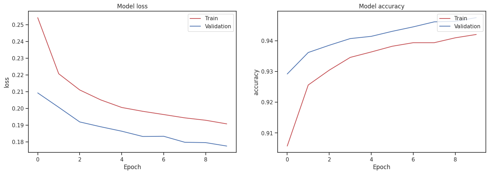

# Importing


```python
import pandas as pd
import numpy as np
import matplotlib.pyplot as plt
import seaborn as sns

import warnings
warnings.simplefilter(action='ignore', category=FutureWarning)
```

# EDA

## Data collection & data understanding


```python
train = pd.read_csv('train.csv')
test = pd.read_csv('test.csv')
original = pd.read_csv('credit_risk_dataset.csv')
train.head()  # train.sample()
```


  <div id="df-ab74d52c-6f14-44b2-92f0-9ba38235f502" class="colab-df-container">
    <div>
<style scoped>
    .dataframe tbody tr th:only-of-type {
        vertical-align: middle;
    }

    .dataframe tbody tr th {
        vertical-align: top;
    }

    .dataframe thead th {
        text-align: right;
    }
</style>
<table border="1" class="dataframe">
  <thead>
    <tr style="text-align: right;">
      <th></th>
      <th>id</th>
      <th>person_age</th>
      <th>person_income</th>
      <th>person_home_ownership</th>
      <th>person_emp_length</th>
      <th>loan_intent</th>
      <th>loan_grade</th>
      <th>loan_amnt</th>
      <th>loan_int_rate</th>
      <th>loan_percent_income</th>
      <th>cb_person_default_on_file</th>
      <th>cb_person_cred_hist_length</th>
      <th>loan_status</th>
    </tr>
  </thead>
  <tbody>
    <tr>
      <th>0</th>
      <td>0</td>
      <td>37</td>
      <td>35000</td>
      <td>RENT</td>
      <td>0.0</td>
      <td>EDUCATION</td>
      <td>B</td>
      <td>6000</td>
      <td>11.49</td>
      <td>0.17</td>
      <td>N</td>
      <td>14</td>
      <td>0</td>
    </tr>
    <tr>
      <th>1</th>
      <td>1</td>
      <td>22</td>
      <td>56000</td>
      <td>OWN</td>
      <td>6.0</td>
      <td>MEDICAL</td>
      <td>C</td>
      <td>4000</td>
      <td>13.35</td>
      <td>0.07</td>
      <td>N</td>
      <td>2</td>
      <td>0</td>
    </tr>
    <tr>
      <th>2</th>
      <td>2</td>
      <td>29</td>
      <td>28800</td>
      <td>OWN</td>
      <td>8.0</td>
      <td>PERSONAL</td>
      <td>A</td>
      <td>6000</td>
      <td>8.90</td>
      <td>0.21</td>
      <td>N</td>
      <td>10</td>
      <td>0</td>
    </tr>
    <tr>
      <th>3</th>
      <td>3</td>
      <td>30</td>
      <td>70000</td>
      <td>RENT</td>
      <td>14.0</td>
      <td>VENTURE</td>
      <td>B</td>
      <td>12000</td>
      <td>11.11</td>
      <td>0.17</td>
      <td>N</td>
      <td>5</td>
      <td>0</td>
    </tr>
    <tr>
      <th>4</th>
      <td>4</td>
      <td>22</td>
      <td>60000</td>
      <td>RENT</td>
      <td>2.0</td>
      <td>MEDICAL</td>
      <td>A</td>
      <td>6000</td>
      <td>6.92</td>
      <td>0.10</td>
      <td>N</td>
      <td>3</td>
      <td>0</td>
    </tr>
  </tbody>
</table>
</div>
    <div class="colab-df-buttons">

  <div class="colab-df-container">
    <button class="colab-df-convert" onclick="convertToInteractive('df-ab74d52c-6f14-44b2-92f0-9ba38235f502')"
            title="Convert this dataframe to an interactive table."
            style="display:none;">

  <svg xmlns="http://www.w3.org/2000/svg" height="24px" viewBox="0 -960 960 960">
    <path d="M120-120v-720h720v720H120Zm60-500h600v-160H180v160Zm220 220h160v-160H400v160Zm0 220h160v-160H400v160ZM180-400h160v-160H180v160Zm440 0h160v-160H620v160ZM180-180h160v-160H180v160Zm440 0h160v-160H620v160Z"/>
  </svg>
    </button>

  <style>
    .colab-df-container {
      display:flex;
      gap: 12px;
    }

    .colab-df-convert {
      background-color: #E8F0FE;
      border: none;
      border-radius: 50%;
      cursor: pointer;
      display: none;
      fill: #1967D2;
      height: 32px;
      padding: 0 0 0 0;
      width: 32px;
    }

    .colab-df-convert:hover {
      background-color: #E2EBFA;
      box-shadow: 0px 1px 2px rgba(60, 64, 67, 0.3), 0px 1px 3px 1px rgba(60, 64, 67, 0.15);
      fill: #174EA6;
    }

    .colab-df-buttons div {
      margin-bottom: 4px;
    }

    [theme=dark] .colab-df-convert {
      background-color: #3B4455;
      fill: #D2E3FC;
    }

    [theme=dark] .colab-df-convert:hover {
      background-color: #434B5C;
      box-shadow: 0px 1px 3px 1px rgba(0, 0, 0, 0.15);
      filter: drop-shadow(0px 1px 2px rgba(0, 0, 0, 0.3));
      fill: #FFFFFF;
    }
  </style>

    <script>
      const buttonEl =
        document.querySelector('#df-ab74d52c-6f14-44b2-92f0-9ba38235f502 button.colab-df-convert');
      buttonEl.style.display =
        google.colab.kernel.accessAllowed ? 'block' : 'none';

      async function convertToInteractive(key) {
        const element = document.querySelector('#df-ab74d52c-6f14-44b2-92f0-9ba38235f502');
        const dataTable =
          await google.colab.kernel.invokeFunction('convertToInteractive',
                                                    [key], {});
        if (!dataTable) return;

        const docLinkHtml = 'Like what you see? Visit the ' +
          '<a target="_blank" href=https://colab.research.google.com/notebooks/data_table.ipynb>data table notebook</a>'
          + ' to learn more about interactive tables.';
        element.innerHTML = '';
        dataTable['output_type'] = 'display_data';
        await google.colab.output.renderOutput(dataTable, element);
        const docLink = document.createElement('div');
        docLink.innerHTML = docLinkHtml;
        element.appendChild(docLink);
      }
    </script>
  </div>


<div id="df-4ed8b53e-a59a-408e-99bf-c309724a207b">
  <button class="colab-df-quickchart" onclick="quickchart('df-4ed8b53e-a59a-408e-99bf-c309724a207b')"
            title="Suggest charts"
            style="display:none;">

<svg xmlns="http://www.w3.org/2000/svg" height="24px"viewBox="0 0 24 24"
     width="24px">
    <g>
        <path d="M19 3H5c-1.1 0-2 .9-2 2v14c0 1.1.9 2 2 2h14c1.1 0 2-.9 2-2V5c0-1.1-.9-2-2-2zM9 17H7v-7h2v7zm4 0h-2V7h2v10zm4 0h-2v-4h2v4z"/>
    </g>
</svg>
  </button>

<style>
  .colab-df-quickchart {
      --bg-color: #E8F0FE;
      --fill-color: #1967D2;
      --hover-bg-color: #E2EBFA;
      --hover-fill-color: #174EA6;
      --disabled-fill-color: #AAA;
      --disabled-bg-color: #DDD;
  }

  [theme=dark] .colab-df-quickchart {
      --bg-color: #3B4455;
      --fill-color: #D2E3FC;
      --hover-bg-color: #434B5C;
      --hover-fill-color: #FFFFFF;
      --disabled-bg-color: #3B4455;
      --disabled-fill-color: #666;
  }

  .colab-df-quickchart {
    background-color: var(--bg-color);
    border: none;
    border-radius: 50%;
    cursor: pointer;
    display: none;
    fill: var(--fill-color);
    height: 32px;
    padding: 0;
    width: 32px;
  }

  .colab-df-quickchart:hover {
    background-color: var(--hover-bg-color);
    box-shadow: 0 1px 2px rgba(60, 64, 67, 0.3), 0 1px 3px 1px rgba(60, 64, 67, 0.15);
    fill: var(--button-hover-fill-color);
  }

  .colab-df-quickchart-complete:disabled,
  .colab-df-quickchart-complete:disabled:hover {
    background-color: var(--disabled-bg-color);
    fill: var(--disabled-fill-color);
    box-shadow: none;
  }

  .colab-df-spinner {
    border: 2px solid var(--fill-color);
    border-color: transparent;
    border-bottom-color: var(--fill-color);
    animation:
      spin 1s steps(1) infinite;
  }

  @keyframes spin {
    0% {
      border-color: transparent;
      border-bottom-color: var(--fill-color);
      border-left-color: var(--fill-color);
    }
    20% {
      border-color: transparent;
      border-left-color: var(--fill-color);
      border-top-color: var(--fill-color);
    }
    30% {
      border-color: transparent;
      border-left-color: var(--fill-color);
      border-top-color: var(--fill-color);
      border-right-color: var(--fill-color);
    }
    40% {
      border-color: transparent;
      border-right-color: var(--fill-color);
      border-top-color: var(--fill-color);
    }
    60% {
      border-color: transparent;
      border-right-color: var(--fill-color);
    }
    80% {
      border-color: transparent;
      border-right-color: var(--fill-color);
      border-bottom-color: var(--fill-color);
    }
    90% {
      border-color: transparent;
      border-bottom-color: var(--fill-color);
    }
  }
</style>

  <script>
    async function quickchart(key) {
      const quickchartButtonEl =
        document.querySelector('#' + key + ' button');
      quickchartButtonEl.disabled = true;  // To prevent multiple clicks.
      quickchartButtonEl.classList.add('colab-df-spinner');
      try {
        const charts = await google.colab.kernel.invokeFunction(
            'suggestCharts', [key], {});
      } catch (error) {
        console.error('Error during call to suggestCharts:', error);
      }
      quickchartButtonEl.classList.remove('colab-df-spinner');
      quickchartButtonEl.classList.add('colab-df-quickchart-complete');
    }
    (() => {
      let quickchartButtonEl =
        document.querySelector('#df-4ed8b53e-a59a-408e-99bf-c309724a207b button');
      quickchartButtonEl.style.display =
        google.colab.kernel.accessAllowed ? 'block' : 'none';
    })();
  </script>
</div>

    </div>
  </div>


```python
original.head()
```


  <div id="df-5e270162-803a-4d90-9814-ac502d029f69" class="colab-df-container">
    <div>
<style scoped>
    .dataframe tbody tr th:only-of-type {
        vertical-align: middle;
    }

    .dataframe tbody tr th {
        vertical-align: top;
    }

    .dataframe thead th {
        text-align: right;
    }
</style>
<table border="1" class="dataframe">
  <thead>
    <tr style="text-align: right;">
      <th></th>
      <th>person_age</th>
      <th>person_income</th>
      <th>person_home_ownership</th>
      <th>person_emp_length</th>
      <th>loan_intent</th>
      <th>loan_grade</th>
      <th>loan_amnt</th>
      <th>loan_int_rate</th>
      <th>loan_status</th>
      <th>loan_percent_income</th>
      <th>cb_person_default_on_file</th>
      <th>cb_person_cred_hist_length</th>
    </tr>
  </thead>
  <tbody>
    <tr>
      <th>0</th>
      <td>22</td>
      <td>59000</td>
      <td>RENT</td>
      <td>123.0</td>
      <td>PERSONAL</td>
      <td>D</td>
      <td>35000</td>
      <td>16.02</td>
      <td>1</td>
      <td>0.59</td>
      <td>Y</td>
      <td>3</td>
    </tr>
    <tr>
      <th>1</th>
      <td>21</td>
      <td>9600</td>
      <td>OWN</td>
      <td>5.0</td>
      <td>EDUCATION</td>
      <td>B</td>
      <td>1000</td>
      <td>11.14</td>
      <td>0</td>
      <td>0.10</td>
      <td>N</td>
      <td>2</td>
    </tr>
    <tr>
      <th>2</th>
      <td>25</td>
      <td>9600</td>
      <td>MORTGAGE</td>
      <td>1.0</td>
      <td>MEDICAL</td>
      <td>C</td>
      <td>5500</td>
      <td>12.87</td>
      <td>1</td>
      <td>0.57</td>
      <td>N</td>
      <td>3</td>
    </tr>
    <tr>
      <th>3</th>
      <td>23</td>
      <td>65500</td>
      <td>RENT</td>
      <td>4.0</td>
      <td>MEDICAL</td>
      <td>C</td>
      <td>35000</td>
      <td>15.23</td>
      <td>1</td>
      <td>0.53</td>
      <td>N</td>
      <td>2</td>
    </tr>
    <tr>
      <th>4</th>
      <td>24</td>
      <td>54400</td>
      <td>RENT</td>
      <td>8.0</td>
      <td>MEDICAL</td>
      <td>C</td>
      <td>35000</td>
      <td>14.27</td>
      <td>1</td>
      <td>0.55</td>
      <td>Y</td>
      <td>4</td>
    </tr>
  </tbody>
</table>
</div>
    <div class="colab-df-buttons">

  <div class="colab-df-container">
    <button class="colab-df-convert" onclick="convertToInteractive('df-5e270162-803a-4d90-9814-ac502d029f69')"
            title="Convert this dataframe to an interactive table."
            style="display:none;">

  <svg xmlns="http://www.w3.org/2000/svg" height="24px" viewBox="0 -960 960 960">
    <path d="M120-120v-720h720v720H120Zm60-500h600v-160H180v160Zm220 220h160v-160H400v160Zm0 220h160v-160H400v160ZM180-400h160v-160H180v160Zm440 0h160v-160H620v160ZM180-180h160v-160H180v160Zm440 0h160v-160H620v160Z"/>
  </svg>
    </button>

  <style>
    .colab-df-container {
      display:flex;
      gap: 12px;
    }

    .colab-df-convert {
      background-color: #E8F0FE;
      border: none;
      border-radius: 50%;
      cursor: pointer;
      display: none;
      fill: #1967D2;
      height: 32px;
      padding: 0 0 0 0;
      width: 32px;
    }

    .colab-df-convert:hover {
      background-color: #E2EBFA;
      box-shadow: 0px 1px 2px rgba(60, 64, 67, 0.3), 0px 1px 3px 1px rgba(60, 64, 67, 0.15);
      fill: #174EA6;
    }

    .colab-df-buttons div {
      margin-bottom: 4px;
    }

    [theme=dark] .colab-df-convert {
      background-color: #3B4455;
      fill: #D2E3FC;
    }

    [theme=dark] .colab-df-convert:hover {
      background-color: #434B5C;
      box-shadow: 0px 1px 3px 1px rgba(0, 0, 0, 0.15);
      filter: drop-shadow(0px 1px 2px rgba(0, 0, 0, 0.3));
      fill: #FFFFFF;
    }
  </style>

    <script>
      const buttonEl =
        document.querySelector('#df-5e270162-803a-4d90-9814-ac502d029f69 button.colab-df-convert');
      buttonEl.style.display =
        google.colab.kernel.accessAllowed ? 'block' : 'none';

      async function convertToInteractive(key) {
        const element = document.querySelector('#df-5e270162-803a-4d90-9814-ac502d029f69');
        const dataTable =
          await google.colab.kernel.invokeFunction('convertToInteractive',
                                                    [key], {});
        if (!dataTable) return;

        const docLinkHtml = 'Like what you see? Visit the ' +
          '<a target="_blank" href=https://colab.research.google.com/notebooks/data_table.ipynb>data table notebook</a>'
          + ' to learn more about interactive tables.';
        element.innerHTML = '';
        dataTable['output_type'] = 'display_data';
        await google.colab.output.renderOutput(dataTable, element);
        const docLink = document.createElement('div');
        docLink.innerHTML = docLinkHtml;
        element.appendChild(docLink);
      }
    </script>
  </div>


<div id="df-7bcf7da2-cf8e-4c96-82cc-8b1aac603a58">
  <button class="colab-df-quickchart" onclick="quickchart('df-7bcf7da2-cf8e-4c96-82cc-8b1aac603a58')"
            title="Suggest charts"
            style="display:none;">

<svg xmlns="http://www.w3.org/2000/svg" height="24px"viewBox="0 0 24 24"
     width="24px">
    <g>
        <path d="M19 3H5c-1.1 0-2 .9-2 2v14c0 1.1.9 2 2 2h14c1.1 0 2-.9 2-2V5c0-1.1-.9-2-2-2zM9 17H7v-7h2v7zm4 0h-2V7h2v10zm4 0h-2v-4h2v4z"/>
    </g>
</svg>
  </button>

<style>
  .colab-df-quickchart {
      --bg-color: #E8F0FE;
      --fill-color: #1967D2;
      --hover-bg-color: #E2EBFA;
      --hover-fill-color: #174EA6;
      --disabled-fill-color: #AAA;
      --disabled-bg-color: #DDD;
  }

  [theme=dark] .colab-df-quickchart {
      --bg-color: #3B4455;
      --fill-color: #D2E3FC;
      --hover-bg-color: #434B5C;
      --hover-fill-color: #FFFFFF;
      --disabled-bg-color: #3B4455;
      --disabled-fill-color: #666;
  }

  .colab-df-quickchart {
    background-color: var(--bg-color);
    border: none;
    border-radius: 50%;
    cursor: pointer;
    display: none;
    fill: var(--fill-color);
    height: 32px;
    padding: 0;
    width: 32px;
  }

  .colab-df-quickchart:hover {
    background-color: var(--hover-bg-color);
    box-shadow: 0 1px 2px rgba(60, 64, 67, 0.3), 0 1px 3px 1px rgba(60, 64, 67, 0.15);
    fill: var(--button-hover-fill-color);
  }

  .colab-df-quickchart-complete:disabled,
  .colab-df-quickchart-complete:disabled:hover {
    background-color: var(--disabled-bg-color);
    fill: var(--disabled-fill-color);
    box-shadow: none;
  }

  .colab-df-spinner {
    border: 2px solid var(--fill-color);
    border-color: transparent;
    border-bottom-color: var(--fill-color);
    animation:
      spin 1s steps(1) infinite;
  }

  @keyframes spin {
    0% {
      border-color: transparent;
      border-bottom-color: var(--fill-color);
      border-left-color: var(--fill-color);
    }
    20% {
      border-color: transparent;
      border-left-color: var(--fill-color);
      border-top-color: var(--fill-color);
    }
    30% {
      border-color: transparent;
      border-left-color: var(--fill-color);
      border-top-color: var(--fill-color);
      border-right-color: var(--fill-color);
    }
    40% {
      border-color: transparent;
      border-right-color: var(--fill-color);
      border-top-color: var(--fill-color);
    }
    60% {
      border-color: transparent;
      border-right-color: var(--fill-color);
    }
    80% {
      border-color: transparent;
      border-right-color: var(--fill-color);
      border-bottom-color: var(--fill-color);
    }
    90% {
      border-color: transparent;
      border-bottom-color: var(--fill-color);
    }
  }
</style>

  <script>
    async function quickchart(key) {
      const quickchartButtonEl =
        document.querySelector('#' + key + ' button');
      quickchartButtonEl.disabled = true;  // To prevent multiple clicks.
      quickchartButtonEl.classList.add('colab-df-spinner');
      try {
        const charts = await google.colab.kernel.invokeFunction(
            'suggestCharts', [key], {});
      } catch (error) {
        console.error('Error during call to suggestCharts:', error);
      }
      quickchartButtonEl.classList.remove('colab-df-spinner');
      quickchartButtonEl.classList.add('colab-df-quickchart-complete');
    }
    (() => {
      let quickchartButtonEl =
        document.querySelector('#df-7bcf7da2-cf8e-4c96-82cc-8b1aac603a58 button');
      quickchartButtonEl.style.display =
        google.colab.kernel.accessAllowed ? 'block' : 'none';
    })();
  </script>
</div>

    </div>
  </div>


```python
train.info()
```

    <class 'pandas.core.frame.DataFrame'>
    RangeIndex: 58645 entries, 0 to 58644
    Data columns (total 13 columns):
     #   Column                      Non-Null Count  Dtype  
    ---  ------                      --------------  -----  
     0   id                          58645 non-null  int64  
     1   person_age                  58645 non-null  int64  
     2   person_income               58645 non-null  int64  
     3   person_home_ownership       58645 non-null  object 
     4   person_emp_length           58645 non-null  float64
     5   loan_intent                 58645 non-null  object 
     6   loan_grade                  58645 non-null  object 
     7   loan_amnt                   58645 non-null  int64  
     8   loan_int_rate               58645 non-null  float64
     9   loan_percent_income         58645 non-null  float64
     10  cb_person_default_on_file   58645 non-null  object 
     11  cb_person_cred_hist_length  58645 non-null  int64  
     12  loan_status                 58645 non-null  int64  
    dtypes: float64(3), int64(6), object(4)
    memory usage: 5.8+ MB
    


```python
test.info()
```

    <class 'pandas.core.frame.DataFrame'>
    RangeIndex: 39098 entries, 0 to 39097
    Data columns (total 12 columns):
     #   Column                      Non-Null Count  Dtype  
    ---  ------                      --------------  -----  
     0   id                          39098 non-null  int64  
     1   person_age                  39098 non-null  int64  
     2   person_income               39098 non-null  int64  
     3   person_home_ownership       39098 non-null  object 
     4   person_emp_length           39098 non-null  float64
     5   loan_intent                 39098 non-null  object 
     6   loan_grade                  39098 non-null  object 
     7   loan_amnt                   39098 non-null  int64  
     8   loan_int_rate               39098 non-null  float64
     9   loan_percent_income         39098 non-null  float64
     10  cb_person_default_on_file   39098 non-null  object 
     11  cb_person_cred_hist_length  39098 non-null  int64  
    dtypes: float64(3), int64(5), object(4)
    memory usage: 3.6+ MB
    


```python
original.info()
```

    <class 'pandas.core.frame.DataFrame'>
    RangeIndex: 32581 entries, 0 to 32580
    Data columns (total 12 columns):
     #   Column                      Non-Null Count  Dtype  
    ---  ------                      --------------  -----  
     0   person_age                  32581 non-null  int64  
     1   person_income               32581 non-null  int64  
     2   person_home_ownership       32581 non-null  object 
     3   person_emp_length           31686 non-null  float64
     4   loan_intent                 32581 non-null  object 
     5   loan_grade                  32581 non-null  object 
     6   loan_amnt                   32581 non-null  int64  
     7   loan_int_rate               29465 non-null  float64
     8   loan_status                 32581 non-null  int64  
     9   loan_percent_income         32581 non-null  float64
     10  cb_person_default_on_file   32581 non-null  object 
     11  cb_person_cred_hist_length  32581 non-null  int64  
    dtypes: float64(3), int64(5), object(4)
    memory usage: 3.0+ MB
    

**id** column seems unnecessary so let's take one more look before dropping it


```python
train.describe()
```


  <div id="df-7188c341-ca1f-4dac-a093-fb32c841f2a3" class="colab-df-container">
    <div>
<style scoped>
    .dataframe tbody tr th:only-of-type {
        vertical-align: middle;
    }

    .dataframe tbody tr th {
        vertical-align: top;
    }

    .dataframe thead th {
        text-align: right;
    }
</style>
<table border="1" class="dataframe">
  <thead>
    <tr style="text-align: right;">
      <th></th>
      <th>id</th>
      <th>person_age</th>
      <th>person_income</th>
      <th>person_emp_length</th>
      <th>loan_amnt</th>
      <th>loan_int_rate</th>
      <th>loan_percent_income</th>
      <th>cb_person_cred_hist_length</th>
      <th>loan_status</th>
    </tr>
  </thead>
  <tbody>
    <tr>
      <th>count</th>
      <td>58645.000000</td>
      <td>58645.000000</td>
      <td>5.864500e+04</td>
      <td>58645.000000</td>
      <td>58645.000000</td>
      <td>58645.000000</td>
      <td>58645.000000</td>
      <td>58645.000000</td>
      <td>58645.000000</td>
    </tr>
    <tr>
      <th>mean</th>
      <td>29322.000000</td>
      <td>27.550857</td>
      <td>6.404617e+04</td>
      <td>4.701015</td>
      <td>9217.556518</td>
      <td>10.677874</td>
      <td>0.159238</td>
      <td>5.813556</td>
      <td>0.142382</td>
    </tr>
    <tr>
      <th>std</th>
      <td>16929.497605</td>
      <td>6.033216</td>
      <td>3.793111e+04</td>
      <td>3.959784</td>
      <td>5563.807384</td>
      <td>3.034697</td>
      <td>0.091692</td>
      <td>4.029196</td>
      <td>0.349445</td>
    </tr>
    <tr>
      <th>min</th>
      <td>0.000000</td>
      <td>20.000000</td>
      <td>4.200000e+03</td>
      <td>0.000000</td>
      <td>500.000000</td>
      <td>5.420000</td>
      <td>0.000000</td>
      <td>2.000000</td>
      <td>0.000000</td>
    </tr>
    <tr>
      <th>25%</th>
      <td>14661.000000</td>
      <td>23.000000</td>
      <td>4.200000e+04</td>
      <td>2.000000</td>
      <td>5000.000000</td>
      <td>7.880000</td>
      <td>0.090000</td>
      <td>3.000000</td>
      <td>0.000000</td>
    </tr>
    <tr>
      <th>50%</th>
      <td>29322.000000</td>
      <td>26.000000</td>
      <td>5.800000e+04</td>
      <td>4.000000</td>
      <td>8000.000000</td>
      <td>10.750000</td>
      <td>0.140000</td>
      <td>4.000000</td>
      <td>0.000000</td>
    </tr>
    <tr>
      <th>75%</th>
      <td>43983.000000</td>
      <td>30.000000</td>
      <td>7.560000e+04</td>
      <td>7.000000</td>
      <td>12000.000000</td>
      <td>12.990000</td>
      <td>0.210000</td>
      <td>8.000000</td>
      <td>0.000000</td>
    </tr>
    <tr>
      <th>max</th>
      <td>58644.000000</td>
      <td>123.000000</td>
      <td>1.900000e+06</td>
      <td>123.000000</td>
      <td>35000.000000</td>
      <td>23.220000</td>
      <td>0.830000</td>
      <td>30.000000</td>
      <td>1.000000</td>
    </tr>
  </tbody>
</table>
</div>
    <div class="colab-df-buttons">

  <div class="colab-df-container">
    <button class="colab-df-convert" onclick="convertToInteractive('df-7188c341-ca1f-4dac-a093-fb32c841f2a3')"
            title="Convert this dataframe to an interactive table."
            style="display:none;">

  <svg xmlns="http://www.w3.org/2000/svg" height="24px" viewBox="0 -960 960 960">
    <path d="M120-120v-720h720v720H120Zm60-500h600v-160H180v160Zm220 220h160v-160H400v160Zm0 220h160v-160H400v160ZM180-400h160v-160H180v160Zm440 0h160v-160H620v160ZM180-180h160v-160H180v160Zm440 0h160v-160H620v160Z"/>
  </svg>
    </button>

  <style>
    .colab-df-container {
      display:flex;
      gap: 12px;
    }

    .colab-df-convert {
      background-color: #E8F0FE;
      border: none;
      border-radius: 50%;
      cursor: pointer;
      display: none;
      fill: #1967D2;
      height: 32px;
      padding: 0 0 0 0;
      width: 32px;
    }

    .colab-df-convert:hover {
      background-color: #E2EBFA;
      box-shadow: 0px 1px 2px rgba(60, 64, 67, 0.3), 0px 1px 3px 1px rgba(60, 64, 67, 0.15);
      fill: #174EA6;
    }

    .colab-df-buttons div {
      margin-bottom: 4px;
    }

    [theme=dark] .colab-df-convert {
      background-color: #3B4455;
      fill: #D2E3FC;
    }

    [theme=dark] .colab-df-convert:hover {
      background-color: #434B5C;
      box-shadow: 0px 1px 3px 1px rgba(0, 0, 0, 0.15);
      filter: drop-shadow(0px 1px 2px rgba(0, 0, 0, 0.3));
      fill: #FFFFFF;
    }
  </style>

    <script>
      const buttonEl =
        document.querySelector('#df-7188c341-ca1f-4dac-a093-fb32c841f2a3 button.colab-df-convert');
      buttonEl.style.display =
        google.colab.kernel.accessAllowed ? 'block' : 'none';

      async function convertToInteractive(key) {
        const element = document.querySelector('#df-7188c341-ca1f-4dac-a093-fb32c841f2a3');
        const dataTable =
          await google.colab.kernel.invokeFunction('convertToInteractive',
                                                    [key], {});
        if (!dataTable) return;

        const docLinkHtml = 'Like what you see? Visit the ' +
          '<a target="_blank" href=https://colab.research.google.com/notebooks/data_table.ipynb>data table notebook</a>'
          + ' to learn more about interactive tables.';
        element.innerHTML = '';
        dataTable['output_type'] = 'display_data';
        await google.colab.output.renderOutput(dataTable, element);
        const docLink = document.createElement('div');
        docLink.innerHTML = docLinkHtml;
        element.appendChild(docLink);
      }
    </script>
  </div>


<div id="df-805b13ed-2423-4f83-8cb5-c6cbcb17a8d6">
  <button class="colab-df-quickchart" onclick="quickchart('df-805b13ed-2423-4f83-8cb5-c6cbcb17a8d6')"
            title="Suggest charts"
            style="display:none;">

<svg xmlns="http://www.w3.org/2000/svg" height="24px"viewBox="0 0 24 24"
     width="24px">
    <g>
        <path d="M19 3H5c-1.1 0-2 .9-2 2v14c0 1.1.9 2 2 2h14c1.1 0 2-.9 2-2V5c0-1.1-.9-2-2-2zM9 17H7v-7h2v7zm4 0h-2V7h2v10zm4 0h-2v-4h2v4z"/>
    </g>
</svg>
  </button>

<style>
  .colab-df-quickchart {
      --bg-color: #E8F0FE;
      --fill-color: #1967D2;
      --hover-bg-color: #E2EBFA;
      --hover-fill-color: #174EA6;
      --disabled-fill-color: #AAA;
      --disabled-bg-color: #DDD;
  }

  [theme=dark] .colab-df-quickchart {
      --bg-color: #3B4455;
      --fill-color: #D2E3FC;
      --hover-bg-color: #434B5C;
      --hover-fill-color: #FFFFFF;
      --disabled-bg-color: #3B4455;
      --disabled-fill-color: #666;
  }

  .colab-df-quickchart {
    background-color: var(--bg-color);
    border: none;
    border-radius: 50%;
    cursor: pointer;
    display: none;
    fill: var(--fill-color);
    height: 32px;
    padding: 0;
    width: 32px;
  }

  .colab-df-quickchart:hover {
    background-color: var(--hover-bg-color);
    box-shadow: 0 1px 2px rgba(60, 64, 67, 0.3), 0 1px 3px 1px rgba(60, 64, 67, 0.15);
    fill: var(--button-hover-fill-color);
  }

  .colab-df-quickchart-complete:disabled,
  .colab-df-quickchart-complete:disabled:hover {
    background-color: var(--disabled-bg-color);
    fill: var(--disabled-fill-color);
    box-shadow: none;
  }

  .colab-df-spinner {
    border: 2px solid var(--fill-color);
    border-color: transparent;
    border-bottom-color: var(--fill-color);
    animation:
      spin 1s steps(1) infinite;
  }

  @keyframes spin {
    0% {
      border-color: transparent;
      border-bottom-color: var(--fill-color);
      border-left-color: var(--fill-color);
    }
    20% {
      border-color: transparent;
      border-left-color: var(--fill-color);
      border-top-color: var(--fill-color);
    }
    30% {
      border-color: transparent;
      border-left-color: var(--fill-color);
      border-top-color: var(--fill-color);
      border-right-color: var(--fill-color);
    }
    40% {
      border-color: transparent;
      border-right-color: var(--fill-color);
      border-top-color: var(--fill-color);
    }
    60% {
      border-color: transparent;
      border-right-color: var(--fill-color);
    }
    80% {
      border-color: transparent;
      border-right-color: var(--fill-color);
      border-bottom-color: var(--fill-color);
    }
    90% {
      border-color: transparent;
      border-bottom-color: var(--fill-color);
    }
  }
</style>

  <script>
    async function quickchart(key) {
      const quickchartButtonEl =
        document.querySelector('#' + key + ' button');
      quickchartButtonEl.disabled = true;  // To prevent multiple clicks.
      quickchartButtonEl.classList.add('colab-df-spinner');
      try {
        const charts = await google.colab.kernel.invokeFunction(
            'suggestCharts', [key], {});
      } catch (error) {
        console.error('Error during call to suggestCharts:', error);
      }
      quickchartButtonEl.classList.remove('colab-df-spinner');
      quickchartButtonEl.classList.add('colab-df-quickchart-complete');
    }
    (() => {
      let quickchartButtonEl =
        document.querySelector('#df-805b13ed-2423-4f83-8cb5-c6cbcb17a8d6 button');
      quickchartButtonEl.style.display =
        google.colab.kernel.accessAllowed ? 'block' : 'none';
    })();
  </script>
</div>

    </div>
  </div>


```python
train.drop(columns=['id'], inplace=True)
test.drop(columns=['id'], inplace=True)
test.describe()
```


  <div id="df-bcb46a2b-e7a6-4e28-b2d9-84f3b3ea354c" class="colab-df-container">
    <div>
<style scoped>
    .dataframe tbody tr th:only-of-type {
        vertical-align: middle;
    }

    .dataframe tbody tr th {
        vertical-align: top;
    }

    .dataframe thead th {
        text-align: right;
    }
</style>
<table border="1" class="dataframe">
  <thead>
    <tr style="text-align: right;">
      <th></th>
      <th>person_age</th>
      <th>person_income</th>
      <th>person_emp_length</th>
      <th>loan_amnt</th>
      <th>loan_int_rate</th>
      <th>loan_percent_income</th>
      <th>cb_person_cred_hist_length</th>
    </tr>
  </thead>
  <tbody>
    <tr>
      <th>count</th>
      <td>39098.000000</td>
      <td>3.909800e+04</td>
      <td>39098.000000</td>
      <td>39098.000000</td>
      <td>39098.000000</td>
      <td>39098.000000</td>
      <td>39098.000000</td>
    </tr>
    <tr>
      <th>mean</th>
      <td>27.566781</td>
      <td>6.406046e+04</td>
      <td>4.687068</td>
      <td>9251.466188</td>
      <td>10.661216</td>
      <td>0.159573</td>
      <td>5.830707</td>
    </tr>
    <tr>
      <th>std</th>
      <td>6.032761</td>
      <td>3.795583e+04</td>
      <td>3.868395</td>
      <td>5576.254680</td>
      <td>3.020220</td>
      <td>0.091633</td>
      <td>4.072157</td>
    </tr>
    <tr>
      <th>min</th>
      <td>20.000000</td>
      <td>4.000000e+03</td>
      <td>0.000000</td>
      <td>700.000000</td>
      <td>5.420000</td>
      <td>0.000000</td>
      <td>2.000000</td>
    </tr>
    <tr>
      <th>25%</th>
      <td>23.000000</td>
      <td>4.200000e+04</td>
      <td>2.000000</td>
      <td>5000.000000</td>
      <td>7.880000</td>
      <td>0.090000</td>
      <td>3.000000</td>
    </tr>
    <tr>
      <th>50%</th>
      <td>26.000000</td>
      <td>5.800000e+04</td>
      <td>4.000000</td>
      <td>8000.000000</td>
      <td>10.750000</td>
      <td>0.140000</td>
      <td>4.000000</td>
    </tr>
    <tr>
      <th>75%</th>
      <td>30.000000</td>
      <td>7.588500e+04</td>
      <td>7.000000</td>
      <td>12000.000000</td>
      <td>12.990000</td>
      <td>0.210000</td>
      <td>8.000000</td>
    </tr>
    <tr>
      <th>max</th>
      <td>94.000000</td>
      <td>1.900000e+06</td>
      <td>42.000000</td>
      <td>35000.000000</td>
      <td>22.110000</td>
      <td>0.730000</td>
      <td>30.000000</td>
    </tr>
  </tbody>
</table>
</div>
    <div class="colab-df-buttons">

  <div class="colab-df-container">
    <button class="colab-df-convert" onclick="convertToInteractive('df-bcb46a2b-e7a6-4e28-b2d9-84f3b3ea354c')"
            title="Convert this dataframe to an interactive table."
            style="display:none;">

  <svg xmlns="http://www.w3.org/2000/svg" height="24px" viewBox="0 -960 960 960">
    <path d="M120-120v-720h720v720H120Zm60-500h600v-160H180v160Zm220 220h160v-160H400v160Zm0 220h160v-160H400v160ZM180-400h160v-160H180v160Zm440 0h160v-160H620v160ZM180-180h160v-160H180v160Zm440 0h160v-160H620v160Z"/>
  </svg>
    </button>

  <style>
    .colab-df-container {
      display:flex;
      gap: 12px;
    }

    .colab-df-convert {
      background-color: #E8F0FE;
      border: none;
      border-radius: 50%;
      cursor: pointer;
      display: none;
      fill: #1967D2;
      height: 32px;
      padding: 0 0 0 0;
      width: 32px;
    }

    .colab-df-convert:hover {
      background-color: #E2EBFA;
      box-shadow: 0px 1px 2px rgba(60, 64, 67, 0.3), 0px 1px 3px 1px rgba(60, 64, 67, 0.15);
      fill: #174EA6;
    }

    .colab-df-buttons div {
      margin-bottom: 4px;
    }

    [theme=dark] .colab-df-convert {
      background-color: #3B4455;
      fill: #D2E3FC;
    }

    [theme=dark] .colab-df-convert:hover {
      background-color: #434B5C;
      box-shadow: 0px 1px 3px 1px rgba(0, 0, 0, 0.15);
      filter: drop-shadow(0px 1px 2px rgba(0, 0, 0, 0.3));
      fill: #FFFFFF;
    }
  </style>

    <script>
      const buttonEl =
        document.querySelector('#df-bcb46a2b-e7a6-4e28-b2d9-84f3b3ea354c button.colab-df-convert');
      buttonEl.style.display =
        google.colab.kernel.accessAllowed ? 'block' : 'none';

      async function convertToInteractive(key) {
        const element = document.querySelector('#df-bcb46a2b-e7a6-4e28-b2d9-84f3b3ea354c');
        const dataTable =
          await google.colab.kernel.invokeFunction('convertToInteractive',
                                                    [key], {});
        if (!dataTable) return;

        const docLinkHtml = 'Like what you see? Visit the ' +
          '<a target="_blank" href=https://colab.research.google.com/notebooks/data_table.ipynb>data table notebook</a>'
          + ' to learn more about interactive tables.';
        element.innerHTML = '';
        dataTable['output_type'] = 'display_data';
        await google.colab.output.renderOutput(dataTable, element);
        const docLink = document.createElement('div');
        docLink.innerHTML = docLinkHtml;
        element.appendChild(docLink);
      }
    </script>
  </div>


<div id="df-6d1dde51-bd35-443d-b597-e67744eb6a60">
  <button class="colab-df-quickchart" onclick="quickchart('df-6d1dde51-bd35-443d-b597-e67744eb6a60')"
            title="Suggest charts"
            style="display:none;">

<svg xmlns="http://www.w3.org/2000/svg" height="24px"viewBox="0 0 24 24"
     width="24px">
    <g>
        <path d="M19 3H5c-1.1 0-2 .9-2 2v14c0 1.1.9 2 2 2h14c1.1 0 2-.9 2-2V5c0-1.1-.9-2-2-2zM9 17H7v-7h2v7zm4 0h-2V7h2v10zm4 0h-2v-4h2v4z"/>
    </g>
</svg>
  </button>

<style>
  .colab-df-quickchart {
      --bg-color: #E8F0FE;
      --fill-color: #1967D2;
      --hover-bg-color: #E2EBFA;
      --hover-fill-color: #174EA6;
      --disabled-fill-color: #AAA;
      --disabled-bg-color: #DDD;
  }

  [theme=dark] .colab-df-quickchart {
      --bg-color: #3B4455;
      --fill-color: #D2E3FC;
      --hover-bg-color: #434B5C;
      --hover-fill-color: #FFFFFF;
      --disabled-bg-color: #3B4455;
      --disabled-fill-color: #666;
  }

  .colab-df-quickchart {
    background-color: var(--bg-color);
    border: none;
    border-radius: 50%;
    cursor: pointer;
    display: none;
    fill: var(--fill-color);
    height: 32px;
    padding: 0;
    width: 32px;
  }

  .colab-df-quickchart:hover {
    background-color: var(--hover-bg-color);
    box-shadow: 0 1px 2px rgba(60, 64, 67, 0.3), 0 1px 3px 1px rgba(60, 64, 67, 0.15);
    fill: var(--button-hover-fill-color);
  }

  .colab-df-quickchart-complete:disabled,
  .colab-df-quickchart-complete:disabled:hover {
    background-color: var(--disabled-bg-color);
    fill: var(--disabled-fill-color);
    box-shadow: none;
  }

  .colab-df-spinner {
    border: 2px solid var(--fill-color);
    border-color: transparent;
    border-bottom-color: var(--fill-color);
    animation:
      spin 1s steps(1) infinite;
  }

  @keyframes spin {
    0% {
      border-color: transparent;
      border-bottom-color: var(--fill-color);
      border-left-color: var(--fill-color);
    }
    20% {
      border-color: transparent;
      border-left-color: var(--fill-color);
      border-top-color: var(--fill-color);
    }
    30% {
      border-color: transparent;
      border-left-color: var(--fill-color);
      border-top-color: var(--fill-color);
      border-right-color: var(--fill-color);
    }
    40% {
      border-color: transparent;
      border-right-color: var(--fill-color);
      border-top-color: var(--fill-color);
    }
    60% {
      border-color: transparent;
      border-right-color: var(--fill-color);
    }
    80% {
      border-color: transparent;
      border-right-color: var(--fill-color);
      border-bottom-color: var(--fill-color);
    }
    90% {
      border-color: transparent;
      border-bottom-color: var(--fill-color);
    }
  }
</style>

  <script>
    async function quickchart(key) {
      const quickchartButtonEl =
        document.querySelector('#' + key + ' button');
      quickchartButtonEl.disabled = true;  // To prevent multiple clicks.
      quickchartButtonEl.classList.add('colab-df-spinner');
      try {
        const charts = await google.colab.kernel.invokeFunction(
            'suggestCharts', [key], {});
      } catch (error) {
        console.error('Error during call to suggestCharts:', error);
      }
      quickchartButtonEl.classList.remove('colab-df-spinner');
      quickchartButtonEl.classList.add('colab-df-quickchart-complete');
    }
    (() => {
      let quickchartButtonEl =
        document.querySelector('#df-6d1dde51-bd35-443d-b597-e67744eb6a60 button');
      quickchartButtonEl.style.display =
        google.colab.kernel.accessAllowed ? 'block' : 'none';
    })();
  </script>
</div>

    </div>
  </div>


```python
train.describe(include=['O'])
```


  <div id="df-d903afc2-4023-441a-ac01-aa6fcce0020b" class="colab-df-container">
    <div>
<style scoped>
    .dataframe tbody tr th:only-of-type {
        vertical-align: middle;
    }

    .dataframe tbody tr th {
        vertical-align: top;
    }

    .dataframe thead th {
        text-align: right;
    }
</style>
<table border="1" class="dataframe">
  <thead>
    <tr style="text-align: right;">
      <th></th>
      <th>person_home_ownership</th>
      <th>loan_intent</th>
      <th>loan_grade</th>
      <th>cb_person_default_on_file</th>
    </tr>
  </thead>
  <tbody>
    <tr>
      <th>count</th>
      <td>58645</td>
      <td>58645</td>
      <td>58645</td>
      <td>58645</td>
    </tr>
    <tr>
      <th>unique</th>
      <td>4</td>
      <td>6</td>
      <td>7</td>
      <td>2</td>
    </tr>
    <tr>
      <th>top</th>
      <td>RENT</td>
      <td>EDUCATION</td>
      <td>A</td>
      <td>N</td>
    </tr>
    <tr>
      <th>freq</th>
      <td>30594</td>
      <td>12271</td>
      <td>20984</td>
      <td>49943</td>
    </tr>
  </tbody>
</table>
</div>
    <div class="colab-df-buttons">

  <div class="colab-df-container">
    <button class="colab-df-convert" onclick="convertToInteractive('df-d903afc2-4023-441a-ac01-aa6fcce0020b')"
            title="Convert this dataframe to an interactive table."
            style="display:none;">

  <svg xmlns="http://www.w3.org/2000/svg" height="24px" viewBox="0 -960 960 960">
    <path d="M120-120v-720h720v720H120Zm60-500h600v-160H180v160Zm220 220h160v-160H400v160Zm0 220h160v-160H400v160ZM180-400h160v-160H180v160Zm440 0h160v-160H620v160ZM180-180h160v-160H180v160Zm440 0h160v-160H620v160Z"/>
  </svg>
    </button>

  <style>
    .colab-df-container {
      display:flex;
      gap: 12px;
    }

    .colab-df-convert {
      background-color: #E8F0FE;
      border: none;
      border-radius: 50%;
      cursor: pointer;
      display: none;
      fill: #1967D2;
      height: 32px;
      padding: 0 0 0 0;
      width: 32px;
    }

    .colab-df-convert:hover {
      background-color: #E2EBFA;
      box-shadow: 0px 1px 2px rgba(60, 64, 67, 0.3), 0px 1px 3px 1px rgba(60, 64, 67, 0.15);
      fill: #174EA6;
    }

    .colab-df-buttons div {
      margin-bottom: 4px;
    }

    [theme=dark] .colab-df-convert {
      background-color: #3B4455;
      fill: #D2E3FC;
    }

    [theme=dark] .colab-df-convert:hover {
      background-color: #434B5C;
      box-shadow: 0px 1px 3px 1px rgba(0, 0, 0, 0.15);
      filter: drop-shadow(0px 1px 2px rgba(0, 0, 0, 0.3));
      fill: #FFFFFF;
    }
  </style>

    <script>
      const buttonEl =
        document.querySelector('#df-d903afc2-4023-441a-ac01-aa6fcce0020b button.colab-df-convert');
      buttonEl.style.display =
        google.colab.kernel.accessAllowed ? 'block' : 'none';

      async function convertToInteractive(key) {
        const element = document.querySelector('#df-d903afc2-4023-441a-ac01-aa6fcce0020b');
        const dataTable =
          await google.colab.kernel.invokeFunction('convertToInteractive',
                                                    [key], {});
        if (!dataTable) return;

        const docLinkHtml = 'Like what you see? Visit the ' +
          '<a target="_blank" href=https://colab.research.google.com/notebooks/data_table.ipynb>data table notebook</a>'
          + ' to learn more about interactive tables.';
        element.innerHTML = '';
        dataTable['output_type'] = 'display_data';
        await google.colab.output.renderOutput(dataTable, element);
        const docLink = document.createElement('div');
        docLink.innerHTML = docLinkHtml;
        element.appendChild(docLink);
      }
    </script>
  </div>


<div id="df-c4ec25c3-2255-4912-96af-e545e91afe33">
  <button class="colab-df-quickchart" onclick="quickchart('df-c4ec25c3-2255-4912-96af-e545e91afe33')"
            title="Suggest charts"
            style="display:none;">

<svg xmlns="http://www.w3.org/2000/svg" height="24px"viewBox="0 0 24 24"
     width="24px">
    <g>
        <path d="M19 3H5c-1.1 0-2 .9-2 2v14c0 1.1.9 2 2 2h14c1.1 0 2-.9 2-2V5c0-1.1-.9-2-2-2zM9 17H7v-7h2v7zm4 0h-2V7h2v10zm4 0h-2v-4h2v4z"/>
    </g>
</svg>
  </button>

<style>
  .colab-df-quickchart {
      --bg-color: #E8F0FE;
      --fill-color: #1967D2;
      --hover-bg-color: #E2EBFA;
      --hover-fill-color: #174EA6;
      --disabled-fill-color: #AAA;
      --disabled-bg-color: #DDD;
  }

  [theme=dark] .colab-df-quickchart {
      --bg-color: #3B4455;
      --fill-color: #D2E3FC;
      --hover-bg-color: #434B5C;
      --hover-fill-color: #FFFFFF;
      --disabled-bg-color: #3B4455;
      --disabled-fill-color: #666;
  }

  .colab-df-quickchart {
    background-color: var(--bg-color);
    border: none;
    border-radius: 50%;
    cursor: pointer;
    display: none;
    fill: var(--fill-color);
    height: 32px;
    padding: 0;
    width: 32px;
  }

  .colab-df-quickchart:hover {
    background-color: var(--hover-bg-color);
    box-shadow: 0 1px 2px rgba(60, 64, 67, 0.3), 0 1px 3px 1px rgba(60, 64, 67, 0.15);
    fill: var(--button-hover-fill-color);
  }

  .colab-df-quickchart-complete:disabled,
  .colab-df-quickchart-complete:disabled:hover {
    background-color: var(--disabled-bg-color);
    fill: var(--disabled-fill-color);
    box-shadow: none;
  }

  .colab-df-spinner {
    border: 2px solid var(--fill-color);
    border-color: transparent;
    border-bottom-color: var(--fill-color);
    animation:
      spin 1s steps(1) infinite;
  }

  @keyframes spin {
    0% {
      border-color: transparent;
      border-bottom-color: var(--fill-color);
      border-left-color: var(--fill-color);
    }
    20% {
      border-color: transparent;
      border-left-color: var(--fill-color);
      border-top-color: var(--fill-color);
    }
    30% {
      border-color: transparent;
      border-left-color: var(--fill-color);
      border-top-color: var(--fill-color);
      border-right-color: var(--fill-color);
    }
    40% {
      border-color: transparent;
      border-right-color: var(--fill-color);
      border-top-color: var(--fill-color);
    }
    60% {
      border-color: transparent;
      border-right-color: var(--fill-color);
    }
    80% {
      border-color: transparent;
      border-right-color: var(--fill-color);
      border-bottom-color: var(--fill-color);
    }
    90% {
      border-color: transparent;
      border-bottom-color: var(--fill-color);
    }
  }
</style>

  <script>
    async function quickchart(key) {
      const quickchartButtonEl =
        document.querySelector('#' + key + ' button');
      quickchartButtonEl.disabled = true;  // To prevent multiple clicks.
      quickchartButtonEl.classList.add('colab-df-spinner');
      try {
        const charts = await google.colab.kernel.invokeFunction(
            'suggestCharts', [key], {});
      } catch (error) {
        console.error('Error during call to suggestCharts:', error);
      }
      quickchartButtonEl.classList.remove('colab-df-spinner');
      quickchartButtonEl.classList.add('colab-df-quickchart-complete');
    }
    (() => {
      let quickchartButtonEl =
        document.querySelector('#df-c4ec25c3-2255-4912-96af-e545e91afe33 button');
      quickchartButtonEl.style.display =
        google.colab.kernel.accessAllowed ? 'block' : 'none';
    })();
  </script>
</div>

    </div>
  </div>


Combining train & original dataframe rows into **tando**


```python
tando = pd.concat([train, original]).reset_index(drop=True)
tando.shape
```


    (91226, 12)


## Data cleaning

### Handling Missing Values

**original.info()** showed that tando has missing values


```python
def missing_values_report(df):
    missing_data = df.isnull().sum()
    missing_percentage = (missing_data / len(df)) * 100
    missing_report = pd.DataFrame({'Missing Values': missing_data, 'Percentage': missing_percentage})
    return missing_report

def detailed_missing_report(df):
    missing_data = df.isnull().sum(axis=1)
    missing_report = pd.DataFrame({'Missing Cells': missing_data, 'Percentage': (missing_data / df.shape[1]) * 100})
    return missing_report.sort_values(by='Missing Cells', ascending=False)

missing_values_report(tando)
```


  <div id="df-160a0ddf-22a3-4bc3-84fe-2a46e6d1dd66" class="colab-df-container">
    <div>
<style scoped>
    .dataframe tbody tr th:only-of-type {
        vertical-align: middle;
    }

    .dataframe tbody tr th {
        vertical-align: top;
    }

    .dataframe thead th {
        text-align: right;
    }
</style>
<table border="1" class="dataframe">
  <thead>
    <tr style="text-align: right;">
      <th></th>
      <th>Missing Values</th>
      <th>Percentage</th>
    </tr>
  </thead>
  <tbody>
    <tr>
      <th>person_age</th>
      <td>0</td>
      <td>0.000000</td>
    </tr>
    <tr>
      <th>person_income</th>
      <td>0</td>
      <td>0.000000</td>
    </tr>
    <tr>
      <th>person_home_ownership</th>
      <td>0</td>
      <td>0.000000</td>
    </tr>
    <tr>
      <th>person_emp_length</th>
      <td>895</td>
      <td>0.981080</td>
    </tr>
    <tr>
      <th>loan_intent</th>
      <td>0</td>
      <td>0.000000</td>
    </tr>
    <tr>
      <th>loan_grade</th>
      <td>0</td>
      <td>0.000000</td>
    </tr>
    <tr>
      <th>loan_amnt</th>
      <td>0</td>
      <td>0.000000</td>
    </tr>
    <tr>
      <th>loan_int_rate</th>
      <td>3116</td>
      <td>3.415693</td>
    </tr>
    <tr>
      <th>loan_percent_income</th>
      <td>0</td>
      <td>0.000000</td>
    </tr>
    <tr>
      <th>cb_person_default_on_file</th>
      <td>0</td>
      <td>0.000000</td>
    </tr>
    <tr>
      <th>cb_person_cred_hist_length</th>
      <td>0</td>
      <td>0.000000</td>
    </tr>
    <tr>
      <th>loan_status</th>
      <td>0</td>
      <td>0.000000</td>
    </tr>
  </tbody>
</table>
</div>
    <div class="colab-df-buttons">

  <div class="colab-df-container">
    <button class="colab-df-convert" onclick="convertToInteractive('df-160a0ddf-22a3-4bc3-84fe-2a46e6d1dd66')"
            title="Convert this dataframe to an interactive table."
            style="display:none;">

  <svg xmlns="http://www.w3.org/2000/svg" height="24px" viewBox="0 -960 960 960">
    <path d="M120-120v-720h720v720H120Zm60-500h600v-160H180v160Zm220 220h160v-160H400v160Zm0 220h160v-160H400v160ZM180-400h160v-160H180v160Zm440 0h160v-160H620v160ZM180-180h160v-160H180v160Zm440 0h160v-160H620v160Z"/>
  </svg>
    </button>

  <style>
    .colab-df-container {
      display:flex;
      gap: 12px;
    }

    .colab-df-convert {
      background-color: #E8F0FE;
      border: none;
      border-radius: 50%;
      cursor: pointer;
      display: none;
      fill: #1967D2;
      height: 32px;
      padding: 0 0 0 0;
      width: 32px;
    }

    .colab-df-convert:hover {
      background-color: #E2EBFA;
      box-shadow: 0px 1px 2px rgba(60, 64, 67, 0.3), 0px 1px 3px 1px rgba(60, 64, 67, 0.15);
      fill: #174EA6;
    }

    .colab-df-buttons div {
      margin-bottom: 4px;
    }

    [theme=dark] .colab-df-convert {
      background-color: #3B4455;
      fill: #D2E3FC;
    }

    [theme=dark] .colab-df-convert:hover {
      background-color: #434B5C;
      box-shadow: 0px 1px 3px 1px rgba(0, 0, 0, 0.15);
      filter: drop-shadow(0px 1px 2px rgba(0, 0, 0, 0.3));
      fill: #FFFFFF;
    }
  </style>

    <script>
      const buttonEl =
        document.querySelector('#df-160a0ddf-22a3-4bc3-84fe-2a46e6d1dd66 button.colab-df-convert');
      buttonEl.style.display =
        google.colab.kernel.accessAllowed ? 'block' : 'none';

      async function convertToInteractive(key) {
        const element = document.querySelector('#df-160a0ddf-22a3-4bc3-84fe-2a46e6d1dd66');
        const dataTable =
          await google.colab.kernel.invokeFunction('convertToInteractive',
                                                    [key], {});
        if (!dataTable) return;

        const docLinkHtml = 'Like what you see? Visit the ' +
          '<a target="_blank" href=https://colab.research.google.com/notebooks/data_table.ipynb>data table notebook</a>'
          + ' to learn more about interactive tables.';
        element.innerHTML = '';
        dataTable['output_type'] = 'display_data';
        await google.colab.output.renderOutput(dataTable, element);
        const docLink = document.createElement('div');
        docLink.innerHTML = docLinkHtml;
        element.appendChild(docLink);
      }
    </script>
  </div>


<div id="df-688a65a3-6900-470f-9c45-0cf969ed1368">
  <button class="colab-df-quickchart" onclick="quickchart('df-688a65a3-6900-470f-9c45-0cf969ed1368')"
            title="Suggest charts"
            style="display:none;">

<svg xmlns="http://www.w3.org/2000/svg" height="24px"viewBox="0 0 24 24"
     width="24px">
    <g>
        <path d="M19 3H5c-1.1 0-2 .9-2 2v14c0 1.1.9 2 2 2h14c1.1 0 2-.9 2-2V5c0-1.1-.9-2-2-2zM9 17H7v-7h2v7zm4 0h-2V7h2v10zm4 0h-2v-4h2v4z"/>
    </g>
</svg>
  </button>

<style>
  .colab-df-quickchart {
      --bg-color: #E8F0FE;
      --fill-color: #1967D2;
      --hover-bg-color: #E2EBFA;
      --hover-fill-color: #174EA6;
      --disabled-fill-color: #AAA;
      --disabled-bg-color: #DDD;
  }

  [theme=dark] .colab-df-quickchart {
      --bg-color: #3B4455;
      --fill-color: #D2E3FC;
      --hover-bg-color: #434B5C;
      --hover-fill-color: #FFFFFF;
      --disabled-bg-color: #3B4455;
      --disabled-fill-color: #666;
  }

  .colab-df-quickchart {
    background-color: var(--bg-color);
    border: none;
    border-radius: 50%;
    cursor: pointer;
    display: none;
    fill: var(--fill-color);
    height: 32px;
    padding: 0;
    width: 32px;
  }

  .colab-df-quickchart:hover {
    background-color: var(--hover-bg-color);
    box-shadow: 0 1px 2px rgba(60, 64, 67, 0.3), 0 1px 3px 1px rgba(60, 64, 67, 0.15);
    fill: var(--button-hover-fill-color);
  }

  .colab-df-quickchart-complete:disabled,
  .colab-df-quickchart-complete:disabled:hover {
    background-color: var(--disabled-bg-color);
    fill: var(--disabled-fill-color);
    box-shadow: none;
  }

  .colab-df-spinner {
    border: 2px solid var(--fill-color);
    border-color: transparent;
    border-bottom-color: var(--fill-color);
    animation:
      spin 1s steps(1) infinite;
  }

  @keyframes spin {
    0% {
      border-color: transparent;
      border-bottom-color: var(--fill-color);
      border-left-color: var(--fill-color);
    }
    20% {
      border-color: transparent;
      border-left-color: var(--fill-color);
      border-top-color: var(--fill-color);
    }
    30% {
      border-color: transparent;
      border-left-color: var(--fill-color);
      border-top-color: var(--fill-color);
      border-right-color: var(--fill-color);
    }
    40% {
      border-color: transparent;
      border-right-color: var(--fill-color);
      border-top-color: var(--fill-color);
    }
    60% {
      border-color: transparent;
      border-right-color: var(--fill-color);
    }
    80% {
      border-color: transparent;
      border-right-color: var(--fill-color);
      border-bottom-color: var(--fill-color);
    }
    90% {
      border-color: transparent;
      border-bottom-color: var(--fill-color);
    }
  }
</style>

  <script>
    async function quickchart(key) {
      const quickchartButtonEl =
        document.querySelector('#' + key + ' button');
      quickchartButtonEl.disabled = true;  // To prevent multiple clicks.
      quickchartButtonEl.classList.add('colab-df-spinner');
      try {
        const charts = await google.colab.kernel.invokeFunction(
            'suggestCharts', [key], {});
      } catch (error) {
        console.error('Error during call to suggestCharts:', error);
      }
      quickchartButtonEl.classList.remove('colab-df-spinner');
      quickchartButtonEl.classList.add('colab-df-quickchart-complete');
    }
    (() => {
      let quickchartButtonEl =
        document.querySelector('#df-688a65a3-6900-470f-9c45-0cf969ed1368 button');
      quickchartButtonEl.style.display =
        google.colab.kernel.accessAllowed ? 'block' : 'none';
    })();
  </script>
</div>

    </div>
  </div>


```python
from sklearn.impute import SimpleImputer, KNNImputer
from sklearn.experimental import enable_iterative_imputer
from sklearn.impute import IterativeImputer

# Using pandas fillna method
tando['person_emp_length'].fillna(tando['person_emp_length'].mean(), inplace=True)
tando['loan_int_rate'].fillna(tando['loan_int_rate'].mean(), inplace=True)

missing_values_report(tando)
```


  <div id="df-1e1cf22a-bd67-4695-a9bd-22edb8b99edb" class="colab-df-container">
    <div>
<style scoped>
    .dataframe tbody tr th:only-of-type {
        vertical-align: middle;
    }

    .dataframe tbody tr th {
        vertical-align: top;
    }

    .dataframe thead th {
        text-align: right;
    }
</style>
<table border="1" class="dataframe">
  <thead>
    <tr style="text-align: right;">
      <th></th>
      <th>Missing Values</th>
      <th>Percentage</th>
    </tr>
  </thead>
  <tbody>
    <tr>
      <th>person_age</th>
      <td>0</td>
      <td>0.0</td>
    </tr>
    <tr>
      <th>person_income</th>
      <td>0</td>
      <td>0.0</td>
    </tr>
    <tr>
      <th>person_home_ownership</th>
      <td>0</td>
      <td>0.0</td>
    </tr>
    <tr>
      <th>person_emp_length</th>
      <td>0</td>
      <td>0.0</td>
    </tr>
    <tr>
      <th>loan_intent</th>
      <td>0</td>
      <td>0.0</td>
    </tr>
    <tr>
      <th>loan_grade</th>
      <td>0</td>
      <td>0.0</td>
    </tr>
    <tr>
      <th>loan_amnt</th>
      <td>0</td>
      <td>0.0</td>
    </tr>
    <tr>
      <th>loan_int_rate</th>
      <td>0</td>
      <td>0.0</td>
    </tr>
    <tr>
      <th>loan_percent_income</th>
      <td>0</td>
      <td>0.0</td>
    </tr>
    <tr>
      <th>cb_person_default_on_file</th>
      <td>0</td>
      <td>0.0</td>
    </tr>
    <tr>
      <th>cb_person_cred_hist_length</th>
      <td>0</td>
      <td>0.0</td>
    </tr>
    <tr>
      <th>loan_status</th>
      <td>0</td>
      <td>0.0</td>
    </tr>
  </tbody>
</table>
</div>
    <div class="colab-df-buttons">

  <div class="colab-df-container">
    <button class="colab-df-convert" onclick="convertToInteractive('df-1e1cf22a-bd67-4695-a9bd-22edb8b99edb')"
            title="Convert this dataframe to an interactive table."
            style="display:none;">

  <svg xmlns="http://www.w3.org/2000/svg" height="24px" viewBox="0 -960 960 960">
    <path d="M120-120v-720h720v720H120Zm60-500h600v-160H180v160Zm220 220h160v-160H400v160Zm0 220h160v-160H400v160ZM180-400h160v-160H180v160Zm440 0h160v-160H620v160ZM180-180h160v-160H180v160Zm440 0h160v-160H620v160Z"/>
  </svg>
    </button>

  <style>
    .colab-df-container {
      display:flex;
      gap: 12px;
    }

    .colab-df-convert {
      background-color: #E8F0FE;
      border: none;
      border-radius: 50%;
      cursor: pointer;
      display: none;
      fill: #1967D2;
      height: 32px;
      padding: 0 0 0 0;
      width: 32px;
    }

    .colab-df-convert:hover {
      background-color: #E2EBFA;
      box-shadow: 0px 1px 2px rgba(60, 64, 67, 0.3), 0px 1px 3px 1px rgba(60, 64, 67, 0.15);
      fill: #174EA6;
    }

    .colab-df-buttons div {
      margin-bottom: 4px;
    }

    [theme=dark] .colab-df-convert {
      background-color: #3B4455;
      fill: #D2E3FC;
    }

    [theme=dark] .colab-df-convert:hover {
      background-color: #434B5C;
      box-shadow: 0px 1px 3px 1px rgba(0, 0, 0, 0.15);
      filter: drop-shadow(0px 1px 2px rgba(0, 0, 0, 0.3));
      fill: #FFFFFF;
    }
  </style>

    <script>
      const buttonEl =
        document.querySelector('#df-1e1cf22a-bd67-4695-a9bd-22edb8b99edb button.colab-df-convert');
      buttonEl.style.display =
        google.colab.kernel.accessAllowed ? 'block' : 'none';

      async function convertToInteractive(key) {
        const element = document.querySelector('#df-1e1cf22a-bd67-4695-a9bd-22edb8b99edb');
        const dataTable =
          await google.colab.kernel.invokeFunction('convertToInteractive',
                                                    [key], {});
        if (!dataTable) return;

        const docLinkHtml = 'Like what you see? Visit the ' +
          '<a target="_blank" href=https://colab.research.google.com/notebooks/data_table.ipynb>data table notebook</a>'
          + ' to learn more about interactive tables.';
        element.innerHTML = '';
        dataTable['output_type'] = 'display_data';
        await google.colab.output.renderOutput(dataTable, element);
        const docLink = document.createElement('div');
        docLink.innerHTML = docLinkHtml;
        element.appendChild(docLink);
      }
    </script>
  </div>


<div id="df-39a3b24e-b5d0-4e5c-847a-2d1ed215f528">
  <button class="colab-df-quickchart" onclick="quickchart('df-39a3b24e-b5d0-4e5c-847a-2d1ed215f528')"
            title="Suggest charts"
            style="display:none;">

<svg xmlns="http://www.w3.org/2000/svg" height="24px"viewBox="0 0 24 24"
     width="24px">
    <g>
        <path d="M19 3H5c-1.1 0-2 .9-2 2v14c0 1.1.9 2 2 2h14c1.1 0 2-.9 2-2V5c0-1.1-.9-2-2-2zM9 17H7v-7h2v7zm4 0h-2V7h2v10zm4 0h-2v-4h2v4z"/>
    </g>
</svg>
  </button>

<style>
  .colab-df-quickchart {
      --bg-color: #E8F0FE;
      --fill-color: #1967D2;
      --hover-bg-color: #E2EBFA;
      --hover-fill-color: #174EA6;
      --disabled-fill-color: #AAA;
      --disabled-bg-color: #DDD;
  }

  [theme=dark] .colab-df-quickchart {
      --bg-color: #3B4455;
      --fill-color: #D2E3FC;
      --hover-bg-color: #434B5C;
      --hover-fill-color: #FFFFFF;
      --disabled-bg-color: #3B4455;
      --disabled-fill-color: #666;
  }

  .colab-df-quickchart {
    background-color: var(--bg-color);
    border: none;
    border-radius: 50%;
    cursor: pointer;
    display: none;
    fill: var(--fill-color);
    height: 32px;
    padding: 0;
    width: 32px;
  }

  .colab-df-quickchart:hover {
    background-color: var(--hover-bg-color);
    box-shadow: 0 1px 2px rgba(60, 64, 67, 0.3), 0 1px 3px 1px rgba(60, 64, 67, 0.15);
    fill: var(--button-hover-fill-color);
  }

  .colab-df-quickchart-complete:disabled,
  .colab-df-quickchart-complete:disabled:hover {
    background-color: var(--disabled-bg-color);
    fill: var(--disabled-fill-color);
    box-shadow: none;
  }

  .colab-df-spinner {
    border: 2px solid var(--fill-color);
    border-color: transparent;
    border-bottom-color: var(--fill-color);
    animation:
      spin 1s steps(1) infinite;
  }

  @keyframes spin {
    0% {
      border-color: transparent;
      border-bottom-color: var(--fill-color);
      border-left-color: var(--fill-color);
    }
    20% {
      border-color: transparent;
      border-left-color: var(--fill-color);
      border-top-color: var(--fill-color);
    }
    30% {
      border-color: transparent;
      border-left-color: var(--fill-color);
      border-top-color: var(--fill-color);
      border-right-color: var(--fill-color);
    }
    40% {
      border-color: transparent;
      border-right-color: var(--fill-color);
      border-top-color: var(--fill-color);
    }
    60% {
      border-color: transparent;
      border-right-color: var(--fill-color);
    }
    80% {
      border-color: transparent;
      border-right-color: var(--fill-color);
      border-bottom-color: var(--fill-color);
    }
    90% {
      border-color: transparent;
      border-bottom-color: var(--fill-color);
    }
  }
</style>

  <script>
    async function quickchart(key) {
      const quickchartButtonEl =
        document.querySelector('#' + key + ' button');
      quickchartButtonEl.disabled = true;  // To prevent multiple clicks.
      quickchartButtonEl.classList.add('colab-df-spinner');
      try {
        const charts = await google.colab.kernel.invokeFunction(
            'suggestCharts', [key], {});
      } catch (error) {
        console.error('Error during call to suggestCharts:', error);
      }
      quickchartButtonEl.classList.remove('colab-df-spinner');
      quickchartButtonEl.classList.add('colab-df-quickchart-complete');
    }
    (() => {
      let quickchartButtonEl =
        document.querySelector('#df-39a3b24e-b5d0-4e5c-847a-2d1ed215f528 button');
      quickchartButtonEl.style.display =
        google.colab.kernel.accessAllowed ? 'block' : 'none';
    })();
  </script>
</div>

    </div>
  </div>


### Removing duplicates


```python
print('Number of duplicates in train: ', train.duplicated().sum())
train.drop_duplicates(inplace=True)
train.reset_index(drop=True, inplace=True)

print('Number of duplicates in tando: ', tando.duplicated().sum())
tando.drop_duplicates(inplace=True)
tando.reset_index(drop=True, inplace=True)

train.shape, tando.shape
```

    Number of duplicates in train:  0
    Number of duplicates in tando:  165
    


    ((58645, 12), (91061, 12))


### Data Type Conversion


```python
categorical_columns = train.select_dtypes(include=['O']).columns.to_list()
train[categorical_columns] = train[categorical_columns].astype('category')
tando[categorical_columns] = tando[categorical_columns].astype('category')
```

### Feature Screening


```python
numerical_columns = train.select_dtypes(exclude=['category']).columns.to_list()
numerical_columns.remove('loan_status')

def feature_screen(df):
    label = df['loan_status']
    features = df.drop(columns=['loan_status'])

    # Calculate Coefficient of Variation for continuous variables
    cv = features[numerical_columns].std() / features[numerical_columns].mean()

    # Identify features with CV less than 0.1
    low_cv_features = cv[cv < 0.1].index.tolist()
    print("\nFeatures with Coefficient of Variation less than 0.1:", low_cv_features)

    # Calculate Mode Category Percentage for categorical variables
    mode_percentage = features[categorical_columns].apply(lambda x: x.value_counts(normalize=True).max())

    # Identify features where the mode category percentage is greater than 95%
    high_mode_features = mode_percentage[mode_percentage > 95].index.tolist()
    print("Categorical features where mode category percentage is greater than 95%:", high_mode_features)

    # Calculate Percentage of Unique Categories for categorical variables
    unique_category_percentage = features[categorical_columns].nunique() / len(features) * 100

    # Identify features with a percentage of unique categories exceeding 90%(id column would've been one)
    high_unique_features = unique_category_percentage[unique_category_percentage > 90].index.tolist()
    print("Categorical features with percentage of unique categories exceeding 90%:", high_unique_features)

    # Combine all features to be removed
    features_to_remove = set(low_cv_features + high_mode_features + high_unique_features)
    print("Features to be removed:", features_to_remove)

    # Remove the identified features from the features dataframe
    cleaned_features = features.drop(columns=features_to_remove)

    # Return the cleaned features with the label
    return pd.concat([cleaned_features, label], axis=1)

print('Feature screening for train dataframe')
cleaned_train = feature_screen(train)
print('cleaned_train shape: ', cleaned_train.shape)

print('\n\nFeature screening for tando dataframe')
cleaned_tando = feature_screen(tando)
print('cleaned_tando shape: ', cleaned_tando.shape)


categorical_columns = cleaned_train.select_dtypes(include=['category']).columns.to_list()
numerical_columns = cleaned_train.select_dtypes(exclude=['category']).columns.to_list()
numerical_columns.remove('loan_status')

cleaned_test = test[categorical_columns+numerical_columns]
```

    Feature screening for train dataframe
    
    Features with Coefficient of Variation less than 0.1: []
    Categorical features where mode category percentage is greater than 95%: []
    Categorical features with percentage of unique categories exceeding 90%: []
    Features to be removed: set()
    cleaned_train shape:  (58645, 12)
    
    
    Feature screening for tando dataframe
    
    Features with Coefficient of Variation less than 0.1: []
    Categorical features where mode category percentage is greater than 95%: []
    Categorical features with percentage of unique categories exceeding 90%: []
    Features to be removed: set()
    cleaned_tando shape:  (91061, 12)
    

### Handling Out of Logical Range Data

For example there is a client **123 years old**, which is I think out of logical range.


```python
cleaned_train = cleaned_train[(cleaned_train.person_age < 100) & (cleaned_train.person_emp_length < 70)]
cleaned_train.reset_index(drop=True, inplace=True)

cleaned_tando = cleaned_tando[(cleaned_tando.person_age < 100) & (cleaned_tando.person_emp_length < 70)]
cleaned_tando.reset_index(drop=True, inplace=True)

cleaned_train.shape, cleaned_tando.shape
```


    ((58642, 12), (91051, 12))


### Handling Inconsistent Data
Searching for wrongly typed categories for example if there are both **'Education'** and **'education'** categories in loan_intent then we make them one category.


```python
cleaned_train['loan_status'].value_counts(normalize=True)*100, \
cleaned_tando['loan_status'].value_counts(normalize=True)*100
```


    (loan_status
     0    85.762764
     1    14.237236
     Name: proportion, dtype: float64,
     loan_status
     0    83.045766
     1    16.954234
     Name: proportion, dtype: float64)


```python
for col in categorical_columns:
    print('\ncleaned_train')
    print(cleaned_train[col].value_counts())
    print('\ncleaned_tando')
    print(cleaned_tando[col].value_counts())
```

    
    cleaned_train
    person_home_ownership
    RENT        30594
    MORTGAGE    24821
    OWN          3138
    OTHER          89
    Name: count, dtype: int64
    
    cleaned_tando
    person_home_ownership
    RENT        46968
    MORTGAGE    38187
    OWN          5701
    OTHER         195
    Name: count, dtype: int64
    
    cleaned_train
    loan_intent
    EDUCATION            12271
    MEDICAL              10933
    PERSONAL             10015
    VENTURE              10010
    DEBTCONSOLIDATION     9133
    HOMEIMPROVEMENT       6280
    Name: count, dtype: int64
    
    cleaned_tando
    loan_intent
    EDUCATION            18680
    MEDICAL              16975
    VENTURE              15689
    PERSONAL             15511
    DEBTCONSOLIDATION    14322
    HOMEIMPROVEMENT       9874
    Name: count, dtype: int64
    
    cleaned_train
    loan_grade
    A    20984
    B    20398
    C    11036
    D     5033
    E     1009
    F      149
    G       33
    Name: count, dtype: int64
    
    cleaned_tando
    loan_grade
    A    31686
    B    30782
    C    17472
    D     8652
    E     1972
    F      390
    G       97
    Name: count, dtype: int64
    
    cleaned_train
    cb_person_default_on_file
    N    49941
    Y     8701
    Name: count, dtype: int64
    
    cleaned_tando
    cb_person_default_on_file
    N    76621
    Y    14430
    Name: count, dtype: int64
    

## Outlier Detection and Handling


```python
def violin_plot(df, columns, name=''):
    m = len(columns)
    fig, axes = plt.subplots(1, m, figsize=(m*4, 4))
    plt.suptitle(f'{name} violinplots', size=30)
    for i, col in enumerate(columns):
        sns.violinplot(data=df, y=col, ax=axes[i])
    plt.tight_layout()

violin_plot(cleaned_train, numerical_columns, 'cleaned_train')
violin_plot(cleaned_tando, numerical_columns, 'cleaned_tando')
# tap twice(in jupiter) or once(in colab) to zoom
```


    

    


    

    


### Applying One-Dimensional Methods

One-dimensional methods can be applied only to continuous variables. We will explore two common methods:

1. **Standard Deviation Method**: This method uses the standard deviation from the mean to identify outliers. Values that fall outside of 3 standard deviations are typically considered outliers.
2. **Interquartile Range (IQR) Method**: This method uses the IQR to define limits on the sample values. Values below the 25th percentile minus 1.5 times the IQR or above the 75th percentile plus 1.5 times the IQR are considered outliers.

#### Detecting outliers


```python
def detect_outliers_std(df, columns, threshold=3):
    outliers_dict = {}
    for col in columns:
        mean = df[col].mean()
        std_dev = df[col].std()
        outliers = (df[col] > mean + threshold * std_dev) | (df[col] < mean - threshold * std_dev)
        outliers_dict[col] = df[outliers].index
    return outliers_dict

def detect_outliers_iqr(df, columns, k=2):
    outliers_dict = {}
    for col in columns:
        Q1 = df[col].quantile(0.25)
        Q3 = df[col].quantile(0.75)
        IQR = Q3 - Q1
        outliers = (df[col] < (Q1 - k * IQR)) | (df[col] > (Q3 + k * IQR))
        outliers_dict[col] = df[outliers].index
    return outliers_dict

std_outliers_train = detect_outliers_std(cleaned_train, numerical_columns, threshold=3)
iqr_outliers_train = detect_outliers_iqr(cleaned_train, numerical_columns, k=2)

std_outliers_tando = detect_outliers_std(cleaned_tando, numerical_columns, threshold=3)
iqr_outliers_tando = detect_outliers_iqr(cleaned_tando, numerical_columns, k=2)

tab = pd.DataFrame(columns=numerical_columns, index=['std_outliers_train', 'iqr_outliers_train', 'std_outliers_tando', 'iqr_outliers_tando'])

for col in numerical_columns:
    tab.loc['std_outliers_train', col] = len(std_outliers_train[col])
    tab.loc['iqr_outliers_train', col] = len(iqr_outliers_train[col])
    tab.loc['std_outliers_tando', col] = len(std_outliers_tando[col])
    tab.loc['iqr_outliers_tando', col] = len(iqr_outliers_tando[col])

tab['total'] = tab.sum(1)
display(tab)
```


  <div id="df-03a5656a-cfdb-48e8-8e88-59c7f3c3d82a" class="colab-df-container">
    <div>
<style scoped>
    .dataframe tbody tr th:only-of-type {
        vertical-align: middle;
    }

    .dataframe tbody tr th {
        vertical-align: top;
    }

    .dataframe thead th {
        text-align: right;
    }
</style>
<table border="1" class="dataframe">
  <thead>
    <tr style="text-align: right;">
      <th></th>
      <th>person_age</th>
      <th>person_income</th>
      <th>person_emp_length</th>
      <th>loan_amnt</th>
      <th>loan_int_rate</th>
      <th>loan_percent_income</th>
      <th>cb_person_cred_hist_length</th>
      <th>total</th>
    </tr>
  </thead>
  <tbody>
    <tr>
      <th>std_outliers_train</th>
      <td>1009</td>
      <td>532</td>
      <td>625</td>
      <td>345</td>
      <td>66</td>
      <td>459</td>
      <td>492</td>
      <td>3528</td>
    </tr>
    <tr>
      <th>iqr_outliers_train</th>
      <td>1172</td>
      <td>1421</td>
      <td>457</td>
      <td>343</td>
      <td>1</td>
      <td>368</td>
      <td>468</td>
      <td>4230</td>
    </tr>
    <tr>
      <th>std_outliers_tando</th>
      <td>1655</td>
      <td>912</td>
      <td>1072</td>
      <td>763</td>
      <td>123</td>
      <td>872</td>
      <td>775</td>
      <td>6172</td>
    </tr>
    <tr>
      <th>iqr_outliers_tando</th>
      <td>1926</td>
      <td>1918</td>
      <td>776</td>
      <td>769</td>
      <td>0</td>
      <td>511</td>
      <td>732</td>
      <td>6632</td>
    </tr>
  </tbody>
</table>
</div>
    <div class="colab-df-buttons">

  <div class="colab-df-container">
    <button class="colab-df-convert" onclick="convertToInteractive('df-03a5656a-cfdb-48e8-8e88-59c7f3c3d82a')"
            title="Convert this dataframe to an interactive table."
            style="display:none;">

  <svg xmlns="http://www.w3.org/2000/svg" height="24px" viewBox="0 -960 960 960">
    <path d="M120-120v-720h720v720H120Zm60-500h600v-160H180v160Zm220 220h160v-160H400v160Zm0 220h160v-160H400v160ZM180-400h160v-160H180v160Zm440 0h160v-160H620v160ZM180-180h160v-160H180v160Zm440 0h160v-160H620v160Z"/>
  </svg>
    </button>

  <style>
    .colab-df-container {
      display:flex;
      gap: 12px;
    }

    .colab-df-convert {
      background-color: #E8F0FE;
      border: none;
      border-radius: 50%;
      cursor: pointer;
      display: none;
      fill: #1967D2;
      height: 32px;
      padding: 0 0 0 0;
      width: 32px;
    }

    .colab-df-convert:hover {
      background-color: #E2EBFA;
      box-shadow: 0px 1px 2px rgba(60, 64, 67, 0.3), 0px 1px 3px 1px rgba(60, 64, 67, 0.15);
      fill: #174EA6;
    }

    .colab-df-buttons div {
      margin-bottom: 4px;
    }

    [theme=dark] .colab-df-convert {
      background-color: #3B4455;
      fill: #D2E3FC;
    }

    [theme=dark] .colab-df-convert:hover {
      background-color: #434B5C;
      box-shadow: 0px 1px 3px 1px rgba(0, 0, 0, 0.15);
      filter: drop-shadow(0px 1px 2px rgba(0, 0, 0, 0.3));
      fill: #FFFFFF;
    }
  </style>

    <script>
      const buttonEl =
        document.querySelector('#df-03a5656a-cfdb-48e8-8e88-59c7f3c3d82a button.colab-df-convert');
      buttonEl.style.display =
        google.colab.kernel.accessAllowed ? 'block' : 'none';

      async function convertToInteractive(key) {
        const element = document.querySelector('#df-03a5656a-cfdb-48e8-8e88-59c7f3c3d82a');
        const dataTable =
          await google.colab.kernel.invokeFunction('convertToInteractive',
                                                    [key], {});
        if (!dataTable) return;

        const docLinkHtml = 'Like what you see? Visit the ' +
          '<a target="_blank" href=https://colab.research.google.com/notebooks/data_table.ipynb>data table notebook</a>'
          + ' to learn more about interactive tables.';
        element.innerHTML = '';
        dataTable['output_type'] = 'display_data';
        await google.colab.output.renderOutput(dataTable, element);
        const docLink = document.createElement('div');
        docLink.innerHTML = docLinkHtml;
        element.appendChild(docLink);
      }
    </script>
  </div>


<div id="df-e971120b-bcd1-4cac-ab9b-82a4ab8322b0">
  <button class="colab-df-quickchart" onclick="quickchart('df-e971120b-bcd1-4cac-ab9b-82a4ab8322b0')"
            title="Suggest charts"
            style="display:none;">

<svg xmlns="http://www.w3.org/2000/svg" height="24px"viewBox="0 0 24 24"
     width="24px">
    <g>
        <path d="M19 3H5c-1.1 0-2 .9-2 2v14c0 1.1.9 2 2 2h14c1.1 0 2-.9 2-2V5c0-1.1-.9-2-2-2zM9 17H7v-7h2v7zm4 0h-2V7h2v10zm4 0h-2v-4h2v4z"/>
    </g>
</svg>
  </button>

<style>
  .colab-df-quickchart {
      --bg-color: #E8F0FE;
      --fill-color: #1967D2;
      --hover-bg-color: #E2EBFA;
      --hover-fill-color: #174EA6;
      --disabled-fill-color: #AAA;
      --disabled-bg-color: #DDD;
  }

  [theme=dark] .colab-df-quickchart {
      --bg-color: #3B4455;
      --fill-color: #D2E3FC;
      --hover-bg-color: #434B5C;
      --hover-fill-color: #FFFFFF;
      --disabled-bg-color: #3B4455;
      --disabled-fill-color: #666;
  }

  .colab-df-quickchart {
    background-color: var(--bg-color);
    border: none;
    border-radius: 50%;
    cursor: pointer;
    display: none;
    fill: var(--fill-color);
    height: 32px;
    padding: 0;
    width: 32px;
  }

  .colab-df-quickchart:hover {
    background-color: var(--hover-bg-color);
    box-shadow: 0 1px 2px rgba(60, 64, 67, 0.3), 0 1px 3px 1px rgba(60, 64, 67, 0.15);
    fill: var(--button-hover-fill-color);
  }

  .colab-df-quickchart-complete:disabled,
  .colab-df-quickchart-complete:disabled:hover {
    background-color: var(--disabled-bg-color);
    fill: var(--disabled-fill-color);
    box-shadow: none;
  }

  .colab-df-spinner {
    border: 2px solid var(--fill-color);
    border-color: transparent;
    border-bottom-color: var(--fill-color);
    animation:
      spin 1s steps(1) infinite;
  }

  @keyframes spin {
    0% {
      border-color: transparent;
      border-bottom-color: var(--fill-color);
      border-left-color: var(--fill-color);
    }
    20% {
      border-color: transparent;
      border-left-color: var(--fill-color);
      border-top-color: var(--fill-color);
    }
    30% {
      border-color: transparent;
      border-left-color: var(--fill-color);
      border-top-color: var(--fill-color);
      border-right-color: var(--fill-color);
    }
    40% {
      border-color: transparent;
      border-right-color: var(--fill-color);
      border-top-color: var(--fill-color);
    }
    60% {
      border-color: transparent;
      border-right-color: var(--fill-color);
    }
    80% {
      border-color: transparent;
      border-right-color: var(--fill-color);
      border-bottom-color: var(--fill-color);
    }
    90% {
      border-color: transparent;
      border-bottom-color: var(--fill-color);
    }
  }
</style>

  <script>
    async function quickchart(key) {
      const quickchartButtonEl =
        document.querySelector('#' + key + ' button');
      quickchartButtonEl.disabled = true;  // To prevent multiple clicks.
      quickchartButtonEl.classList.add('colab-df-spinner');
      try {
        const charts = await google.colab.kernel.invokeFunction(
            'suggestCharts', [key], {});
      } catch (error) {
        console.error('Error during call to suggestCharts:', error);
      }
      quickchartButtonEl.classList.remove('colab-df-spinner');
      quickchartButtonEl.classList.add('colab-df-quickchart-complete');
    }
    (() => {
      let quickchartButtonEl =
        document.querySelector('#df-e971120b-bcd1-4cac-ab9b-82a4ab8322b0 button');
      quickchartButtonEl.style.display =
        google.colab.kernel.accessAllowed ? 'block' : 'none';
    })();
  </script>
</div>

  <div id="id_589fb26f-216d-4ac0-ba8f-39c5a43a439a">
    <style>
      .colab-df-generate {
        background-color: #E8F0FE;
        border: none;
        border-radius: 50%;
        cursor: pointer;
        display: none;
        fill: #1967D2;
        height: 32px;
        padding: 0 0 0 0;
        width: 32px;
      }

      .colab-df-generate:hover {
        background-color: #E2EBFA;
        box-shadow: 0px 1px 2px rgba(60, 64, 67, 0.3), 0px 1px 3px 1px rgba(60, 64, 67, 0.15);
        fill: #174EA6;
      }

      [theme=dark] .colab-df-generate {
        background-color: #3B4455;
        fill: #D2E3FC;
      }

      [theme=dark] .colab-df-generate:hover {
        background-color: #434B5C;
        box-shadow: 0px 1px 3px 1px rgba(0, 0, 0, 0.15);
        filter: drop-shadow(0px 1px 2px rgba(0, 0, 0, 0.3));
        fill: #FFFFFF;
      }
    </style>
    <button class="colab-df-generate" onclick="generateWithVariable('tab')"
            title="Generate code using this dataframe."
            style="display:none;">

  <svg xmlns="http://www.w3.org/2000/svg" height="24px"viewBox="0 0 24 24"
       width="24px">
    <path d="M7,19H8.4L18.45,9,17,7.55,7,17.6ZM5,21V16.75L18.45,3.32a2,2,0,0,1,2.83,0l1.4,1.43a1.91,1.91,0,0,1,.58,1.4,1.91,1.91,0,0,1-.58,1.4L9.25,21ZM18.45,9,17,7.55Zm-12,3A5.31,5.31,0,0,0,4.9,8.1,5.31,5.31,0,0,0,1,6.5,5.31,5.31,0,0,0,4.9,4.9,5.31,5.31,0,0,0,6.5,1,5.31,5.31,0,0,0,8.1,4.9,5.31,5.31,0,0,0,12,6.5,5.46,5.46,0,0,0,6.5,12Z"/>
  </svg>
    </button>
    <script>
      (() => {
      const buttonEl =
        document.querySelector('#id_589fb26f-216d-4ac0-ba8f-39c5a43a439a button.colab-df-generate');
      buttonEl.style.display =
        google.colab.kernel.accessAllowed ? 'block' : 'none';

      buttonEl.onclick = () => {
        google.colab.notebook.generateWithVariable('tab');
      }
      })();
    </script>
  </div>

    </div>
  </div>


#### Handling Outliers

##### Remove Rows Example


```python
train_removed = cleaned_train.copy()
tando_removed = cleaned_tando.copy()

for col in numerical_columns:
    train_removed = train_removed[~train_removed.index.isin(iqr_outliers_train[col])]
    tando_removed = tando_removed[~tando_removed.index.isin(iqr_outliers_tando[col])]

print("train_removed data shape after removing outliers using IQR method: ", train_removed.shape)
print("tando_removed data shape after removing outliers using IQR method: ", tando_removed.shape)
```

    train_removed data shape after removing outliers using IQR method:  (55153, 12)
    tando_removed data shape after removing outliers using IQR method:  (85645, 12)
    

##### Coerce to Bounds Example


```python
train_coerced = cleaned_train.copy()
tando_coerced = cleaned_tando.copy()

for col in numerical_columns:
    Q1 = train_coerced[col].quantile(0.25)
    Q3 = train_coerced[col].quantile(0.75)
    IQR = Q3 - Q1
    lower_bound = Q1 - 1.5 * IQR
    upper_bound = Q3 + 1.5 * IQR
    train_coerced[col] = np.where(train_coerced[col] < lower_bound, lower_bound, train_coerced[col])
    train_coerced[col] = np.where(train_coerced[col] > upper_bound, upper_bound, train_coerced[col])

    Q1 = tando_coerced[col].quantile(0.25)
    Q3 = tando_coerced[col].quantile(0.75)
    IQR = Q3 - Q1
    lower_bound = Q1 - 1.5 * IQR
    upper_bound = Q3 + 1.5 * IQR
    tando_coerced[col] = np.where(tando_coerced[col] < lower_bound, lower_bound, tando_coerced[col])
    tando_coerced[col] = np.where(tando_coerced[col] > upper_bound, upper_bound, tando_coerced[col])

print("train_coerced data shape after coercing outliers using IQR method: ", train_coerced.shape)
print("tando_coerced data shape after coercing outliers using IQR method: ", tando_coerced.shape)
```

    train_coerced data shape after coercing outliers using IQR method:  (58642, 12)
    tando_coerced data shape after coercing outliers using IQR method:  (91051, 12)
    

#### Violinplots


```python
violin_plot(train_removed, numerical_columns, 'train_removed')
violin_plot(tando_removed, numerical_columns, 'tando_removed')
```


    

    


    

    


### Applying Multidimensional Method

Outlier detection can also be extended to multidimensional datasets where interactions between multiple variables can reveal anomalies that one-dimensional methods might miss. One effective multidimensional method is the **Isolation Forest algorithm**.

Before applying **the Isolation Forest** for outlier detection, we need to preprocess the data.  
This includes:
- 1. **Imputation**: Missing values can lead to errors in model training and predictions. Imputing missing values ensures that our dataset is complete.
- 2. **Encoding**: Machine learning algorithms require numerical inputs. Encoding categorical variables allows us to convert them into a numerical format that can be processed by the model.
- 3. **Scaling**: Standardizing numerical features by removing the mean and scaling to unit variance is important for algorithms like Isolation Forest, which are sensitive to the scale of input data.


```python
from sklearn.ensemble import IsolationForest
from sklearn.impute import SimpleImputer
from sklearn.preprocessing import OneHotEncoder, StandardScaler
from sklearn.compose import ColumnTransformer
from sklearn.pipeline import Pipeline

# Define the preprocessing pipeline for numerical features
numerical_pipeline = Pipeline(steps=[
    ('imputer', SimpleImputer(strategy='mean')),  # Impute missing values with the mean
    ('scaler', StandardScaler())  # Standardize numerical features
])

# Define the preprocessing pipeline for categorical features
categorical_pipeline = Pipeline(steps=[
    ('imputer', SimpleImputer(strategy='most_frequent')),  # Impute missing values with the most frequent value
    ('encoder', OneHotEncoder(handle_unknown='ignore'))  # Encode categorical features
])

# Combine numerical and categorical pipelines into a single preprocessor using ColumnTransformer
preprocessor = ColumnTransformer(transformers=[
    ('num', numerical_pipeline, numerical_columns),
    ('cat', categorical_pipeline, categorical_columns)
])

# Apply the preprocessing pipeline to the combined data
train_preprocessed = preprocessor.fit_transform(cleaned_train)
tando_preprocessed = preprocessor.fit_transform(cleaned_tando)
```

After preprocessing, we apply **the Isolation Forest** algorithm to detect and remove outliers from the dataset. Isolation Forest is an unsupervised learning algorithm that identifies anomalies in the data by isolating observations. Anomalies are more **susceptible to isolation**, thus making them easier to identify. We set the **contamination parameter to 0.05**, which means we expect 5% of the data to be outliers.


```python
# Detecting Outliers
iso_forest = IsolationForest(contamination=0.05, random_state=42)

iso_forest.fit(train_preprocessed)
outliers_train = iso_forest.predict(train_preprocessed) == -1
print(f"Isolation Forest detected {np.sum(outliers_train)} outliers in cleaned_train.")

iso_forest.fit(tando_preprocessed)
outliers_tando = iso_forest.predict(tando_preprocessed) == -1
print(f"Isolation Forest detected {np.sum(outliers_tando)} outliers in cleaned_tando.")

# Handling Outliers

# Remove outliers
train_iso = cleaned_train[~outliers_train]
tando_iso = cleaned_tando[~outliers_tando]

print("train_iso data shape after removing outliers using Isolation Forest: ", train_iso.shape)
print("tando_iso data shape after removing outliers using Isolation Forest: ", tando_iso.shape)
```

    Isolation Forest detected 2933 outliers in cleaned_train.
    Isolation Forest detected 4553 outliers in cleaned_tando.
    train_iso data shape after removing outliers using Isolation Forest:  (55709, 12)
    tando_iso data shape after removing outliers using Isolation Forest:  (86498, 12)
    


```python
violin_plot(train_iso, numerical_columns, 'train_iso')
violin_plot(tando_iso, numerical_columns, 'tando_iso')
```


    

    


    

    


## Data Visualisation

### Autoviz


```python
# !pip install autoviz
from autoviz.AutoViz_Class import AutoViz_Class
%matplotlib inline

AV_infinty = AutoViz_Class()

AV_infinty .AutoViz(filename='',dfte=train_removed,depVar='loan_status',verbose=1,max_rows_analyzed=train_removed.shape[0]
               ,max_cols_analyzed=train_removed.shape[1])
```

### Profile report


```python
# !pip install ydata_profiling
from ydata_profiling import ProfileReport

train_removed['loan_status'] = train_removed['loan_status'].astype('category')
# We did this to ensure that the data types are correctly identified by the profiling tool. you can also use the type_schema parameter to specify the data types of the columns.

train_0 = train_removed[train_removed.loan_status == 0].copy()
train_1 = train_removed[train_removed.loan_status == 1].copy()

# Generate the profile report for Loan_status = 0 with adjusted correlation settings
profile_0 = ProfileReport(train_0, title="Loan_status = 0", explorative=True, correlations={"auto": {"calculate": False}})

# Generate the profile report for Loan_status = 1 with adjusted correlation settings
profile_1 = ProfileReport(train_1, title="Loan_status = 1", explorative=True, correlations={"auto": {"calculate": False}})

comparison_report = profile_0.compare(profile_1)

# Save the comparison report to an HTML file
comparison_report.to_file("comparison_report_loan_status.html")

# Display the comparison report within the notebook
comparison_report.to_notebook_iframe()

train_removed['loan_status'] = train_removed['loan_status'].cat.codes
```

### Average Loan Amount by Loan Grade and Status


```python
plt.figure(figsize=(12, 6))
sns.barplot(x='loan_grade', y='loan_amnt', hue='loan_status', data=train_removed, estimator=np.mean)
plt.title('Average Loan Amount by Loan Grade and Status')
plt.xlabel('Loan Grade')
plt.ylabel('Average Loan Amount')
plt.legend(title='Loan Status')
plt.show()
```


    

    


### Pairplots


```python
subset_features = ['loan_amnt', 'loan_int_rate', 'person_income', 'person_age', 'loan_status']
sns.pairplot(train_removed[subset_features], hue='loan_status')
plt.title('Pair Plot of Selected Features')
plt.show()
```


    

    


### Stacked barplots of categorical vs target features with Chi-Square statistic and Cramer's V score


```python
import scipy.stats as stats

def stacked_bar_plot(df, feature, ax, target='loan_status', normalize=False):
    crosstab = pd.crosstab(df[feature], df[target], normalize=normalize)
    crosstab.plot(kind='bar', stacked=True, ax=ax, cmap='coolwarm')
    plt.suptitle(f'Stacked Bar Plots of {feature} vs {target}')
    if normalize=='index':
        title = 'Normalised'
    else:
        chi2, p, dof, expected_frequencies  = stats.chi2_contingency(crosstab)
        n = crosstab.sum().sum()  # Total number of observations
        c_v = np.sqrt(chi2 / (n * (min(crosstab.shape) - 1)))
        print(f"\nDegrees of Freedom: {dof}")
        print(f"Chi-Square Statistic: {chi2:.4f}")
        print(f"p-value: {p:.4f}")
        print(f"Cramer's v: {c_v}")
        title = 'Not normalised(Countplot)'
    ax.set_title(title)
    ax.set_ylabel('Proportion')
    ax.legend(loc='upper right')


for i, col in enumerate(categorical_columns):
    fig, axes = plt.subplots(1, 2, figsize=(12, 4))
    stacked_bar_plot(train_removed, col, axes[0], normalize='index')
    stacked_bar_plot(train_removed, col, axes[1],)
    plt.show()
```

    
    Degrees of Freedom: 3
    Chi-Square Statistic: 2968.8105
    p-value: 0.0000
    Cramer's v: 0.23200998063625408
    


    

    


    
    Degrees of Freedom: 5
    Chi-Square Statistic: 646.5107
    p-value: 0.0000
    Cramer's v: 0.10826879033548552
    


    

    


    
    Degrees of Freedom: 6
    Chi-Square Statistic: 12171.8361
    p-value: 0.0000
    Cramer's v: 0.4697788692698457
    


    

    


    
    Degrees of Freedom: 1
    Chi-Square Statistic: 2006.1692
    p-value: 0.0000
    Cramer's v: 0.1907213032252367
    


    

    


## Correlation analysis

### Cramr's V

**Cramr's V** is a statistic that measures the strength of association between **two categorical variables**. It is based on the **Chi-Square statistic** and provides a value **between 0 and 1** to indicate how strongly two categorical variables are related.  

**Interpretation of Cramr's V:**
- **0**: Indicates **no association** between the variables. This means the two variables are completely independent.
- **1**: Indicates a **perfect association** between the variables. This means knowing the value of one variable allows you to predict the value of the other perfectly.
- **Values closer to 0**: Weak association.
- **Values closer to 1**: Strong association.  

**When to Use Cramr's V:**
- **Categorical vs Categorical**: Cramr's V is used when both variables are categorical, and you want to understand the strength of the relationship between them.
- **Nominal Data**: It is particularly useful for nominal (unordered) data, such as the relationship between a person's gender and their favorite color.


```python
import scipy.stats as stats
from IPython.display import display, Markdown
from itertools import combinations

def cramers_v(mat):
    chi2, p, dof, expected = stats.chi2_contingency(mat)
    n = mat.sum().sum()  # Total number of observations
    c_v = np.sqrt(chi2 / (n * (min(mat.shape) - 1)))
    if (expected<5).any():
        return (expected-5).min(), chi2, p, dof, c_v
    return chi2, p, dof, c_v
```


```python
for col1, col2 in combinations(categorical_columns, 2):
    display(Markdown(f"\nTest Results for **{col1}** & **{col2}**:"))
    crosstab = pd.crosstab(train_removed[col1], train_removed[col2])
    res = cramers_v(crosstab)
    if res[0] < 0:
        error, chi2, p, dof, v = res
        print(f'There was expected frequency equal to {error+5}(less than 5)')
    else:
        chi2, p, dof, v = res
    print(f"\nDegrees of Freedom: {dof}")
    print(f"Chi-Square Statistic: {chi2:.4f}")
    print(f"p-value: {p:.4f}")
    print(f"Cramer's v: {v}")
```


Test Results for **person_home_ownership** & **loan_intent**:


    
    Degrees of Freedom: 15
    Chi-Square Statistic: 1412.3657
    p-value: 0.0000
    Cramer's v: 0.09239072585860314
    


Test Results for **person_home_ownership** & **loan_grade**:


    There was expected frequency equal to 0.04460319474915231(less than 5)
    
    Degrees of Freedom: 18
    Chi-Square Statistic: 2483.1588
    p-value: 0.0000
    Cramer's v: 0.12250591122053761
    


Test Results for **person_home_ownership** & **cb_person_default_on_file**:


    
    Degrees of Freedom: 3
    Chi-Square Statistic: 560.8261
    p-value: 0.0000
    Cramer's v: 0.100839231787221
    


Test Results for **loan_intent** & **loan_grade**:


    There was expected frequency equal to 3.15159646800718(less than 5)
    
    Degrees of Freedom: 30
    Chi-Square Statistic: 231.9600
    p-value: 0.0000
    Cramer's v: 0.029002605455018524
    


Test Results for **loan_intent** & **cb_person_default_on_file**:


    
    Degrees of Freedom: 5
    Chi-Square Statistic: 38.4734
    p-value: 0.0000
    Cramer's v: 0.026411673999130206
    


Test Results for **loan_grade** & **cb_person_default_on_file**:


    There was expected frequency equal to 4.466302830308415(less than 5)
    
    Degrees of Freedom: 6
    Chi-Square Statistic: 23077.2319
    p-value: 0.0000
    Cramer's v: 0.6468555167710986
    

+ **P-value of 0** indicates a **statistically significant association.**
+ **Cramrs V** measures the **strength** of that association.
+ While a p-value close to 0 suggests some relationship, **Cramrs V may still be less than 1** due to factors like sample size, number of categories, and uneven distributions. Therefore, a low p-value does not guarantee a high Cramrs V, though it often indicates a stronger association.


### Point Biserial & ANOVA

Point Biserial(binary)  & ANOVA(multi-level categories) for categorical vs numerical features


```python
# correlation, p_value = stats.pointbiserialr(cleaned_train['person_home_ownership'], cleaned_train['loan_status'])
# print(correlation, p_value)

anova_result = stats.f_oneway(train_removed[train_removed['person_home_ownership'] == 'MORTGAGE']['person_income'],
                              train_removed[train_removed['person_home_ownership'] == 'OTHER']['person_income'],
                              train_removed[train_removed['person_home_ownership'] == 'OWN']['person_income'],
                              train_removed[train_removed['person_home_ownership'] == 'RENT']['person_income']
)
print(anova_result.pvalue)
```

    0.0
    

### Encoding categorical variables
- **Label Encoding:** For **ordinal** categories(has an inherent order), preserves order.
- **One-Hot Encoding:** For **nominal** categories(no inherent order), treats categories independently.
- **Target Encoding:** Replaces each category with the **mean of the target variable for that category**, useful for **high cardinality** features.
- **Frequency Encoding:** Replaces each category with its **frequency** in the dataset, useful for **high cardinality** features.


```python
from sklearn.preprocessing import LabelEncoder

def encode_data(train, test):
    df_train, df_test = train.copy(), test.copy()
    # Label Encoding
    label_enc = LabelEncoder()
    label_cols = ['person_home_ownership', 'loan_grade', 'cb_person_default_on_file']
    for col in label_cols:
        df_train[col] = label_enc.fit_transform(df_train[col])
        df_test[col] = label_enc.transform(df_test[col])

    # One-Hot Encoding
    df_train = pd.get_dummies(df_train, columns=['loan_intent'], drop_first=True)
    df_test = pd.get_dummies(df_test, columns=['loan_intent'], drop_first=True)

    # Making sure columns are in same order
    train_columns = df_train.drop(columns=['loan_status']).columns
    df_test = df_test.reindex(columns=train_columns, fill_value=0)

    return df_train, df_test

train_encoded, test_encoded_1 = encode_data(train_removed, cleaned_test)
tando_encoded, test_encoded_2 = encode_data(tando_removed, cleaned_test)
train_encoded.head()
```


  <div id="df-d8333a90-1cf4-46a1-b8f5-84c5ec13cfa3" class="colab-df-container">
    <div>
<style scoped>
    .dataframe tbody tr th:only-of-type {
        vertical-align: middle;
    }

    .dataframe tbody tr th {
        vertical-align: top;
    }

    .dataframe thead th {
        text-align: right;
    }
</style>
<table border="1" class="dataframe">
  <thead>
    <tr style="text-align: center;">
      <th></th>
      <th>person_age</th>
      <th>person_income</th>
      <th>person_home_ownership</th>
      <th>person_emp_length</th>
      <th>loan_grade</th>
      <th>loan_amnt</th>
      <th>loan_int_rate</th>
      <th>loan_percent_income</th>
      <th>cb_person_default_on_file</th>
      <th>cb_person_cred_hist_length</th>
      <th>loan_status</th>
      <th>loan_intent_EDUCATION</th>
      <th>loan_intent_HOMEIMPROVEMENT</th>
      <th>loan_intent_MEDICAL</th>
      <th>loan_intent_PERSONAL</th>
      <th>loan_intent_VENTURE</th>
    </tr>
  </thead>
  <tbody>
    <tr>
      <th>0</th>
      <td>37</td>
      <td>35000</td>
      <td>3</td>
      <td>0.0</td>
      <td>1</td>
      <td>6000</td>
      <td>11.49</td>
      <td>0.17</td>
      <td>0</td>
      <td>14</td>
      <td>0</td>
      <td>True</td>
      <td>False</td>
      <td>False</td>
      <td>False</td>
      <td>False</td>
    </tr>
    <tr>
      <th>1</th>
      <td>22</td>
      <td>56000</td>
      <td>2</td>
      <td>6.0</td>
      <td>2</td>
      <td>4000</td>
      <td>13.35</td>
      <td>0.07</td>
      <td>0</td>
      <td>2</td>
      <td>0</td>
      <td>False</td>
      <td>False</td>
      <td>True</td>
      <td>False</td>
      <td>False</td>
    </tr>
    <tr>
      <th>2</th>
      <td>29</td>
      <td>28800</td>
      <td>2</td>
      <td>8.0</td>
      <td>0</td>
      <td>6000</td>
      <td>8.90</td>
      <td>0.21</td>
      <td>0</td>
      <td>10</td>
      <td>0</td>
      <td>False</td>
      <td>False</td>
      <td>False</td>
      <td>True</td>
      <td>False</td>
    </tr>
    <tr>
      <th>3</th>
      <td>30</td>
      <td>70000</td>
      <td>3</td>
      <td>14.0</td>
      <td>1</td>
      <td>12000</td>
      <td>11.11</td>
      <td>0.17</td>
      <td>0</td>
      <td>5</td>
      <td>0</td>
      <td>False</td>
      <td>False</td>
      <td>False</td>
      <td>False</td>
      <td>True</td>
    </tr>
    <tr>
      <th>4</th>
      <td>22</td>
      <td>60000</td>
      <td>3</td>
      <td>2.0</td>
      <td>0</td>
      <td>6000</td>
      <td>6.92</td>
      <td>0.10</td>
      <td>0</td>
      <td>3</td>
      <td>0</td>
      <td>False</td>
      <td>False</td>
      <td>True</td>
      <td>False</td>
      <td>False</td>
    </tr>
  </tbody>
</table>
</div>
    <div class="colab-df-buttons">

  <div class="colab-df-container">
    <button class="colab-df-convert" onclick="convertToInteractive('df-d8333a90-1cf4-46a1-b8f5-84c5ec13cfa3')"
            title="Convert this dataframe to an interactive table."
            style="display:none;">

  <svg xmlns="http://www.w3.org/2000/svg" height="24px" viewBox="0 -960 960 960">
    <path d="M120-120v-720h720v720H120Zm60-500h600v-160H180v160Zm220 220h160v-160H400v160Zm0 220h160v-160H400v160ZM180-400h160v-160H180v160Zm440 0h160v-160H620v160ZM180-180h160v-160H180v160Zm440 0h160v-160H620v160Z"/>
  </svg>
    </button>

  <style>
    .colab-df-container {
      display:flex;
      gap: 12px;
    }

    .colab-df-convert {
      background-color: #E8F0FE;
      border: none;
      border-radius: 50%;
      cursor: pointer;
      display: none;
      fill: #1967D2;
      height: 32px;
      padding: 0 0 0 0;
      width: 32px;
    }

    .colab-df-convert:hover {
      background-color: #E2EBFA;
      box-shadow: 0px 1px 2px rgba(60, 64, 67, 0.3), 0px 1px 3px 1px rgba(60, 64, 67, 0.15);
      fill: #174EA6;
    }

    .colab-df-buttons div {
      margin-bottom: 4px;
    }

    [theme=dark] .colab-df-convert {
      background-color: #3B4455;
      fill: #D2E3FC;
    }

    [theme=dark] .colab-df-convert:hover {
      background-color: #434B5C;
      box-shadow: 0px 1px 3px 1px rgba(0, 0, 0, 0.15);
      filter: drop-shadow(0px 1px 2px rgba(0, 0, 0, 0.3));
      fill: #FFFFFF;
    }
  </style>

    <script>
      const buttonEl =
        document.querySelector('#df-d8333a90-1cf4-46a1-b8f5-84c5ec13cfa3 button.colab-df-convert');
      buttonEl.style.display =
        google.colab.kernel.accessAllowed ? 'block' : 'none';

      async function convertToInteractive(key) {
        const element = document.querySelector('#df-d8333a90-1cf4-46a1-b8f5-84c5ec13cfa3');
        const dataTable =
          await google.colab.kernel.invokeFunction('convertToInteractive',
                                                    [key], {});
        if (!dataTable) return;

        const docLinkHtml = 'Like what you see? Visit the ' +
          '<a target="_blank" href=https://colab.research.google.com/notebooks/data_table.ipynb>data table notebook</a>'
          + ' to learn more about interactive tables.';
        element.innerHTML = '';
        dataTable['output_type'] = 'display_data';
        await google.colab.output.renderOutput(dataTable, element);
        const docLink = document.createElement('div');
        docLink.innerHTML = docLinkHtml;
        element.appendChild(docLink);
      }
    </script>
  </div>


<div id="df-31c019e2-5679-44f5-a671-152869a8fa36">
  <button class="colab-df-quickchart" onclick="quickchart('df-31c019e2-5679-44f5-a671-152869a8fa36')"
            title="Suggest charts"
            style="display:none;">

<svg xmlns="http://www.w3.org/2000/svg" height="24px"viewBox="0 0 24 24"
     width="24px">
    <g>
        <path d="M19 3H5c-1.1 0-2 .9-2 2v14c0 1.1.9 2 2 2h14c1.1 0 2-.9 2-2V5c0-1.1-.9-2-2-2zM9 17H7v-7h2v7zm4 0h-2V7h2v10zm4 0h-2v-4h2v4z"/>
    </g>
</svg>
  </button>

<style>
  .colab-df-quickchart {
      --bg-color: #E8F0FE;
      --fill-color: #1967D2;
      --hover-bg-color: #E2EBFA;
      --hover-fill-color: #174EA6;
      --disabled-fill-color: #AAA;
      --disabled-bg-color: #DDD;
  }

  [theme=dark] .colab-df-quickchart {
      --bg-color: #3B4455;
      --fill-color: #D2E3FC;
      --hover-bg-color: #434B5C;
      --hover-fill-color: #FFFFFF;
      --disabled-bg-color: #3B4455;
      --disabled-fill-color: #666;
  }

  .colab-df-quickchart {
    background-color: var(--bg-color);
    border: none;
    border-radius: 50%;
    cursor: pointer;
    display: none;
    fill: var(--fill-color);
    height: 32px;
    padding: 0;
    width: 32px;
  }

  .colab-df-quickchart:hover {
    background-color: var(--hover-bg-color);
    box-shadow: 0 1px 2px rgba(60, 64, 67, 0.3), 0 1px 3px 1px rgba(60, 64, 67, 0.15);
    fill: var(--button-hover-fill-color);
  }

  .colab-df-quickchart-complete:disabled,
  .colab-df-quickchart-complete:disabled:hover {
    background-color: var(--disabled-bg-color);
    fill: var(--disabled-fill-color);
    box-shadow: none;
  }

  .colab-df-spinner {
    border: 2px solid var(--fill-color);
    border-color: transparent;
    border-bottom-color: var(--fill-color);
    animation:
      spin 1s steps(1) infinite;
  }

  @keyframes spin {
    0% {
      border-color: transparent;
      border-bottom-color: var(--fill-color);
      border-left-color: var(--fill-color);
    }
    20% {
      border-color: transparent;
      border-left-color: var(--fill-color);
      border-top-color: var(--fill-color);
    }
    30% {
      border-color: transparent;
      border-left-color: var(--fill-color);
      border-top-color: var(--fill-color);
      border-right-color: var(--fill-color);
    }
    40% {
      border-color: transparent;
      border-right-color: var(--fill-color);
      border-top-color: var(--fill-color);
    }
    60% {
      border-color: transparent;
      border-right-color: var(--fill-color);
    }
    80% {
      border-color: transparent;
      border-right-color: var(--fill-color);
      border-bottom-color: var(--fill-color);
    }
    90% {
      border-color: transparent;
      border-bottom-color: var(--fill-color);
    }
  }
</style>

  <script>
    async function quickchart(key) {
      const quickchartButtonEl =
        document.querySelector('#' + key + ' button');
      quickchartButtonEl.disabled = true;  // To prevent multiple clicks.
      quickchartButtonEl.classList.add('colab-df-spinner');
      try {
        const charts = await google.colab.kernel.invokeFunction(
            'suggestCharts', [key], {});
      } catch (error) {
        console.error('Error during call to suggestCharts:', error);
      }
      quickchartButtonEl.classList.remove('colab-df-spinner');
      quickchartButtonEl.classList.add('colab-df-quickchart-complete');
    }
    (() => {
      let quickchartButtonEl =
        document.querySelector('#df-31c019e2-5679-44f5-a671-152869a8fa36 button');
      quickchartButtonEl.style.display =
        google.colab.kernel.accessAllowed ? 'block' : 'none';
    })();
  </script>
</div>

    </div>
  </div>


### Correlation heatmap


```python
def corr_heatmap(df):
    correlation_matrix = df.corr()
    plt.figure(figsize=(15, 6))
    sns.heatmap(correlation_matrix, annot=True, cmap='coolwarm', fmt=".1f", linewidths=0.2)
    plt.gcf().set_facecolor('#00FFFF')
    plt.title('Correlation Matrix')
    plt.show()

corr_heatmap(tando_encoded)
```


    

    


- **loan_grade** and **loan_int_rate** are highly correlated - **0.9**
- **person_age** and **cb_person_cred_hist_length** are highly correlated - **0.9**

Dropping one of each of these pairs should be a good idea.  
**But** after checking **feature importances** with  **RandomForestClassifier**, loan_grade's importance didn't quite go to loan_int_rate.   
So I decided to **keep** loan_grade.


```python
train_encoded.drop(columns=['cb_person_cred_hist_length'], inplace=True)
test_encoded_1.drop(columns=['cb_person_cred_hist_length'], inplace=True)
tando_encoded.drop(columns=['cb_person_cred_hist_length'], inplace=True)
test_encoded_2.drop(columns=['cb_person_cred_hist_length'], inplace=True)

numerical_columns.remove('cb_person_cred_hist_length')
```

# Feature Engineering

Since Feature Engineering I'm gonna use only one training data: either train_encoded or tando_encoded

## Train-test split


```python
y_train = train_encoded['loan_status']
X_train = train_encoded.drop(['loan_status'], axis=1)
X_test = test_encoded_1
```

## Feature Creation
- Creating new features like **ratios**, **differences**, or **aggregates**.
- **Domain-specific** features (e.g., extracting weekday, month, or season from a date feature).


```python
def feature_engineering(df, median_income):
    df['financial_burden'] = df['loan_amnt'] * df['loan_int_rate']
    #df['income_per_year_emp'] = df['person_income'] / (df['person_emp_length'] + 1)
    #df['cred_hist_to_age_ratio'] = df['cb_person_cred_hist_length'] / df['person_age']
    #df['int_to_loan_ratio'] = df['loan_int_rate'] / df['loan_amnt']
    #df['is_home_owner'] = df['person_home_ownership'].apply(lambda x: 1 if x == 'OWN' else 0)
    df['loan_int_emp_interaction'] = df['loan_int_rate'] * df['person_emp_length']
    #df['cb_person_default_on_file'] = df['cb_person_default_on_file'].map({'Y': 1, 'N': 0})
    #df['income_stability_index'] = (df['person_income'] / df['person_emp_length']) / df['person_income'].mean()
    #df['loan_grade_int_interaction'] = df['loan_grade'].astype('category').cat.codes * df['loan_int_rate']
    #df['debt_to_credit_ratio'] = df['loan_amnt'] / df['cb_person_cred_hist_length']
    #df['loan_affordability'] = df['loan_amnt'] / (df['person_income'] / 12)
    #df['int_to_cred_hist'] = df['loan_int_rate'] / df['cb_person_cred_hist_length']
    #df['int_per_year_emp'] = df['loan_int_rate'] / (df['person_emp_length'] + 1)
    #df['loan_amt_per_emp_year'] = df['loan_amnt'] / (df['person_emp_length'] + 1)
    #df['is_young_borrower'] = df['person_age'].apply(lambda x: 1 if x < 30 else 0)
    #df['is_high_income'] = df['person_income'].apply(lambda x: 1 if x > median_income else 0)
    return df

median_income = X_train['person_income'].median()
X_train = feature_engineering(X_train, median_income)
X_test = feature_engineering(X_test, median_income)
```

## Feature Transformation
- Encoding categorical variables (e.g., **one-hot encoding**).
- Log transformations to handle **skewed distributions**.
- Polynomial features for **non-linear relationships**.


```python
# original distributions
n = len(numerical_columns)
fig, axes = plt.subplots(1, n, figsize=(n*4, 4))
for i, col in enumerate(numerical_columns):
    axes[i].hist(X_train[col])
    axes[i].set_title(col)
plt.tight_layout()

# log distributions
fig, axes = plt.subplots(1, n, figsize=(n*4, 4))
for i, col in enumerate(numerical_columns):
    axes[i].hist(np.log(X_train[col][X_train[col] > 0]))
    axes[i].set_title(col)
plt.tight_layout()

# squared distributions
fig, axes = plt.subplots(1, n, figsize=(n*4, 4))
for i, col in enumerate(numerical_columns):
    axes[i].hist(X_train[col]**2)
    axes[i].set_title(col)
plt.tight_layout()
```


    

    


    

    


    

    


```python
X_train['log_person_age'] = np.log(X_train['person_age'])
X_train['2_loan_int_rate'] = X_train['loan_int_rate']**2

X_test['log_person_age'] = np.log(X_test['person_age'])
X_test['2_loan_int_rate'] = X_test['loan_int_rate']**2

X_train.shape, X_train.columns.to_list()
```


    ((55153, 18),
     ['person_age',
      'person_income',
      'person_home_ownership',
      'person_emp_length',
      'loan_grade',
      'loan_amnt',
      'loan_int_rate',
      'loan_percent_income',
      'cb_person_default_on_file',
      'loan_intent_EDUCATION',
      'loan_intent_HOMEIMPROVEMENT',
      'loan_intent_MEDICAL',
      'loan_intent_PERSONAL',
      'loan_intent_VENTURE',
      'financial_burden',
      'loan_int_emp_interaction',
      'log_person_age',
      '2_loan_int_rate'])


## Feature Selection before Scaling

Feature selection is **flexible**, and there are **many ways** to select features.  
**The order** of feature selection should be chosen according to **the actual situation**.  
- Some feature selection techniques (like **variance threshold**) depend on the original distribution of the data. Scaling can change the **variance** and relationships between features, potentially distorting these techniques.
- Algorithms like **Lasso (L1)** or **Ridge (L2)** regression involve **regularization**, which is sensitive to the scale of the data. In these cases, you would need to **scale the features first** and then apply the model-based feature selection technique.
- Tree-based models aren't sensitive to the scale of features and **can handle** unscaled data. In this case, scaling may be **optional**, but you can still perform feature selection before or after.

**Filter Methods:**  Filter methods rely on the **general characteristics of the data** to select features, **independently** of any specific machine learning model.

- Correlation Coefficient
    - Measures the **statistical relationship** between each **feature** and the **target** variable.
- Variance Threshold      
    - Removes all features with **low variance**, assuming that features with very low variance do not contain **useful information**.

**Wrapper Methods:**  Wrapper methods **evaluate** multiple models by using a **subset of features** and selecting the one that gives the best performance.

- Recursive Feature Elimination (RFE)
    - Starts with **all** features, trains a model, **ranks features** by importance, and **recursively eliminates** the least important features.
- Sequential Feature Selection (SFS)
    - **Forward Selection**: Start with no features and add one at a time.
    - **Backward Selection**: Start with all features and remove one at a time.

**Embedded Methods:**
Embedded methods **select** features **during the model training process** itself.
- Lasso Regression (L1 Regularization)
  - **Adds a penalty** to the model for large coefficients, shrinking less important **features to zero**.
  - Often used in **linear models** to perform feature selection.
- Ridge Regression (L2 Regularization)  
    - Ridge also adds a **penalty**, but it **shrinks** the coefficients **proportionally** without eliminating them.
- Tree-Based Models (Random Forest, Gradient Boosting)
    - Algorithms like **Random Forests** or **Gradient Boosting** can rank features based on how important they are for making predictions.
    - Tree-based methods **automatically** perform feature selection **by giving more weight** to important features.


**Dimensionality Reduction:**

- Principal Component Analysis (PCA)
    - **Reduces** the number of features by finding **new feature axes** (principal components) that explain the **maximum variance** in the data.
- Linear Discriminant Analysis (LDA)
    - A **supervised** dimensionality reduction **technique** that finds a **linear combination** of features that best **separate** two or more classes.

### Filter Methods

#### Correlation Coefficient


```python
df = X_train.copy()
df['loan_status'] = y_train

corr_matrix = df.corr()
l = abs(corr_matrix["loan_status"]) >= 0.05
print(df.columns[l == 0])
```

    Index(['person_age', 'loan_intent_HOMEIMPROVEMENT', 'loan_intent_MEDICAL',
           'loan_intent_PERSONAL', 'loan_int_emp_interaction', 'log_person_age'],
          dtype='object')
    


```python
columns_to_remove = ['person_age', 'loan_int_emp_interaction', 'log_person_age']

# X_train.drop(columns=columns_to_remove, inplace=True)
# X_test.drop(columns=columns_to_remove, inplace=True)
```

#### Variance Threshold


```python
from sklearn.feature_selection import VarianceThreshold

selector = VarianceThreshold(threshold=0.1) # features with variance less than 0.1 will be removed

# X_train = selector.fit_transform(X_train)
# X_test = X_test.loc[:, X_train.columns.to_list()]
# X_train.shape
```

## Feature Scaling

- **Normalization** (e.g., **Min-Max Scaling** - scaling values between 0 and 1).
- **Standardization** (e.g., z-score scaling where features have mean = 0 and standard deviation = 1).
- **Robust Scaling** (uses the **median** and the **interquartile range (IQR)** instead of mean and standard deviation)

Key Notes:
* Always **fit** the scaler on the **training set** and then **transform** both the training and test sets.  
  This ensures that the test data is transformed using the scaling parameters derived from the training data, avoiding data leakage.

* **StandardScaler** is ideal when the data follows a **normal distribution**, while **MinMaxScaler** works well when the features are **not normally distributed** but need to be within a bounded range.


```python
from sklearn.preprocessing import MinMaxScaler, StandardScaler, RobustScaler

scaler = StandardScaler() # scaler = MinMaxScaler(), scaler = RobustScaler()

X_train_scaled = scaler.fit_transform(X_train)
X_test_scaled = scaler.transform(X_test)
y_train = y_train.to_numpy()
```

## Feature Selection after Scaling

### Wrapper Methods

#### Recursive Feature Elimination (RFE)


```python
from sklearn.feature_selection import RFE
from sklearn.ensemble import RandomForestClassifier

model = RandomForestClassifier()

rfe = RFE(estimator=model, n_features_to_select=0.9)
rfe.fit(X_train_scaled, y_train)

selected_features = rfe.get_support(indices=True)
print(f"Selected features: {selected_features}")

# X_train_scaled = X_train_scaled[:, selected_features]
# X_test_scaled = X_test_scaled[:, selected_features]

print(rfe.support_)  # Boolean array indicating selected features
print(rfe.ranking_)  # Feature rankings
```

    Selected features: [ 0  1  2  3  4  5  6  7  9 10 11 12 14 15 16 17]
    [ True  True  True  True  True  True  True  True False  True  True  True
      True False  True  True  True  True]
    [1 1 1 1 1 1 1 1 3 1 1 1 1 2 1 1 1 1]
    

#### Sequential Feature Selection (SFS)


```python
from sklearn.feature_selection import SequentialFeatureSelector
from sklearn.linear_model import LogisticRegression

model = LogisticRegression()

# Perform forward sequential feature selection
sfs = SequentialFeatureSelector(model, n_features_to_select=0.9, direction='forward')
sfs.fit(X_train_scaled, y_train)

selected_features = sfs.get_support(indices=True)
print(f"Selected features: {selected_features}")

# X_train_scaled = X_train_scaled[:, selected_features]
# X_test_scaled = X_test_scaled[:, selected_features]
```

    Selected features: [ 0  2  3  4  5  6  7  9 10 11 12 13 14 15 16 17]
    

### Embedded Methods

#### Lasso Regression (L1 Regularization)


```python
from sklearn.linear_model import Lasso

model = Lasso(alpha=0.01)  # You can adjust alpha to control regularization strength
model.fit(X_train_scaled, y_train)

print(model.coef_.round(4))
# Select non-zero coefficient features
# X_train_scaled = X_train_scaled[:, model.coef_ != 0]
# X_test_scaled = X_test_scaled[:, model.coef_ != 0]
```

    [ 0.000e+00 -1.400e-03  2.060e-02 -0.000e+00  1.099e-01 -2.510e-02
      0.000e+00  1.111e-01  0.000e+00 -1.100e-02  1.000e-04  0.000e+00
     -0.000e+00 -1.360e-02 -0.000e+00 -8.800e-03  0.000e+00  0.000e+00]
    

#### Ridge Regression (L2 Regularization)


```python
from sklearn.linear_model import Ridge

model = Ridge(alpha=0.01)
model.fit(X_train_scaled, y_train)

# Check coefficients to assess feature importance
print(model.coef_.round(4))
```

    [ 0.0173  0.0445  0.0314  0.0634  0.1216 -0.0952 -0.3085  0.1864 -0.0136
     -0.0331 -0.002  -0.0111 -0.0203 -0.0356 -0.0078 -0.0774 -0.0184  0.3338]
    

#### Tree-Based Methods (Feature Importance)


```python
from sklearn.ensemble import RandomForestClassifier

model = RandomForestClassifier()
model.fit(X_train_scaled, y_train)

# Get feature importances
feature_importances = pd.Series(model.feature_importances_, index=X_train.columns)
print(feature_importances.sort_values(ascending=False))
```

    loan_percent_income            0.205625
    loan_grade                     0.111961
    person_income                  0.098851
    loan_int_rate                  0.085148
    person_home_ownership          0.082192
    2_loan_int_rate                0.074028
    financial_burden               0.061197
    loan_int_emp_interaction       0.055980
    loan_amnt                      0.047023
    person_emp_length              0.034467
    person_age                     0.031448
    log_person_age                 0.031033
    loan_intent_MEDICAL            0.017236
    loan_intent_HOMEIMPROVEMENT    0.016659
    loan_intent_EDUCATION          0.013424
    loan_intent_PERSONAL           0.012470
    loan_intent_VENTURE            0.012013
    cb_person_default_on_file      0.009244
    dtype: float64
    

### Dimensionality Reduction

#### Principal Component Analysis (PCA)


```python
from sklearn.decomposition import PCA

pca = PCA(n_components=5)
X_pca = pca.fit_transform(X_train_scaled)
print(pca.explained_variance_ratio_)  # Shows the variance explained by each component
```

    [0.2167923  0.14060084 0.11399905 0.10372163 0.07296659]
    

#### Linear Discriminant Analysis (LDA)


```python
from sklearn.discriminant_analysis import LinearDiscriminantAnalysis as LDA

lda = LDA(n_components=1)
X_lda = lda.fit_transform(X_train_scaled, y_train)
X_lda.shape
```


    (55153, 1)


# Class Balancing


```python
X_train_scaled.shape, np.unique(y_train, return_counts=True)
```


    ((55153, 18), (array([0, 1], dtype=int8), array([47442,  7711])))


```python
from imblearn.over_sampling import SMOTE, RandomOverSampler

sm = SMOTE(sampling_strategy=1, random_state=42, k_neighbors=3)
X_train_balanced, y_train_balanced = sm.fit_resample(X_train_scaled, y_train)

X_train_balanced.shape, np.unique(y_train_balanced, return_counts=True)
```


    ((94884, 18), (array([0, 1], dtype=int8), array([47442, 47442])))


# Model Selection


```python
from sklearn.model_selection import train_test_split, cross_val_score, GridSearchCV
from sklearn.metrics import roc_auc_score, classification_report, accuracy_score as accuracy#,  confusion_matrix, \
#  matthews_corrcoef as mcc, f1_score, average_precision_score as ap, PrecisionRecallDisplay as prd

data = pd.DataFrame(columns=['roc_auc_score_train', 'roc_auc_score_test', 'accuracy_train'])
data.loc['Min', 'accuracy_train'] = 1-y_train.mean()
```

## GaussianNB


```python
from sklearn.naive_bayes import GaussianNB

clf_nb = GaussianNB().fit(X_train_scaled, y_train)
y_probs = clf_nb.predict_proba(X_train_scaled)[:, 1]
y_pred = y_probs >= 0.5

data.loc[f'GaussianNB', ['roc_auc_score_train', 'accuracy_train']] = [roc_auc_score(y_train, y_probs), accuracy(y_train, y_pred)]
data

# Training on balanced
clf_nb_b = GaussianNB().fit(X_train_balanced, y_train_balanced)
y_probs = clf_nb_b.predict_proba(X_train_balanced)[:, 1]
y_pred = y_probs >= 0.5

data.loc[f'GaussianNB_balanced', ['roc_auc_score_train', 'accuracy_train']] = [roc_auc_score(y_train_balanced, y_probs), accuracy(y_train_balanced, y_pred)]
data
```


  <div id="df-3e09ff06-e25e-4d35-a3a9-e43a7fa45ae9" class="colab-df-container">
    <div>
<style scoped>
    .dataframe tbody tr th:only-of-type {
        vertical-align: middle;
    }

    .dataframe tbody tr th {
        vertical-align: top;
    }

    .dataframe thead th {
        text-align: right;
    }
</style>
<table border="1" class="dataframe">
  <thead>
    <tr style="text-align: center;">
      <th></th>
      <th>roc_auc_score_train</th>
      <th>roc_auc_score_test</th>
      <th>accuracy_train</th>
    </tr>
  </thead>
  <tbody>
    <tr>
      <th>Min</th>
      <td>NaN</td>
      <td>NaN</td>
      <td>0.860189</td>
    </tr>
    <tr>
      <th>GaussianNB</th>
      <td>0.8677</td>
      <td>NaN</td>
      <td>0.836274</td>
    </tr>
    <tr>
      <th>GaussianNB_balanced</th>
      <td>0.871425</td>
      <td>NaN</td>
      <td>0.790607</td>
    </tr>
  </tbody>
</table>
</div>
    <div class="colab-df-buttons">

  <div class="colab-df-container">
    <button class="colab-df-convert" onclick="convertToInteractive('df-3e09ff06-e25e-4d35-a3a9-e43a7fa45ae9')"
            title="Convert this dataframe to an interactive table."
            style="display:none;">

  <svg xmlns="http://www.w3.org/2000/svg" height="24px" viewBox="0 -960 960 960">
    <path d="M120-120v-720h720v720H120Zm60-500h600v-160H180v160Zm220 220h160v-160H400v160Zm0 220h160v-160H400v160ZM180-400h160v-160H180v160Zm440 0h160v-160H620v160ZM180-180h160v-160H180v160Zm440 0h160v-160H620v160Z"/>
  </svg>
    </button>

  <style>
    .colab-df-container {
      display:flex;
      gap: 12px;
    }

    .colab-df-convert {
      background-color: #E8F0FE;
      border: none;
      border-radius: 50%;
      cursor: pointer;
      display: none;
      fill: #1967D2;
      height: 32px;
      padding: 0 0 0 0;
      width: 32px;
    }

    .colab-df-convert:hover {
      background-color: #E2EBFA;
      box-shadow: 0px 1px 2px rgba(60, 64, 67, 0.3), 0px 1px 3px 1px rgba(60, 64, 67, 0.15);
      fill: #174EA6;
    }

    .colab-df-buttons div {
      margin-bottom: 4px;
    }

    [theme=dark] .colab-df-convert {
      background-color: #3B4455;
      fill: #D2E3FC;
    }

    [theme=dark] .colab-df-convert:hover {
      background-color: #434B5C;
      box-shadow: 0px 1px 3px 1px rgba(0, 0, 0, 0.15);
      filter: drop-shadow(0px 1px 2px rgba(0, 0, 0, 0.3));
      fill: #FFFFFF;
    }
  </style>

    <script>
      const buttonEl =
        document.querySelector('#df-3e09ff06-e25e-4d35-a3a9-e43a7fa45ae9 button.colab-df-convert');
      buttonEl.style.display =
        google.colab.kernel.accessAllowed ? 'block' : 'none';

      async function convertToInteractive(key) {
        const element = document.querySelector('#df-3e09ff06-e25e-4d35-a3a9-e43a7fa45ae9');
        const dataTable =
          await google.colab.kernel.invokeFunction('convertToInteractive',
                                                    [key], {});
        if (!dataTable) return;

        const docLinkHtml = 'Like what you see? Visit the ' +
          '<a target="_blank" href=https://colab.research.google.com/notebooks/data_table.ipynb>data table notebook</a>'
          + ' to learn more about interactive tables.';
        element.innerHTML = '';
        dataTable['output_type'] = 'display_data';
        await google.colab.output.renderOutput(dataTable, element);
        const docLink = document.createElement('div');
        docLink.innerHTML = docLinkHtml;
        element.appendChild(docLink);
      }
    </script>
  </div>


<div id="df-6eb60909-dbdb-4837-abe4-a6fc21a73a74">
  <button class="colab-df-quickchart" onclick="quickchart('df-6eb60909-dbdb-4837-abe4-a6fc21a73a74')"
            title="Suggest charts"
            style="display:none;">

<svg xmlns="http://www.w3.org/2000/svg" height="24px"viewBox="0 0 24 24"
     width="24px">
    <g>
        <path d="M19 3H5c-1.1 0-2 .9-2 2v14c0 1.1.9 2 2 2h14c1.1 0 2-.9 2-2V5c0-1.1-.9-2-2-2zM9 17H7v-7h2v7zm4 0h-2V7h2v10zm4 0h-2v-4h2v4z"/>
    </g>
</svg>
  </button>

<style>
  .colab-df-quickchart {
      --bg-color: #E8F0FE;
      --fill-color: #1967D2;
      --hover-bg-color: #E2EBFA;
      --hover-fill-color: #174EA6;
      --disabled-fill-color: #AAA;
      --disabled-bg-color: #DDD;
  }

  [theme=dark] .colab-df-quickchart {
      --bg-color: #3B4455;
      --fill-color: #D2E3FC;
      --hover-bg-color: #434B5C;
      --hover-fill-color: #FFFFFF;
      --disabled-bg-color: #3B4455;
      --disabled-fill-color: #666;
  }

  .colab-df-quickchart {
    background-color: var(--bg-color);
    border: none;
    border-radius: 50%;
    cursor: pointer;
    display: none;
    fill: var(--fill-color);
    height: 32px;
    padding: 0;
    width: 32px;
  }

  .colab-df-quickchart:hover {
    background-color: var(--hover-bg-color);
    box-shadow: 0 1px 2px rgba(60, 64, 67, 0.3), 0 1px 3px 1px rgba(60, 64, 67, 0.15);
    fill: var(--button-hover-fill-color);
  }

  .colab-df-quickchart-complete:disabled,
  .colab-df-quickchart-complete:disabled:hover {
    background-color: var(--disabled-bg-color);
    fill: var(--disabled-fill-color);
    box-shadow: none;
  }

  .colab-df-spinner {
    border: 2px solid var(--fill-color);
    border-color: transparent;
    border-bottom-color: var(--fill-color);
    animation:
      spin 1s steps(1) infinite;
  }

  @keyframes spin {
    0% {
      border-color: transparent;
      border-bottom-color: var(--fill-color);
      border-left-color: var(--fill-color);
    }
    20% {
      border-color: transparent;
      border-left-color: var(--fill-color);
      border-top-color: var(--fill-color);
    }
    30% {
      border-color: transparent;
      border-left-color: var(--fill-color);
      border-top-color: var(--fill-color);
      border-right-color: var(--fill-color);
    }
    40% {
      border-color: transparent;
      border-right-color: var(--fill-color);
      border-top-color: var(--fill-color);
    }
    60% {
      border-color: transparent;
      border-right-color: var(--fill-color);
    }
    80% {
      border-color: transparent;
      border-right-color: var(--fill-color);
      border-bottom-color: var(--fill-color);
    }
    90% {
      border-color: transparent;
      border-bottom-color: var(--fill-color);
    }
  }
</style>

  <script>
    async function quickchart(key) {
      const quickchartButtonEl =
        document.querySelector('#' + key + ' button');
      quickchartButtonEl.disabled = true;  // To prevent multiple clicks.
      quickchartButtonEl.classList.add('colab-df-spinner');
      try {
        const charts = await google.colab.kernel.invokeFunction(
            'suggestCharts', [key], {});
      } catch (error) {
        console.error('Error during call to suggestCharts:', error);
      }
      quickchartButtonEl.classList.remove('colab-df-spinner');
      quickchartButtonEl.classList.add('colab-df-quickchart-complete');
    }
    (() => {
      let quickchartButtonEl =
        document.querySelector('#df-6eb60909-dbdb-4837-abe4-a6fc21a73a74 button');
      quickchartButtonEl.style.display =
        google.colab.kernel.accessAllowed ? 'block' : 'none';
    })();
  </script>
</div>

  <div id="id_cb4cdc56-2ee2-4637-aef4-84edc7f4b3ce">
    <style>
      .colab-df-generate {
        background-color: #E8F0FE;
        border: none;
        border-radius: 50%;
        cursor: pointer;
        display: none;
        fill: #1967D2;
        height: 32px;
        padding: 0 0 0 0;
        width: 32px;
      }

      .colab-df-generate:hover {
        background-color: #E2EBFA;
        box-shadow: 0px 1px 2px rgba(60, 64, 67, 0.3), 0px 1px 3px 1px rgba(60, 64, 67, 0.15);
        fill: #174EA6;
      }

      [theme=dark] .colab-df-generate {
        background-color: #3B4455;
        fill: #D2E3FC;
      }

      [theme=dark] .colab-df-generate:hover {
        background-color: #434B5C;
        box-shadow: 0px 1px 3px 1px rgba(0, 0, 0, 0.15);
        filter: drop-shadow(0px 1px 2px rgba(0, 0, 0, 0.3));
        fill: #FFFFFF;
      }
    </style>
    <button class="colab-df-generate" onclick="generateWithVariable('data')"
            title="Generate code using this dataframe."
            style="display:none;">

  <svg xmlns="http://www.w3.org/2000/svg" height="24px"viewBox="0 0 24 24"
       width="24px">
    <path d="M7,19H8.4L18.45,9,17,7.55,7,17.6ZM5,21V16.75L18.45,3.32a2,2,0,0,1,2.83,0l1.4,1.43a1.91,1.91,0,0,1,.58,1.4,1.91,1.91,0,0,1-.58,1.4L9.25,21ZM18.45,9,17,7.55Zm-12,3A5.31,5.31,0,0,0,4.9,8.1,5.31,5.31,0,0,0,1,6.5,5.31,5.31,0,0,0,4.9,4.9,5.31,5.31,0,0,0,6.5,1,5.31,5.31,0,0,0,8.1,4.9,5.31,5.31,0,0,0,12,6.5,5.46,5.46,0,0,0,6.5,12Z"/>
  </svg>
    </button>
    <script>
      (() => {
      const buttonEl =
        document.querySelector('#id_cb4cdc56-2ee2-4637-aef4-84edc7f4b3ce button.colab-df-generate');
      buttonEl.style.display =
        google.colab.kernel.accessAllowed ? 'block' : 'none';

      buttonEl.onclick = () => {
        google.colab.notebook.generateWithVariable('data');
      }
      })();
    </script>
  </div>

    </div>
  </div>


##  Logistic Regression


```python
from sklearn.linear_model import LogisticRegression

param_grid = {
    'penalty': ['l1', 'l2', 'elasticnet'],
    'C': [0.001, 0.01, 0.1, 1, 10, 100],
    'solver': ['liblinear', 'saga']
}

grid = GridSearchCV(LogisticRegression(max_iter=1000), param_grid=param_grid, verbose=1, scoring='roc_auc', n_jobs=-1)
grid.fit(X_train_scaled, y_train)

clf_log = grid.best_estimator_
y_probs = clf_log.predict_proba(X_train_scaled)[:, 1]
y_pred = y_probs >= 0.5

data.loc['Log_Reg', ['roc_auc_score_train', 'accuracy_train']] = [roc_auc_score(y_train, y_probs), accuracy(y_train, y_pred)]
data

# Training on balanced
grid = GridSearchCV(LogisticRegression(max_iter=1000), param_grid=param_grid, verbose=1, scoring='roc_auc', n_jobs=-1)
grid.fit(X_train_balanced, y_train_balanced)

clf_log_b = grid.best_estimator_
y_probs = clf_log_b.predict_proba(X_train_balanced)[:, 1]
y_pred = y_probs >= 0.5

data.loc['Log_Reg_balanced', ['roc_auc_score_train', 'accuracy_train']] = [roc_auc_score(y_train_balanced, y_probs), accuracy(y_train_balanced, y_pred)]
data
```

    Fitting 5 folds for each of 36 candidates, totalling 180 fits
    Fitting 5 folds for each of 36 candidates, totalling 180 fits
    


  <div id="df-ee676943-8827-4fcb-b813-d9e4402c9170" class="colab-df-container">
    <div>
<style scoped>
    .dataframe tbody tr th:only-of-type {
        vertical-align: middle;
    }

    .dataframe tbody tr th {
        vertical-align: top;
    }

    .dataframe thead th {
        text-align: right;
    }
</style>
<table border="1" class="dataframe">
  <thead>
    <tr style="text-align: center;">
      <th></th>
      <th>roc_auc_score_train</th>
      <th>roc_auc_score_test</th>
      <th>accuracy_train</th>
    </tr>
  </thead>
  <tbody>
    <tr>
      <th>Min</th>
      <td>NaN</td>
      <td>NaN</td>
      <td>0.860189</td>
    </tr>
    <tr>
      <th>GaussianNB</th>
      <td>0.8677</td>
      <td>NaN</td>
      <td>0.836274</td>
    </tr>
    <tr>
      <th>GaussianNB_balanced</th>
      <td>0.871425</td>
      <td>NaN</td>
      <td>0.790607</td>
    </tr>
    <tr>
      <th>Log_Reg</th>
      <td>0.888346</td>
      <td>NaN</td>
      <td>0.902743</td>
    </tr>
    <tr>
      <th>Log_Reg_balanced</th>
      <td>0.894688</td>
      <td>NaN</td>
      <td>0.823448</td>
    </tr>
  </tbody>
</table>
</div>
    <div class="colab-df-buttons">

  <div class="colab-df-container">
    <button class="colab-df-convert" onclick="convertToInteractive('df-ee676943-8827-4fcb-b813-d9e4402c9170')"
            title="Convert this dataframe to an interactive table."
            style="display:none;">

  <svg xmlns="http://www.w3.org/2000/svg" height="24px" viewBox="0 -960 960 960">
    <path d="M120-120v-720h720v720H120Zm60-500h600v-160H180v160Zm220 220h160v-160H400v160Zm0 220h160v-160H400v160ZM180-400h160v-160H180v160Zm440 0h160v-160H620v160ZM180-180h160v-160H180v160Zm440 0h160v-160H620v160Z"/>
  </svg>
    </button>

  <style>
    .colab-df-container {
      display:flex;
      gap: 12px;
    }

    .colab-df-convert {
      background-color: #E8F0FE;
      border: none;
      border-radius: 50%;
      cursor: pointer;
      display: none;
      fill: #1967D2;
      height: 32px;
      padding: 0 0 0 0;
      width: 32px;
    }

    .colab-df-convert:hover {
      background-color: #E2EBFA;
      box-shadow: 0px 1px 2px rgba(60, 64, 67, 0.3), 0px 1px 3px 1px rgba(60, 64, 67, 0.15);
      fill: #174EA6;
    }

    .colab-df-buttons div {
      margin-bottom: 4px;
    }

    [theme=dark] .colab-df-convert {
      background-color: #3B4455;
      fill: #D2E3FC;
    }

    [theme=dark] .colab-df-convert:hover {
      background-color: #434B5C;
      box-shadow: 0px 1px 3px 1px rgba(0, 0, 0, 0.15);
      filter: drop-shadow(0px 1px 2px rgba(0, 0, 0, 0.3));
      fill: #FFFFFF;
    }
  </style>

    <script>
      const buttonEl =
        document.querySelector('#df-ee676943-8827-4fcb-b813-d9e4402c9170 button.colab-df-convert');
      buttonEl.style.display =
        google.colab.kernel.accessAllowed ? 'block' : 'none';

      async function convertToInteractive(key) {
        const element = document.querySelector('#df-ee676943-8827-4fcb-b813-d9e4402c9170');
        const dataTable =
          await google.colab.kernel.invokeFunction('convertToInteractive',
                                                    [key], {});
        if (!dataTable) return;

        const docLinkHtml = 'Like what you see? Visit the ' +
          '<a target="_blank" href=https://colab.research.google.com/notebooks/data_table.ipynb>data table notebook</a>'
          + ' to learn more about interactive tables.';
        element.innerHTML = '';
        dataTable['output_type'] = 'display_data';
        await google.colab.output.renderOutput(dataTable, element);
        const docLink = document.createElement('div');
        docLink.innerHTML = docLinkHtml;
        element.appendChild(docLink);
      }
    </script>
  </div>


<div id="df-ca89c995-9c7c-4707-8cff-c87c7d70f674">
  <button class="colab-df-quickchart" onclick="quickchart('df-ca89c995-9c7c-4707-8cff-c87c7d70f674')"
            title="Suggest charts"
            style="display:none;">

<svg xmlns="http://www.w3.org/2000/svg" height="24px"viewBox="0 0 24 24"
     width="24px">
    <g>
        <path d="M19 3H5c-1.1 0-2 .9-2 2v14c0 1.1.9 2 2 2h14c1.1 0 2-.9 2-2V5c0-1.1-.9-2-2-2zM9 17H7v-7h2v7zm4 0h-2V7h2v10zm4 0h-2v-4h2v4z"/>
    </g>
</svg>
  </button>

<style>
  .colab-df-quickchart {
      --bg-color: #E8F0FE;
      --fill-color: #1967D2;
      --hover-bg-color: #E2EBFA;
      --hover-fill-color: #174EA6;
      --disabled-fill-color: #AAA;
      --disabled-bg-color: #DDD;
  }

  [theme=dark] .colab-df-quickchart {
      --bg-color: #3B4455;
      --fill-color: #D2E3FC;
      --hover-bg-color: #434B5C;
      --hover-fill-color: #FFFFFF;
      --disabled-bg-color: #3B4455;
      --disabled-fill-color: #666;
  }

  .colab-df-quickchart {
    background-color: var(--bg-color);
    border: none;
    border-radius: 50%;
    cursor: pointer;
    display: none;
    fill: var(--fill-color);
    height: 32px;
    padding: 0;
    width: 32px;
  }

  .colab-df-quickchart:hover {
    background-color: var(--hover-bg-color);
    box-shadow: 0 1px 2px rgba(60, 64, 67, 0.3), 0 1px 3px 1px rgba(60, 64, 67, 0.15);
    fill: var(--button-hover-fill-color);
  }

  .colab-df-quickchart-complete:disabled,
  .colab-df-quickchart-complete:disabled:hover {
    background-color: var(--disabled-bg-color);
    fill: var(--disabled-fill-color);
    box-shadow: none;
  }

  .colab-df-spinner {
    border: 2px solid var(--fill-color);
    border-color: transparent;
    border-bottom-color: var(--fill-color);
    animation:
      spin 1s steps(1) infinite;
  }

  @keyframes spin {
    0% {
      border-color: transparent;
      border-bottom-color: var(--fill-color);
      border-left-color: var(--fill-color);
    }
    20% {
      border-color: transparent;
      border-left-color: var(--fill-color);
      border-top-color: var(--fill-color);
    }
    30% {
      border-color: transparent;
      border-left-color: var(--fill-color);
      border-top-color: var(--fill-color);
      border-right-color: var(--fill-color);
    }
    40% {
      border-color: transparent;
      border-right-color: var(--fill-color);
      border-top-color: var(--fill-color);
    }
    60% {
      border-color: transparent;
      border-right-color: var(--fill-color);
    }
    80% {
      border-color: transparent;
      border-right-color: var(--fill-color);
      border-bottom-color: var(--fill-color);
    }
    90% {
      border-color: transparent;
      border-bottom-color: var(--fill-color);
    }
  }
</style>

  <script>
    async function quickchart(key) {
      const quickchartButtonEl =
        document.querySelector('#' + key + ' button');
      quickchartButtonEl.disabled = true;  // To prevent multiple clicks.
      quickchartButtonEl.classList.add('colab-df-spinner');
      try {
        const charts = await google.colab.kernel.invokeFunction(
            'suggestCharts', [key], {});
      } catch (error) {
        console.error('Error during call to suggestCharts:', error);
      }
      quickchartButtonEl.classList.remove('colab-df-spinner');
      quickchartButtonEl.classList.add('colab-df-quickchart-complete');
    }
    (() => {
      let quickchartButtonEl =
        document.querySelector('#df-ca89c995-9c7c-4707-8cff-c87c7d70f674 button');
      quickchartButtonEl.style.display =
        google.colab.kernel.accessAllowed ? 'block' : 'none';
    })();
  </script>
</div>

  <div id="id_daafdd64-be92-403a-b1c2-767960748c65">
    <style>
      .colab-df-generate {
        background-color: #E8F0FE;
        border: none;
        border-radius: 50%;
        cursor: pointer;
        display: none;
        fill: #1967D2;
        height: 32px;
        padding: 0 0 0 0;
        width: 32px;
      }

      .colab-df-generate:hover {
        background-color: #E2EBFA;
        box-shadow: 0px 1px 2px rgba(60, 64, 67, 0.3), 0px 1px 3px 1px rgba(60, 64, 67, 0.15);
        fill: #174EA6;
      }

      [theme=dark] .colab-df-generate {
        background-color: #3B4455;
        fill: #D2E3FC;
      }

      [theme=dark] .colab-df-generate:hover {
        background-color: #434B5C;
        box-shadow: 0px 1px 3px 1px rgba(0, 0, 0, 0.15);
        filter: drop-shadow(0px 1px 2px rgba(0, 0, 0, 0.3));
        fill: #FFFFFF;
      }
    </style>
    <button class="colab-df-generate" onclick="generateWithVariable('data')"
            title="Generate code using this dataframe."
            style="display:none;">

  <svg xmlns="http://www.w3.org/2000/svg" height="24px"viewBox="0 0 24 24"
       width="24px">
    <path d="M7,19H8.4L18.45,9,17,7.55,7,17.6ZM5,21V16.75L18.45,3.32a2,2,0,0,1,2.83,0l1.4,1.43a1.91,1.91,0,0,1,.58,1.4,1.91,1.91,0,0,1-.58,1.4L9.25,21ZM18.45,9,17,7.55Zm-12,3A5.31,5.31,0,0,0,4.9,8.1,5.31,5.31,0,0,0,1,6.5,5.31,5.31,0,0,0,4.9,4.9,5.31,5.31,0,0,0,6.5,1,5.31,5.31,0,0,0,8.1,4.9,5.31,5.31,0,0,0,12,6.5,5.46,5.46,0,0,0,6.5,12Z"/>
  </svg>
    </button>
    <script>
      (() => {
      const buttonEl =
        document.querySelector('#id_daafdd64-be92-403a-b1c2-767960748c65 button.colab-df-generate');
      buttonEl.style.display =
        google.colab.kernel.accessAllowed ? 'block' : 'none';

      buttonEl.onclick = () => {
        google.colab.notebook.generateWithVariable('data');
      }
      })();
    </script>
  </div>

    </div>
  </div>


## KNN

### Choosing k with **elbow method**


```python
from sklearn.neighbors import KNeighborsClassifier

# (X_train_scaled, y_train), (X_train_balanced, y_train_balanced)
grid = GridSearchCV(KNeighborsClassifier(), param_grid={'n_neighbors': range(3, 20, 2)}, verbose=1, scoring='roc_auc', n_jobs=-1)
grid.fit(X_train_scaled, y_train)

plt.plot(grid.cv_results_['param_n_neighbors'], grid.cv_results_['mean_test_score'], 'o-r')
plt.xticks(range(3, 20, 2))
plt.show()
```

    Fitting 5 folds for each of 9 candidates, totalling 45 fits
    


    

    


### Fitting


```python
for k in [11, 19]:
    clf_knn = KNeighborsClassifier(k).fit(X_train_scaled, y_train)
    y_probs = clf_knn.predict_proba(X_train_scaled)[:, 1]
    y_pred = y_probs > 0.5

    data.loc[f'KNN_{k}', ['roc_auc_score_train', 'accuracy_train']] = [roc_auc_score(y_train, y_probs), accuracy(y_train, y_pred)]

    # Training on balanced
    clf_knn = KNeighborsClassifier(k).fit(X_train_balanced, y_train_balanced)
    y_probs = clf_knn.predict_proba(X_train_balanced)[:, 1]
    y_pred = y_probs > 0.5

    data.loc[f'KNN_{k}_balanced', ['roc_auc_score_train', 'accuracy_train']] = [roc_auc_score(y_train_balanced, y_probs), accuracy(y_train_balanced, y_pred)]
data
```


  <div id="df-3418a4e3-e017-45a6-9cd5-bb3bff2f903d" class="colab-df-container">
    <div>
<style scoped>
    .dataframe tbody tr th:only-of-type {
        vertical-align: middle;
    }

    .dataframe tbody tr th {
        vertical-align: top;
    }

    .dataframe thead th {
        text-align: right;
    }
</style>
<table border="1" class="dataframe">
  <thead>
    <tr style="text-align: center;">
      <th></th>
      <th>roc_auc_score_train</th>
      <th>roc_auc_score_test</th>
      <th>accuracy_train</th>
    </tr>
  </thead>
  <tbody>
    <tr>
      <th>Min</th>
      <td>NaN</td>
      <td>NaN</td>
      <td>0.860189</td>
    </tr>
    <tr>
      <th>GaussianNB</th>
      <td>0.8677</td>
      <td>NaN</td>
      <td>0.836274</td>
    </tr>
    <tr>
      <th>GaussianNB_balanced</th>
      <td>0.871425</td>
      <td>NaN</td>
      <td>0.790607</td>
    </tr>
    <tr>
      <th>Log_Reg</th>
      <td>0.888346</td>
      <td>NaN</td>
      <td>0.902743</td>
    </tr>
    <tr>
      <th>Log_Reg_balanced</th>
      <td>0.894688</td>
      <td>NaN</td>
      <td>0.823448</td>
    </tr>
    <tr>
      <th>KNN_11</th>
      <td>0.956966</td>
      <td>NaN</td>
      <td>0.935108</td>
    </tr>
    <tr>
      <th>KNN_11_balanced</th>
      <td>0.986928</td>
      <td>NaN</td>
      <td>0.921072</td>
    </tr>
    <tr>
      <th>KNN_19</th>
      <td>0.946404</td>
      <td>NaN</td>
      <td>0.930339</td>
    </tr>
    <tr>
      <th>KNN_19_balanced</th>
      <td>0.97646</td>
      <td>NaN</td>
      <td>0.904389</td>
    </tr>
  </tbody>
</table>
</div>
    <div class="colab-df-buttons">

  <div class="colab-df-container">
    <button class="colab-df-convert" onclick="convertToInteractive('df-3418a4e3-e017-45a6-9cd5-bb3bff2f903d')"
            title="Convert this dataframe to an interactive table."
            style="display:none;">

  <svg xmlns="http://www.w3.org/2000/svg" height="24px" viewBox="0 -960 960 960">
    <path d="M120-120v-720h720v720H120Zm60-500h600v-160H180v160Zm220 220h160v-160H400v160Zm0 220h160v-160H400v160ZM180-400h160v-160H180v160Zm440 0h160v-160H620v160ZM180-180h160v-160H180v160Zm440 0h160v-160H620v160Z"/>
  </svg>
    </button>

  <style>
    .colab-df-container {
      display:flex;
      gap: 12px;
    }

    .colab-df-convert {
      background-color: #E8F0FE;
      border: none;
      border-radius: 50%;
      cursor: pointer;
      display: none;
      fill: #1967D2;
      height: 32px;
      padding: 0 0 0 0;
      width: 32px;
    }

    .colab-df-convert:hover {
      background-color: #E2EBFA;
      box-shadow: 0px 1px 2px rgba(60, 64, 67, 0.3), 0px 1px 3px 1px rgba(60, 64, 67, 0.15);
      fill: #174EA6;
    }

    .colab-df-buttons div {
      margin-bottom: 4px;
    }

    [theme=dark] .colab-df-convert {
      background-color: #3B4455;
      fill: #D2E3FC;
    }

    [theme=dark] .colab-df-convert:hover {
      background-color: #434B5C;
      box-shadow: 0px 1px 3px 1px rgba(0, 0, 0, 0.15);
      filter: drop-shadow(0px 1px 2px rgba(0, 0, 0, 0.3));
      fill: #FFFFFF;
    }
  </style>

    <script>
      const buttonEl =
        document.querySelector('#df-3418a4e3-e017-45a6-9cd5-bb3bff2f903d button.colab-df-convert');
      buttonEl.style.display =
        google.colab.kernel.accessAllowed ? 'block' : 'none';

      async function convertToInteractive(key) {
        const element = document.querySelector('#df-3418a4e3-e017-45a6-9cd5-bb3bff2f903d');
        const dataTable =
          await google.colab.kernel.invokeFunction('convertToInteractive',
                                                    [key], {});
        if (!dataTable) return;

        const docLinkHtml = 'Like what you see? Visit the ' +
          '<a target="_blank" href=https://colab.research.google.com/notebooks/data_table.ipynb>data table notebook</a>'
          + ' to learn more about interactive tables.';
        element.innerHTML = '';
        dataTable['output_type'] = 'display_data';
        await google.colab.output.renderOutput(dataTable, element);
        const docLink = document.createElement('div');
        docLink.innerHTML = docLinkHtml;
        element.appendChild(docLink);
      }
    </script>
  </div>


<div id="df-183b9c5f-91ad-4f2f-bfe4-c5e2db7ca298">
  <button class="colab-df-quickchart" onclick="quickchart('df-183b9c5f-91ad-4f2f-bfe4-c5e2db7ca298')"
            title="Suggest charts"
            style="display:none;">

<svg xmlns="http://www.w3.org/2000/svg" height="24px"viewBox="0 0 24 24"
     width="24px">
    <g>
        <path d="M19 3H5c-1.1 0-2 .9-2 2v14c0 1.1.9 2 2 2h14c1.1 0 2-.9 2-2V5c0-1.1-.9-2-2-2zM9 17H7v-7h2v7zm4 0h-2V7h2v10zm4 0h-2v-4h2v4z"/>
    </g>
</svg>
  </button>

<style>
  .colab-df-quickchart {
      --bg-color: #E8F0FE;
      --fill-color: #1967D2;
      --hover-bg-color: #E2EBFA;
      --hover-fill-color: #174EA6;
      --disabled-fill-color: #AAA;
      --disabled-bg-color: #DDD;
  }

  [theme=dark] .colab-df-quickchart {
      --bg-color: #3B4455;
      --fill-color: #D2E3FC;
      --hover-bg-color: #434B5C;
      --hover-fill-color: #FFFFFF;
      --disabled-bg-color: #3B4455;
      --disabled-fill-color: #666;
  }

  .colab-df-quickchart {
    background-color: var(--bg-color);
    border: none;
    border-radius: 50%;
    cursor: pointer;
    display: none;
    fill: var(--fill-color);
    height: 32px;
    padding: 0;
    width: 32px;
  }

  .colab-df-quickchart:hover {
    background-color: var(--hover-bg-color);
    box-shadow: 0 1px 2px rgba(60, 64, 67, 0.3), 0 1px 3px 1px rgba(60, 64, 67, 0.15);
    fill: var(--button-hover-fill-color);
  }

  .colab-df-quickchart-complete:disabled,
  .colab-df-quickchart-complete:disabled:hover {
    background-color: var(--disabled-bg-color);
    fill: var(--disabled-fill-color);
    box-shadow: none;
  }

  .colab-df-spinner {
    border: 2px solid var(--fill-color);
    border-color: transparent;
    border-bottom-color: var(--fill-color);
    animation:
      spin 1s steps(1) infinite;
  }

  @keyframes spin {
    0% {
      border-color: transparent;
      border-bottom-color: var(--fill-color);
      border-left-color: var(--fill-color);
    }
    20% {
      border-color: transparent;
      border-left-color: var(--fill-color);
      border-top-color: var(--fill-color);
    }
    30% {
      border-color: transparent;
      border-left-color: var(--fill-color);
      border-top-color: var(--fill-color);
      border-right-color: var(--fill-color);
    }
    40% {
      border-color: transparent;
      border-right-color: var(--fill-color);
      border-top-color: var(--fill-color);
    }
    60% {
      border-color: transparent;
      border-right-color: var(--fill-color);
    }
    80% {
      border-color: transparent;
      border-right-color: var(--fill-color);
      border-bottom-color: var(--fill-color);
    }
    90% {
      border-color: transparent;
      border-bottom-color: var(--fill-color);
    }
  }
</style>

  <script>
    async function quickchart(key) {
      const quickchartButtonEl =
        document.querySelector('#' + key + ' button');
      quickchartButtonEl.disabled = true;  // To prevent multiple clicks.
      quickchartButtonEl.classList.add('colab-df-spinner');
      try {
        const charts = await google.colab.kernel.invokeFunction(
            'suggestCharts', [key], {});
      } catch (error) {
        console.error('Error during call to suggestCharts:', error);
      }
      quickchartButtonEl.classList.remove('colab-df-spinner');
      quickchartButtonEl.classList.add('colab-df-quickchart-complete');
    }
    (() => {
      let quickchartButtonEl =
        document.querySelector('#df-183b9c5f-91ad-4f2f-bfe4-c5e2db7ca298 button');
      quickchartButtonEl.style.display =
        google.colab.kernel.accessAllowed ? 'block' : 'none';
    })();
  </script>
</div>

  <div id="id_599b5c19-8ba2-447e-99f8-541a1b5383d3">
    <style>
      .colab-df-generate {
        background-color: #E8F0FE;
        border: none;
        border-radius: 50%;
        cursor: pointer;
        display: none;
        fill: #1967D2;
        height: 32px;
        padding: 0 0 0 0;
        width: 32px;
      }

      .colab-df-generate:hover {
        background-color: #E2EBFA;
        box-shadow: 0px 1px 2px rgba(60, 64, 67, 0.3), 0px 1px 3px 1px rgba(60, 64, 67, 0.15);
        fill: #174EA6;
      }

      [theme=dark] .colab-df-generate {
        background-color: #3B4455;
        fill: #D2E3FC;
      }

      [theme=dark] .colab-df-generate:hover {
        background-color: #434B5C;
        box-shadow: 0px 1px 3px 1px rgba(0, 0, 0, 0.15);
        filter: drop-shadow(0px 1px 2px rgba(0, 0, 0, 0.3));
        fill: #FFFFFF;
      }
    </style>
    <button class="colab-df-generate" onclick="generateWithVariable('data')"
            title="Generate code using this dataframe."
            style="display:none;">

  <svg xmlns="http://www.w3.org/2000/svg" height="24px"viewBox="0 0 24 24"
       width="24px">
    <path d="M7,19H8.4L18.45,9,17,7.55,7,17.6ZM5,21V16.75L18.45,3.32a2,2,0,0,1,2.83,0l1.4,1.43a1.91,1.91,0,0,1,.58,1.4,1.91,1.91,0,0,1-.58,1.4L9.25,21ZM18.45,9,17,7.55Zm-12,3A5.31,5.31,0,0,0,4.9,8.1,5.31,5.31,0,0,0,1,6.5,5.31,5.31,0,0,0,4.9,4.9,5.31,5.31,0,0,0,6.5,1,5.31,5.31,0,0,0,8.1,4.9,5.31,5.31,0,0,0,12,6.5,5.46,5.46,0,0,0,6.5,12Z"/>
  </svg>
    </button>
    <script>
      (() => {
      const buttonEl =
        document.querySelector('#id_599b5c19-8ba2-447e-99f8-541a1b5383d3 button.colab-df-generate');
      buttonEl.style.display =
        google.colab.kernel.accessAllowed ? 'block' : 'none';

      buttonEl.onclick = () => {
        google.colab.notebook.generateWithVariable('data');
      }
      })();
    </script>
  </div>

    </div>
  </div>


## LDA


```python
from sklearn.discriminant_analysis import LinearDiscriminantAnalysis as LDA

grid = GridSearchCV(LDA(), param_grid={'solver': ['svd', 'lsqr', 'eigen']}, verbose=1, scoring='roc_auc', n_jobs=-1)
grid.fit(X_train_scaled, y_train)

clf_lda = grid.best_estimator_
y_probs = clf_lda.predict_proba(X_train_scaled)[:, 1]
y_pred = y_probs >= 0.5

data.loc['LDA', ['roc_auc_score_train', 'accuracy_train']] = [roc_auc_score(y_train, y_probs), accuracy(y_train, y_pred)]

# Training on balanced
grid = GridSearchCV(LDA(), param_grid={'solver': ['svd', 'lsqr', 'eigen']}, verbose=1, scoring='roc_auc', n_jobs=-1)
grid.fit(X_train_balanced, y_train_balanced)

clf_lda = grid.best_estimator_
y_probs = clf_lda.predict_proba(X_train_balanced)[:, 1]
y_pred = y_probs >= 0.5

data.loc['LDA_balanced', ['roc_auc_score_train', 'accuracy_train']] = [roc_auc_score(y_train_balanced, y_probs), accuracy(y_train_balanced, y_pred)]
data
```

    Fitting 5 folds for each of 3 candidates, totalling 15 fits
    Fitting 5 folds for each of 3 candidates, totalling 15 fits
    


  <div id="df-1d8d2c58-3683-4e7c-8798-d45ba953cb70" class="colab-df-container">
    <div>
<style scoped>
    .dataframe tbody tr th:only-of-type {
        vertical-align: middle;
    }

    .dataframe tbody tr th {
        vertical-align: top;
    }

    .dataframe thead th {
        text-align: right;
    }
</style>
<table border="1" class="dataframe">
  <thead>
    <tr style="text-align: center;">
      <th></th>
      <th>roc_auc_score_train</th>
      <th>roc_auc_score_test</th>
      <th>accuracy_train</th>
    </tr>
  </thead>
  <tbody>
    <tr>
      <th>Min</th>
      <td>NaN</td>
      <td>NaN</td>
      <td>0.860189</td>
    </tr>
    <tr>
      <th>GaussianNB</th>
      <td>0.8677</td>
      <td>NaN</td>
      <td>0.836274</td>
    </tr>
    <tr>
      <th>GaussianNB_balanced</th>
      <td>0.871425</td>
      <td>NaN</td>
      <td>0.790607</td>
    </tr>
    <tr>
      <th>Log_Reg</th>
      <td>0.888346</td>
      <td>NaN</td>
      <td>0.902743</td>
    </tr>
    <tr>
      <th>Log_Reg_balanced</th>
      <td>0.894688</td>
      <td>NaN</td>
      <td>0.823448</td>
    </tr>
    <tr>
      <th>KNN_11</th>
      <td>0.956966</td>
      <td>NaN</td>
      <td>0.935108</td>
    </tr>
    <tr>
      <th>KNN_11_balanced</th>
      <td>0.986928</td>
      <td>NaN</td>
      <td>0.921072</td>
    </tr>
    <tr>
      <th>KNN_19</th>
      <td>0.946404</td>
      <td>NaN</td>
      <td>0.930339</td>
    </tr>
    <tr>
      <th>KNN_19_balanced</th>
      <td>0.97646</td>
      <td>NaN</td>
      <td>0.904389</td>
    </tr>
    <tr>
      <th>LDA</th>
      <td>0.879627</td>
      <td>NaN</td>
      <td>0.898301</td>
    </tr>
    <tr>
      <th>LDA_balanced</th>
      <td>0.894114</td>
      <td>NaN</td>
      <td>0.82232</td>
    </tr>
  </tbody>
</table>
</div>
    <div class="colab-df-buttons">

  <div class="colab-df-container">
    <button class="colab-df-convert" onclick="convertToInteractive('df-1d8d2c58-3683-4e7c-8798-d45ba953cb70')"
            title="Convert this dataframe to an interactive table."
            style="display:none;">

  <svg xmlns="http://www.w3.org/2000/svg" height="24px" viewBox="0 -960 960 960">
    <path d="M120-120v-720h720v720H120Zm60-500h600v-160H180v160Zm220 220h160v-160H400v160Zm0 220h160v-160H400v160ZM180-400h160v-160H180v160Zm440 0h160v-160H620v160ZM180-180h160v-160H180v160Zm440 0h160v-160H620v160Z"/>
  </svg>
    </button>

  <style>
    .colab-df-container {
      display:flex;
      gap: 12px;
    }

    .colab-df-convert {
      background-color: #E8F0FE;
      border: none;
      border-radius: 50%;
      cursor: pointer;
      display: none;
      fill: #1967D2;
      height: 32px;
      padding: 0 0 0 0;
      width: 32px;
    }

    .colab-df-convert:hover {
      background-color: #E2EBFA;
      box-shadow: 0px 1px 2px rgba(60, 64, 67, 0.3), 0px 1px 3px 1px rgba(60, 64, 67, 0.15);
      fill: #174EA6;
    }

    .colab-df-buttons div {
      margin-bottom: 4px;
    }

    [theme=dark] .colab-df-convert {
      background-color: #3B4455;
      fill: #D2E3FC;
    }

    [theme=dark] .colab-df-convert:hover {
      background-color: #434B5C;
      box-shadow: 0px 1px 3px 1px rgba(0, 0, 0, 0.15);
      filter: drop-shadow(0px 1px 2px rgba(0, 0, 0, 0.3));
      fill: #FFFFFF;
    }
  </style>

    <script>
      const buttonEl =
        document.querySelector('#df-1d8d2c58-3683-4e7c-8798-d45ba953cb70 button.colab-df-convert');
      buttonEl.style.display =
        google.colab.kernel.accessAllowed ? 'block' : 'none';

      async function convertToInteractive(key) {
        const element = document.querySelector('#df-1d8d2c58-3683-4e7c-8798-d45ba953cb70');
        const dataTable =
          await google.colab.kernel.invokeFunction('convertToInteractive',
                                                    [key], {});
        if (!dataTable) return;

        const docLinkHtml = 'Like what you see? Visit the ' +
          '<a target="_blank" href=https://colab.research.google.com/notebooks/data_table.ipynb>data table notebook</a>'
          + ' to learn more about interactive tables.';
        element.innerHTML = '';
        dataTable['output_type'] = 'display_data';
        await google.colab.output.renderOutput(dataTable, element);
        const docLink = document.createElement('div');
        docLink.innerHTML = docLinkHtml;
        element.appendChild(docLink);
      }
    </script>
  </div>


<div id="df-1ec9d959-5beb-45a4-bf7f-ec96892fa4fd">
  <button class="colab-df-quickchart" onclick="quickchart('df-1ec9d959-5beb-45a4-bf7f-ec96892fa4fd')"
            title="Suggest charts"
            style="display:none;">

<svg xmlns="http://www.w3.org/2000/svg" height="24px"viewBox="0 0 24 24"
     width="24px">
    <g>
        <path d="M19 3H5c-1.1 0-2 .9-2 2v14c0 1.1.9 2 2 2h14c1.1 0 2-.9 2-2V5c0-1.1-.9-2-2-2zM9 17H7v-7h2v7zm4 0h-2V7h2v10zm4 0h-2v-4h2v4z"/>
    </g>
</svg>
  </button>

<style>
  .colab-df-quickchart {
      --bg-color: #E8F0FE;
      --fill-color: #1967D2;
      --hover-bg-color: #E2EBFA;
      --hover-fill-color: #174EA6;
      --disabled-fill-color: #AAA;
      --disabled-bg-color: #DDD;
  }

  [theme=dark] .colab-df-quickchart {
      --bg-color: #3B4455;
      --fill-color: #D2E3FC;
      --hover-bg-color: #434B5C;
      --hover-fill-color: #FFFFFF;
      --disabled-bg-color: #3B4455;
      --disabled-fill-color: #666;
  }

  .colab-df-quickchart {
    background-color: var(--bg-color);
    border: none;
    border-radius: 50%;
    cursor: pointer;
    display: none;
    fill: var(--fill-color);
    height: 32px;
    padding: 0;
    width: 32px;
  }

  .colab-df-quickchart:hover {
    background-color: var(--hover-bg-color);
    box-shadow: 0 1px 2px rgba(60, 64, 67, 0.3), 0 1px 3px 1px rgba(60, 64, 67, 0.15);
    fill: var(--button-hover-fill-color);
  }

  .colab-df-quickchart-complete:disabled,
  .colab-df-quickchart-complete:disabled:hover {
    background-color: var(--disabled-bg-color);
    fill: var(--disabled-fill-color);
    box-shadow: none;
  }

  .colab-df-spinner {
    border: 2px solid var(--fill-color);
    border-color: transparent;
    border-bottom-color: var(--fill-color);
    animation:
      spin 1s steps(1) infinite;
  }

  @keyframes spin {
    0% {
      border-color: transparent;
      border-bottom-color: var(--fill-color);
      border-left-color: var(--fill-color);
    }
    20% {
      border-color: transparent;
      border-left-color: var(--fill-color);
      border-top-color: var(--fill-color);
    }
    30% {
      border-color: transparent;
      border-left-color: var(--fill-color);
      border-top-color: var(--fill-color);
      border-right-color: var(--fill-color);
    }
    40% {
      border-color: transparent;
      border-right-color: var(--fill-color);
      border-top-color: var(--fill-color);
    }
    60% {
      border-color: transparent;
      border-right-color: var(--fill-color);
    }
    80% {
      border-color: transparent;
      border-right-color: var(--fill-color);
      border-bottom-color: var(--fill-color);
    }
    90% {
      border-color: transparent;
      border-bottom-color: var(--fill-color);
    }
  }
</style>

  <script>
    async function quickchart(key) {
      const quickchartButtonEl =
        document.querySelector('#' + key + ' button');
      quickchartButtonEl.disabled = true;  // To prevent multiple clicks.
      quickchartButtonEl.classList.add('colab-df-spinner');
      try {
        const charts = await google.colab.kernel.invokeFunction(
            'suggestCharts', [key], {});
      } catch (error) {
        console.error('Error during call to suggestCharts:', error);
      }
      quickchartButtonEl.classList.remove('colab-df-spinner');
      quickchartButtonEl.classList.add('colab-df-quickchart-complete');
    }
    (() => {
      let quickchartButtonEl =
        document.querySelector('#df-1ec9d959-5beb-45a4-bf7f-ec96892fa4fd button');
      quickchartButtonEl.style.display =
        google.colab.kernel.accessAllowed ? 'block' : 'none';
    })();
  </script>
</div>

  <div id="id_604e20e0-849c-4991-b535-51689f277970">
    <style>
      .colab-df-generate {
        background-color: #E8F0FE;
        border: none;
        border-radius: 50%;
        cursor: pointer;
        display: none;
        fill: #1967D2;
        height: 32px;
        padding: 0 0 0 0;
        width: 32px;
      }

      .colab-df-generate:hover {
        background-color: #E2EBFA;
        box-shadow: 0px 1px 2px rgba(60, 64, 67, 0.3), 0px 1px 3px 1px rgba(60, 64, 67, 0.15);
        fill: #174EA6;
      }

      [theme=dark] .colab-df-generate {
        background-color: #3B4455;
        fill: #D2E3FC;
      }

      [theme=dark] .colab-df-generate:hover {
        background-color: #434B5C;
        box-shadow: 0px 1px 3px 1px rgba(0, 0, 0, 0.15);
        filter: drop-shadow(0px 1px 2px rgba(0, 0, 0, 0.3));
        fill: #FFFFFF;
      }
    </style>
    <button class="colab-df-generate" onclick="generateWithVariable('data')"
            title="Generate code using this dataframe."
            style="display:none;">

  <svg xmlns="http://www.w3.org/2000/svg" height="24px"viewBox="0 0 24 24"
       width="24px">
    <path d="M7,19H8.4L18.45,9,17,7.55,7,17.6ZM5,21V16.75L18.45,3.32a2,2,0,0,1,2.83,0l1.4,1.43a1.91,1.91,0,0,1,.58,1.4,1.91,1.91,0,0,1-.58,1.4L9.25,21ZM18.45,9,17,7.55Zm-12,3A5.31,5.31,0,0,0,4.9,8.1,5.31,5.31,0,0,0,1,6.5,5.31,5.31,0,0,0,4.9,4.9,5.31,5.31,0,0,0,6.5,1,5.31,5.31,0,0,0,8.1,4.9,5.31,5.31,0,0,0,12,6.5,5.46,5.46,0,0,0,6.5,12Z"/>
  </svg>
    </button>
    <script>
      (() => {
      const buttonEl =
        document.querySelector('#id_604e20e0-849c-4991-b535-51689f277970 button.colab-df-generate');
      buttonEl.style.display =
        google.colab.kernel.accessAllowed ? 'block' : 'none';

      buttonEl.onclick = () => {
        google.colab.notebook.generateWithVariable('data');
      }
      })();
    </script>
  </div>

    </div>
  </div>


## QDA


```python
from sklearn.discriminant_analysis import QuadraticDiscriminantAnalysis as QDA

grid = GridSearchCV(QDA(), param_grid={'reg_param': np.arange(0.13, 0.19, 0.01)}, verbose=1, scoring='roc_auc', n_jobs=-1)
grid.fit(X_train_scaled, y_train)

clf_qda = grid.best_estimator_
y_probs = clf_qda.predict_proba(X_train_scaled)[:, 1]
y_pred = y_probs >= 0.5

data.loc['QDA', ['roc_auc_score_train', 'accuracy_train']] = [roc_auc_score(y_train, y_probs), accuracy(y_train, y_pred)]

# Training on balanced
grid = GridSearchCV(QDA(), param_grid={'reg_param': np.arange(0.13, 0.19, 0.01)}, verbose=1, scoring='roc_auc', n_jobs=-1)
grid.fit(X_train_balanced, y_train_balanced)

clf_qda = grid.best_estimator_
y_probs = clf_qda.predict_proba(X_train_balanced)[:, 1]
y_pred = y_probs >= 0.5

data.loc['QDA_balanced', ['roc_auc_score_train', 'accuracy_train']] = [roc_auc_score(y_train_balanced, y_probs), accuracy(y_train_balanced, y_pred)]
data
```

    Fitting 5 folds for each of 6 candidates, totalling 30 fits
    Fitting 5 folds for each of 6 candidates, totalling 30 fits
    


  <div id="df-9d0d327f-e57b-4083-8c4d-b945cb5d74d2" class="colab-df-container">
    <div>
<style scoped>
    .dataframe tbody tr th:only-of-type {
        vertical-align: middle;
    }

    .dataframe tbody tr th {
        vertical-align: top;
    }

    .dataframe thead th {
        text-align: right;
    }
</style>
<table border="1" class="dataframe">
  <thead>
    <tr style="text-align: center;">
      <th></th>
      <th>roc_auc_score_train</th>
      <th>roc_auc_score_test</th>
      <th>accuracy_train</th>
    </tr>
  </thead>
  <tbody>
    <tr>
      <th>Min</th>
      <td>NaN</td>
      <td>NaN</td>
      <td>0.860189</td>
    </tr>
    <tr>
      <th>GaussianNB</th>
      <td>0.8677</td>
      <td>NaN</td>
      <td>0.836274</td>
    </tr>
    <tr>
      <th>GaussianNB_balanced</th>
      <td>0.871425</td>
      <td>NaN</td>
      <td>0.790607</td>
    </tr>
    <tr>
      <th>Log_Reg</th>
      <td>0.888346</td>
      <td>NaN</td>
      <td>0.902743</td>
    </tr>
    <tr>
      <th>Log_Reg_balanced</th>
      <td>0.894688</td>
      <td>NaN</td>
      <td>0.823448</td>
    </tr>
    <tr>
      <th>KNN_11</th>
      <td>0.956966</td>
      <td>NaN</td>
      <td>0.935108</td>
    </tr>
    <tr>
      <th>KNN_11_balanced</th>
      <td>0.986928</td>
      <td>NaN</td>
      <td>0.921072</td>
    </tr>
    <tr>
      <th>KNN_19</th>
      <td>0.946404</td>
      <td>NaN</td>
      <td>0.930339</td>
    </tr>
    <tr>
      <th>KNN_19_balanced</th>
      <td>0.97646</td>
      <td>NaN</td>
      <td>0.904389</td>
    </tr>
    <tr>
      <th>LDA</th>
      <td>0.879627</td>
      <td>NaN</td>
      <td>0.898301</td>
    </tr>
    <tr>
      <th>LDA_balanced</th>
      <td>0.894114</td>
      <td>NaN</td>
      <td>0.82232</td>
    </tr>
    <tr>
      <th>QDA</th>
      <td>0.89929</td>
      <td>NaN</td>
      <td>0.896923</td>
    </tr>
    <tr>
      <th>QDA_balanced</th>
      <td>0.904411</td>
      <td>NaN</td>
      <td>0.825271</td>
    </tr>
  </tbody>
</table>
</div>
    <div class="colab-df-buttons">

  <div class="colab-df-container">
    <button class="colab-df-convert" onclick="convertToInteractive('df-9d0d327f-e57b-4083-8c4d-b945cb5d74d2')"
            title="Convert this dataframe to an interactive table."
            style="display:none;">

  <svg xmlns="http://www.w3.org/2000/svg" height="24px" viewBox="0 -960 960 960">
    <path d="M120-120v-720h720v720H120Zm60-500h600v-160H180v160Zm220 220h160v-160H400v160Zm0 220h160v-160H400v160ZM180-400h160v-160H180v160Zm440 0h160v-160H620v160ZM180-180h160v-160H180v160Zm440 0h160v-160H620v160Z"/>
  </svg>
    </button>

  <style>
    .colab-df-container {
      display:flex;
      gap: 12px;
    }

    .colab-df-convert {
      background-color: #E8F0FE;
      border: none;
      border-radius: 50%;
      cursor: pointer;
      display: none;
      fill: #1967D2;
      height: 32px;
      padding: 0 0 0 0;
      width: 32px;
    }

    .colab-df-convert:hover {
      background-color: #E2EBFA;
      box-shadow: 0px 1px 2px rgba(60, 64, 67, 0.3), 0px 1px 3px 1px rgba(60, 64, 67, 0.15);
      fill: #174EA6;
    }

    .colab-df-buttons div {
      margin-bottom: 4px;
    }

    [theme=dark] .colab-df-convert {
      background-color: #3B4455;
      fill: #D2E3FC;
    }

    [theme=dark] .colab-df-convert:hover {
      background-color: #434B5C;
      box-shadow: 0px 1px 3px 1px rgba(0, 0, 0, 0.15);
      filter: drop-shadow(0px 1px 2px rgba(0, 0, 0, 0.3));
      fill: #FFFFFF;
    }
  </style>

    <script>
      const buttonEl =
        document.querySelector('#df-9d0d327f-e57b-4083-8c4d-b945cb5d74d2 button.colab-df-convert');
      buttonEl.style.display =
        google.colab.kernel.accessAllowed ? 'block' : 'none';

      async function convertToInteractive(key) {
        const element = document.querySelector('#df-9d0d327f-e57b-4083-8c4d-b945cb5d74d2');
        const dataTable =
          await google.colab.kernel.invokeFunction('convertToInteractive',
                                                    [key], {});
        if (!dataTable) return;

        const docLinkHtml = 'Like what you see? Visit the ' +
          '<a target="_blank" href=https://colab.research.google.com/notebooks/data_table.ipynb>data table notebook</a>'
          + ' to learn more about interactive tables.';
        element.innerHTML = '';
        dataTable['output_type'] = 'display_data';
        await google.colab.output.renderOutput(dataTable, element);
        const docLink = document.createElement('div');
        docLink.innerHTML = docLinkHtml;
        element.appendChild(docLink);
      }
    </script>
  </div>


<div id="df-b22b673d-fb3a-43f0-8f1a-3da43c5a34f4">
  <button class="colab-df-quickchart" onclick="quickchart('df-b22b673d-fb3a-43f0-8f1a-3da43c5a34f4')"
            title="Suggest charts"
            style="display:none;">

<svg xmlns="http://www.w3.org/2000/svg" height="24px"viewBox="0 0 24 24"
     width="24px">
    <g>
        <path d="M19 3H5c-1.1 0-2 .9-2 2v14c0 1.1.9 2 2 2h14c1.1 0 2-.9 2-2V5c0-1.1-.9-2-2-2zM9 17H7v-7h2v7zm4 0h-2V7h2v10zm4 0h-2v-4h2v4z"/>
    </g>
</svg>
  </button>

<style>
  .colab-df-quickchart {
      --bg-color: #E8F0FE;
      --fill-color: #1967D2;
      --hover-bg-color: #E2EBFA;
      --hover-fill-color: #174EA6;
      --disabled-fill-color: #AAA;
      --disabled-bg-color: #DDD;
  }

  [theme=dark] .colab-df-quickchart {
      --bg-color: #3B4455;
      --fill-color: #D2E3FC;
      --hover-bg-color: #434B5C;
      --hover-fill-color: #FFFFFF;
      --disabled-bg-color: #3B4455;
      --disabled-fill-color: #666;
  }

  .colab-df-quickchart {
    background-color: var(--bg-color);
    border: none;
    border-radius: 50%;
    cursor: pointer;
    display: none;
    fill: var(--fill-color);
    height: 32px;
    padding: 0;
    width: 32px;
  }

  .colab-df-quickchart:hover {
    background-color: var(--hover-bg-color);
    box-shadow: 0 1px 2px rgba(60, 64, 67, 0.3), 0 1px 3px 1px rgba(60, 64, 67, 0.15);
    fill: var(--button-hover-fill-color);
  }

  .colab-df-quickchart-complete:disabled,
  .colab-df-quickchart-complete:disabled:hover {
    background-color: var(--disabled-bg-color);
    fill: var(--disabled-fill-color);
    box-shadow: none;
  }

  .colab-df-spinner {
    border: 2px solid var(--fill-color);
    border-color: transparent;
    border-bottom-color: var(--fill-color);
    animation:
      spin 1s steps(1) infinite;
  }

  @keyframes spin {
    0% {
      border-color: transparent;
      border-bottom-color: var(--fill-color);
      border-left-color: var(--fill-color);
    }
    20% {
      border-color: transparent;
      border-left-color: var(--fill-color);
      border-top-color: var(--fill-color);
    }
    30% {
      border-color: transparent;
      border-left-color: var(--fill-color);
      border-top-color: var(--fill-color);
      border-right-color: var(--fill-color);
    }
    40% {
      border-color: transparent;
      border-right-color: var(--fill-color);
      border-top-color: var(--fill-color);
    }
    60% {
      border-color: transparent;
      border-right-color: var(--fill-color);
    }
    80% {
      border-color: transparent;
      border-right-color: var(--fill-color);
      border-bottom-color: var(--fill-color);
    }
    90% {
      border-color: transparent;
      border-bottom-color: var(--fill-color);
    }
  }
</style>

  <script>
    async function quickchart(key) {
      const quickchartButtonEl =
        document.querySelector('#' + key + ' button');
      quickchartButtonEl.disabled = true;  // To prevent multiple clicks.
      quickchartButtonEl.classList.add('colab-df-spinner');
      try {
        const charts = await google.colab.kernel.invokeFunction(
            'suggestCharts', [key], {});
      } catch (error) {
        console.error('Error during call to suggestCharts:', error);
      }
      quickchartButtonEl.classList.remove('colab-df-spinner');
      quickchartButtonEl.classList.add('colab-df-quickchart-complete');
    }
    (() => {
      let quickchartButtonEl =
        document.querySelector('#df-b22b673d-fb3a-43f0-8f1a-3da43c5a34f4 button');
      quickchartButtonEl.style.display =
        google.colab.kernel.accessAllowed ? 'block' : 'none';
    })();
  </script>
</div>

  <div id="id_50bd328b-c39e-424f-800e-1ce501fdd799">
    <style>
      .colab-df-generate {
        background-color: #E8F0FE;
        border: none;
        border-radius: 50%;
        cursor: pointer;
        display: none;
        fill: #1967D2;
        height: 32px;
        padding: 0 0 0 0;
        width: 32px;
      }

      .colab-df-generate:hover {
        background-color: #E2EBFA;
        box-shadow: 0px 1px 2px rgba(60, 64, 67, 0.3), 0px 1px 3px 1px rgba(60, 64, 67, 0.15);
        fill: #174EA6;
      }

      [theme=dark] .colab-df-generate {
        background-color: #3B4455;
        fill: #D2E3FC;
      }

      [theme=dark] .colab-df-generate:hover {
        background-color: #434B5C;
        box-shadow: 0px 1px 3px 1px rgba(0, 0, 0, 0.15);
        filter: drop-shadow(0px 1px 2px rgba(0, 0, 0, 0.3));
        fill: #FFFFFF;
      }
    </style>
    <button class="colab-df-generate" onclick="generateWithVariable('data')"
            title="Generate code using this dataframe."
            style="display:none;">

  <svg xmlns="http://www.w3.org/2000/svg" height="24px"viewBox="0 0 24 24"
       width="24px">
    <path d="M7,19H8.4L18.45,9,17,7.55,7,17.6ZM5,21V16.75L18.45,3.32a2,2,0,0,1,2.83,0l1.4,1.43a1.91,1.91,0,0,1,.58,1.4,1.91,1.91,0,0,1-.58,1.4L9.25,21ZM18.45,9,17,7.55Zm-12,3A5.31,5.31,0,0,0,4.9,8.1,5.31,5.31,0,0,0,1,6.5,5.31,5.31,0,0,0,4.9,4.9,5.31,5.31,0,0,0,6.5,1,5.31,5.31,0,0,0,8.1,4.9,5.31,5.31,0,0,0,12,6.5,5.46,5.46,0,0,0,6.5,12Z"/>
  </svg>
    </button>
    <script>
      (() => {
      const buttonEl =
        document.querySelector('#id_50bd328b-c39e-424f-800e-1ce501fdd799 button.colab-df-generate');
      buttonEl.style.display =
        google.colab.kernel.accessAllowed ? 'block' : 'none';

      buttonEl.onclick = () => {
        google.colab.notebook.generateWithVariable('data');
      }
      })();
    </script>
  </div>

    </div>
  </div>


## Support Vector Machines (SVM)


```python
# from sklearn.svm import SVC, LinearSVC

# param_grid = {
#     'C': [0.1, 1, 10, 100],  # Regularization parameter
#     'kernel': ['linear', 'rbf', 'poly'],  # Kernel type
#     'gamma': ['scale', 'auto']  # Kernel coefficient
# }

# grid = GridSearchCV(SVC(), param_grid=param_grid, verbose=1, scoring='roc_auc', n_jobs=-1)
# grid.fit(X_train_scaled, y_train)

# clf_svc = grid.best_estimator_
# y_probs = clf_svc.predict_proba(X_train_scaled)
# y_pred = y_probs >= 0.5

# data.loc['SVC', ['roc_auc_score_train', 'accuracy_train']] = [roc_auc_score(y_train, y_probs), accuracy(y_train, y_pred)]

# # Training on balanced
# grid = GridSearchCV(SVC(), param_grid=param_grid, verbose=1, scoring='roc_auc', n_jobs=-1)
# grid.fit(X_train_balanced, y_train)

# clf_svc_b = grid.best_estimator_
# y_probs = clf_svc_b.predict_proba(X_train_balanced)
# y_pred = y_probs >= 0.5

# data.loc['SVC_balanced', ['roc_auc_score_train', 'accuracy_train']] = [roc_auc_score(y_train_balanced, y_probs), accuracy(y_train_balanced, y_pred)]
# data
```

##  Decision_tree


```python
from sklearn.tree import DecisionTreeClassifier

grid = GridSearchCV(DecisionTreeClassifier(), param_grid={'max_depth': range(3, 20)}, verbose=1, scoring='roc_auc', n_jobs=-1)
grid.fit(X_train_scaled, y_train)

clf_dt = grid.best_estimator_
y_probs=clf_dt.predict_proba(X_train_scaled)[:,1]
y_pred = y_probs >= 0.5

data.loc['DecisionTree', ['roc_auc_score_train', 'accuracy_train']] = [roc_auc_score(y_train, y_probs), accuracy(y_train, y_pred)]

# Training on balanced
grid = GridSearchCV(DecisionTreeClassifier(), param_grid={'max_depth': range(3, 20)}, verbose=1, scoring='roc_auc', n_jobs=-1)
grid.fit(X_train_balanced, y_train_balanced)

clf_dt_b = grid.best_estimator_
y_probs=clf_dt_b.predict_proba(X_train_balanced)[:,1]
y_pred = y_probs >= 0.5

data.loc['DecisionTree_balanced', ['roc_auc_score_train', 'accuracy_train']] = [roc_auc_score(y_train_balanced, y_probs), accuracy(y_train_balanced, y_pred)]
data
```

    Fitting 5 folds for each of 17 candidates, totalling 85 fits
    Fitting 5 folds for each of 17 candidates, totalling 85 fits
    


  <div id="df-d5255eaf-b4dd-40df-ac9c-81fa5d0207ce" class="colab-df-container">
    <div>
<style scoped>
    .dataframe tbody tr th:only-of-type {
        vertical-align: middle;
    }

    .dataframe tbody tr th {
        vertical-align: top;
    }

    .dataframe thead th {
        text-align: right;
    }
</style>
<table border="1" class="dataframe">
  <thead>
    <tr style="text-align: center;">
      <th></th>
      <th>roc_auc_score_train</th>
      <th>roc_auc_score_test</th>
      <th>accuracy_train</th>
    </tr>
  </thead>
  <tbody>
    <tr>
      <th>Min</th>
      <td>NaN</td>
      <td>NaN</td>
      <td>0.860189</td>
    </tr>
    <tr>
      <th>GaussianNB</th>
      <td>0.8677</td>
      <td>NaN</td>
      <td>0.836274</td>
    </tr>
    <tr>
      <th>GaussianNB_balanced</th>
      <td>0.871425</td>
      <td>NaN</td>
      <td>0.790607</td>
    </tr>
    <tr>
      <th>Log_Reg</th>
      <td>0.888346</td>
      <td>NaN</td>
      <td>0.902743</td>
    </tr>
    <tr>
      <th>Log_Reg_balanced</th>
      <td>0.894688</td>
      <td>NaN</td>
      <td>0.823448</td>
    </tr>
    <tr>
      <th>KNN_11</th>
      <td>0.956966</td>
      <td>NaN</td>
      <td>0.935108</td>
    </tr>
    <tr>
      <th>KNN_11_balanced</th>
      <td>0.986928</td>
      <td>NaN</td>
      <td>0.921072</td>
    </tr>
    <tr>
      <th>KNN_19</th>
      <td>0.946404</td>
      <td>NaN</td>
      <td>0.930339</td>
    </tr>
    <tr>
      <th>KNN_19_balanced</th>
      <td>0.97646</td>
      <td>NaN</td>
      <td>0.904389</td>
    </tr>
    <tr>
      <th>LDA</th>
      <td>0.879627</td>
      <td>NaN</td>
      <td>0.898301</td>
    </tr>
    <tr>
      <th>LDA_balanced</th>
      <td>0.894114</td>
      <td>NaN</td>
      <td>0.82232</td>
    </tr>
    <tr>
      <th>QDA</th>
      <td>0.89929</td>
      <td>NaN</td>
      <td>0.896923</td>
    </tr>
    <tr>
      <th>QDA_balanced</th>
      <td>0.904411</td>
      <td>NaN</td>
      <td>0.825271</td>
    </tr>
    <tr>
      <th>DecisionTree</th>
      <td>0.923885</td>
      <td>NaN</td>
      <td>0.945987</td>
    </tr>
    <tr>
      <th>DecisionTree_balanced</th>
      <td>0.972539</td>
      <td>NaN</td>
      <td>0.916266</td>
    </tr>
  </tbody>
</table>
</div>
    <div class="colab-df-buttons">

  <div class="colab-df-container">
    <button class="colab-df-convert" onclick="convertToInteractive('df-d5255eaf-b4dd-40df-ac9c-81fa5d0207ce')"
            title="Convert this dataframe to an interactive table."
            style="display:none;">

  <svg xmlns="http://www.w3.org/2000/svg" height="24px" viewBox="0 -960 960 960">
    <path d="M120-120v-720h720v720H120Zm60-500h600v-160H180v160Zm220 220h160v-160H400v160Zm0 220h160v-160H400v160ZM180-400h160v-160H180v160Zm440 0h160v-160H620v160ZM180-180h160v-160H180v160Zm440 0h160v-160H620v160Z"/>
  </svg>
    </button>

  <style>
    .colab-df-container {
      display:flex;
      gap: 12px;
    }

    .colab-df-convert {
      background-color: #E8F0FE;
      border: none;
      border-radius: 50%;
      cursor: pointer;
      display: none;
      fill: #1967D2;
      height: 32px;
      padding: 0 0 0 0;
      width: 32px;
    }

    .colab-df-convert:hover {
      background-color: #E2EBFA;
      box-shadow: 0px 1px 2px rgba(60, 64, 67, 0.3), 0px 1px 3px 1px rgba(60, 64, 67, 0.15);
      fill: #174EA6;
    }

    .colab-df-buttons div {
      margin-bottom: 4px;
    }

    [theme=dark] .colab-df-convert {
      background-color: #3B4455;
      fill: #D2E3FC;
    }

    [theme=dark] .colab-df-convert:hover {
      background-color: #434B5C;
      box-shadow: 0px 1px 3px 1px rgba(0, 0, 0, 0.15);
      filter: drop-shadow(0px 1px 2px rgba(0, 0, 0, 0.3));
      fill: #FFFFFF;
    }
  </style>

    <script>
      const buttonEl =
        document.querySelector('#df-d5255eaf-b4dd-40df-ac9c-81fa5d0207ce button.colab-df-convert');
      buttonEl.style.display =
        google.colab.kernel.accessAllowed ? 'block' : 'none';

      async function convertToInteractive(key) {
        const element = document.querySelector('#df-d5255eaf-b4dd-40df-ac9c-81fa5d0207ce');
        const dataTable =
          await google.colab.kernel.invokeFunction('convertToInteractive',
                                                    [key], {});
        if (!dataTable) return;

        const docLinkHtml = 'Like what you see? Visit the ' +
          '<a target="_blank" href=https://colab.research.google.com/notebooks/data_table.ipynb>data table notebook</a>'
          + ' to learn more about interactive tables.';
        element.innerHTML = '';
        dataTable['output_type'] = 'display_data';
        await google.colab.output.renderOutput(dataTable, element);
        const docLink = document.createElement('div');
        docLink.innerHTML = docLinkHtml;
        element.appendChild(docLink);
      }
    </script>
  </div>


<div id="df-becc579c-4b2f-40f2-89c1-ee2d320c933b">
  <button class="colab-df-quickchart" onclick="quickchart('df-becc579c-4b2f-40f2-89c1-ee2d320c933b')"
            title="Suggest charts"
            style="display:none;">

<svg xmlns="http://www.w3.org/2000/svg" height="24px"viewBox="0 0 24 24"
     width="24px">
    <g>
        <path d="M19 3H5c-1.1 0-2 .9-2 2v14c0 1.1.9 2 2 2h14c1.1 0 2-.9 2-2V5c0-1.1-.9-2-2-2zM9 17H7v-7h2v7zm4 0h-2V7h2v10zm4 0h-2v-4h2v4z"/>
    </g>
</svg>
  </button>

<style>
  .colab-df-quickchart {
      --bg-color: #E8F0FE;
      --fill-color: #1967D2;
      --hover-bg-color: #E2EBFA;
      --hover-fill-color: #174EA6;
      --disabled-fill-color: #AAA;
      --disabled-bg-color: #DDD;
  }

  [theme=dark] .colab-df-quickchart {
      --bg-color: #3B4455;
      --fill-color: #D2E3FC;
      --hover-bg-color: #434B5C;
      --hover-fill-color: #FFFFFF;
      --disabled-bg-color: #3B4455;
      --disabled-fill-color: #666;
  }

  .colab-df-quickchart {
    background-color: var(--bg-color);
    border: none;
    border-radius: 50%;
    cursor: pointer;
    display: none;
    fill: var(--fill-color);
    height: 32px;
    padding: 0;
    width: 32px;
  }

  .colab-df-quickchart:hover {
    background-color: var(--hover-bg-color);
    box-shadow: 0 1px 2px rgba(60, 64, 67, 0.3), 0 1px 3px 1px rgba(60, 64, 67, 0.15);
    fill: var(--button-hover-fill-color);
  }

  .colab-df-quickchart-complete:disabled,
  .colab-df-quickchart-complete:disabled:hover {
    background-color: var(--disabled-bg-color);
    fill: var(--disabled-fill-color);
    box-shadow: none;
  }

  .colab-df-spinner {
    border: 2px solid var(--fill-color);
    border-color: transparent;
    border-bottom-color: var(--fill-color);
    animation:
      spin 1s steps(1) infinite;
  }

  @keyframes spin {
    0% {
      border-color: transparent;
      border-bottom-color: var(--fill-color);
      border-left-color: var(--fill-color);
    }
    20% {
      border-color: transparent;
      border-left-color: var(--fill-color);
      border-top-color: var(--fill-color);
    }
    30% {
      border-color: transparent;
      border-left-color: var(--fill-color);
      border-top-color: var(--fill-color);
      border-right-color: var(--fill-color);
    }
    40% {
      border-color: transparent;
      border-right-color: var(--fill-color);
      border-top-color: var(--fill-color);
    }
    60% {
      border-color: transparent;
      border-right-color: var(--fill-color);
    }
    80% {
      border-color: transparent;
      border-right-color: var(--fill-color);
      border-bottom-color: var(--fill-color);
    }
    90% {
      border-color: transparent;
      border-bottom-color: var(--fill-color);
    }
  }
</style>

  <script>
    async function quickchart(key) {
      const quickchartButtonEl =
        document.querySelector('#' + key + ' button');
      quickchartButtonEl.disabled = true;  // To prevent multiple clicks.
      quickchartButtonEl.classList.add('colab-df-spinner');
      try {
        const charts = await google.colab.kernel.invokeFunction(
            'suggestCharts', [key], {});
      } catch (error) {
        console.error('Error during call to suggestCharts:', error);
      }
      quickchartButtonEl.classList.remove('colab-df-spinner');
      quickchartButtonEl.classList.add('colab-df-quickchart-complete');
    }
    (() => {
      let quickchartButtonEl =
        document.querySelector('#df-becc579c-4b2f-40f2-89c1-ee2d320c933b button');
      quickchartButtonEl.style.display =
        google.colab.kernel.accessAllowed ? 'block' : 'none';
    })();
  </script>
</div>

  <div id="id_39faacbb-7bba-43a6-90f1-0e4d34c0ab43">
    <style>
      .colab-df-generate {
        background-color: #E8F0FE;
        border: none;
        border-radius: 50%;
        cursor: pointer;
        display: none;
        fill: #1967D2;
        height: 32px;
        padding: 0 0 0 0;
        width: 32px;
      }

      .colab-df-generate:hover {
        background-color: #E2EBFA;
        box-shadow: 0px 1px 2px rgba(60, 64, 67, 0.3), 0px 1px 3px 1px rgba(60, 64, 67, 0.15);
        fill: #174EA6;
      }

      [theme=dark] .colab-df-generate {
        background-color: #3B4455;
        fill: #D2E3FC;
      }

      [theme=dark] .colab-df-generate:hover {
        background-color: #434B5C;
        box-shadow: 0px 1px 3px 1px rgba(0, 0, 0, 0.15);
        filter: drop-shadow(0px 1px 2px rgba(0, 0, 0, 0.3));
        fill: #FFFFFF;
      }
    </style>
    <button class="colab-df-generate" onclick="generateWithVariable('data')"
            title="Generate code using this dataframe."
            style="display:none;">

  <svg xmlns="http://www.w3.org/2000/svg" height="24px"viewBox="0 0 24 24"
       width="24px">
    <path d="M7,19H8.4L18.45,9,17,7.55,7,17.6ZM5,21V16.75L18.45,3.32a2,2,0,0,1,2.83,0l1.4,1.43a1.91,1.91,0,0,1,.58,1.4,1.91,1.91,0,0,1-.58,1.4L9.25,21ZM18.45,9,17,7.55Zm-12,3A5.31,5.31,0,0,0,4.9,8.1,5.31,5.31,0,0,0,1,6.5,5.31,5.31,0,0,0,4.9,4.9,5.31,5.31,0,0,0,6.5,1,5.31,5.31,0,0,0,8.1,4.9,5.31,5.31,0,0,0,12,6.5,5.46,5.46,0,0,0,6.5,12Z"/>
  </svg>
    </button>
    <script>
      (() => {
      const buttonEl =
        document.querySelector('#id_39faacbb-7bba-43a6-90f1-0e4d34c0ab43 button.colab-df-generate');
      buttonEl.style.display =
        google.colab.kernel.accessAllowed ? 'block' : 'none';

      buttonEl.onclick = () => {
        google.colab.notebook.generateWithVariable('data');
      }
      })();
    </script>
  </div>

    </div>
  </div>


## Random Forest


```python
# from sklearn.ensemble import RandomForestClassifier

# param_grid = {
#     'n_estimators': [100, 200, 300],
#     'max_depth': [None, 10, 20, 30],
#     'min_samples_split': [2, 5, 10],
#     'min_samples_leaf': [1, 2, 4],
#     'max_features': ['auto', 'sqrt', 'log2']
# }

# grid = GridSearchCV(RandomForestClassifier(), param_grid=param_grid, cv=3, n_jobs=-1, verbose=2)
# grid.fit(X_train_scaled, y_train)

# clf_rf = grid.best_estimator_
# y_probs = clf_rf.predict_proba(X_train_scaled)[:,1]
# y_pred = y_probs >= 0.5

# data.loc['RandomForest', ['roc_auc_score_train', 'accuracy_train']] = [roc_auc_score(y_train, y_probs), accuracy(y_train, y_pred)]

# # Training on balanced
# grid = GridSearchCV(RandomForestClassifier(), param_grid=param_grid, cv=3, n_jobs=-1, verbose=2)
# grid.fit(X_train_balanced, y_train_balanced)

# clf_rf_b = grid.best_estimator_
# y_probs = clf_rf_b.predict_proba(X_train_balanced)[:,1]
# y_pred = y_probs >= 0.5

# data.loc['RandomForest_balanced', ['roc_auc_score_train', 'accuracy_train']] = [roc_auc_score(y_train_balanced, y_probs), accuracy(y_train_balanced, y_pred)]
# data
```

## LGBM


```python
# !pip install lightgbm
from sklearn.model_selection import StratifiedKFold
from lightgbm import LGBMClassifier

lgb_params = {
    'objective': 'binary',
    'n_estimators': 3000,
    'metric': 'binary_logloss',
    'boosting_type': 'gbdt',
    'random_state': 42,
    'learning_rate': 0.0322942967545754,
    'num_leaves': 24,
    'max_depth': 15,
    'min_data_in_leaf': 25,
    'feature_fraction': 0.6236144085285287,
    'bagging_fraction': 0.9596685778433888,
    'bagging_freq': 3,
    'verbose': -1
}

n_splits = 5
skf = StratifiedKFold(n_splits=n_splits, shuffle=True, random_state=42)
lgbm_probs = np.zeros(len(X_train_scaled))
lgbm_true_labels = np.zeros(len(X_train_scaled))
lgbm_test_probs = np.zeros(len(X_test_scaled))

for fold, (train_idx, val_idx) in enumerate(skf.split(X_train_scaled, y_train)):
    X_t, X_val = X_train_scaled[train_idx], X_train_scaled[val_idx]
    y_t, y_val = y_train[train_idx], y_train[val_idx]

    lgbm_model = LGBMClassifier(**lgb_params)
    lgbm_model.fit(X_t, y_t,
                   eval_set=[(X_val, y_val)],
                   eval_metric='auc')

    lgbm_fold_preds = lgbm_model.predict_proba(X_val)[:, 1]
    lgbm_fold_test_preds = lgbm_model.predict_proba(X_test_scaled)[:, 1]
    lgbm_probs[val_idx] = lgbm_fold_preds
    lgbm_true_labels[val_idx] = y_val
    lgbm_test_probs += lgbm_fold_test_preds / n_splits

overall_metric_lgbm = roc_auc_score(lgbm_true_labels, lgbm_probs)
print("Overall AUC (LGBMClassifier with StratifiedKFold):", overall_metric_lgbm)

data.loc['LGBM', ['roc_auc_score_train', 'accuracy_train']] = [roc_auc_score(lgbm_true_labels, lgbm_probs), accuracy(lgbm_true_labels, lgbm_probs>=0.5)]
data
```

    Overall AUC (LGBMClassifier with StratifiedKFold): 0.9551771714442181
    


  <div id="df-d4fd07cb-a6b5-4f56-99a9-563262a61a63" class="colab-df-container">
    <div>
<style scoped>
    .dataframe tbody tr th:only-of-type {
        vertical-align: middle;
    }

    .dataframe tbody tr th {
        vertical-align: top;
    }

    .dataframe thead th {
        text-align: right;
    }
</style>
<table border="1" class="dataframe">
  <thead>
    <tr style="text-align: center;">
      <th></th>
      <th>roc_auc_score_train</th>
      <th>roc_auc_score_test</th>
      <th>accuracy_train</th>
    </tr>
  </thead>
  <tbody>
    <tr>
      <th>Min</th>
      <td>NaN</td>
      <td>NaN</td>
      <td>0.860189</td>
    </tr>
    <tr>
      <th>GaussianNB</th>
      <td>0.8677</td>
      <td>NaN</td>
      <td>0.836274</td>
    </tr>
    <tr>
      <th>GaussianNB_balanced</th>
      <td>0.871425</td>
      <td>NaN</td>
      <td>0.790607</td>
    </tr>
    <tr>
      <th>Log_Reg</th>
      <td>0.888346</td>
      <td>NaN</td>
      <td>0.902743</td>
    </tr>
    <tr>
      <th>Log_Reg_balanced</th>
      <td>0.894688</td>
      <td>NaN</td>
      <td>0.823448</td>
    </tr>
    <tr>
      <th>KNN_11</th>
      <td>0.956966</td>
      <td>NaN</td>
      <td>0.935108</td>
    </tr>
    <tr>
      <th>KNN_11_balanced</th>
      <td>0.986928</td>
      <td>NaN</td>
      <td>0.921072</td>
    </tr>
    <tr>
      <th>KNN_19</th>
      <td>0.946404</td>
      <td>NaN</td>
      <td>0.930339</td>
    </tr>
    <tr>
      <th>KNN_19_balanced</th>
      <td>0.97646</td>
      <td>NaN</td>
      <td>0.904389</td>
    </tr>
    <tr>
      <th>LDA</th>
      <td>0.879627</td>
      <td>NaN</td>
      <td>0.898301</td>
    </tr>
    <tr>
      <th>LDA_balanced</th>
      <td>0.894114</td>
      <td>NaN</td>
      <td>0.82232</td>
    </tr>
    <tr>
      <th>QDA</th>
      <td>0.89929</td>
      <td>NaN</td>
      <td>0.896923</td>
    </tr>
    <tr>
      <th>QDA_balanced</th>
      <td>0.904411</td>
      <td>NaN</td>
      <td>0.825271</td>
    </tr>
    <tr>
      <th>DecisionTree</th>
      <td>0.923885</td>
      <td>NaN</td>
      <td>0.945987</td>
    </tr>
    <tr>
      <th>DecisionTree_balanced</th>
      <td>0.972539</td>
      <td>NaN</td>
      <td>0.916266</td>
    </tr>
    <tr>
      <th>LGBM</th>
      <td>0.955177</td>
      <td>NaN</td>
      <td>0.951934</td>
    </tr>
  </tbody>
</table>
</div>
    <div class="colab-df-buttons">

  <div class="colab-df-container">
    <button class="colab-df-convert" onclick="convertToInteractive('df-d4fd07cb-a6b5-4f56-99a9-563262a61a63')"
            title="Convert this dataframe to an interactive table."
            style="display:none;">

  <svg xmlns="http://www.w3.org/2000/svg" height="24px" viewBox="0 -960 960 960">
    <path d="M120-120v-720h720v720H120Zm60-500h600v-160H180v160Zm220 220h160v-160H400v160Zm0 220h160v-160H400v160ZM180-400h160v-160H180v160Zm440 0h160v-160H620v160ZM180-180h160v-160H180v160Zm440 0h160v-160H620v160Z"/>
  </svg>
    </button>

  <style>
    .colab-df-container {
      display:flex;
      gap: 12px;
    }

    .colab-df-convert {
      background-color: #E8F0FE;
      border: none;
      border-radius: 50%;
      cursor: pointer;
      display: none;
      fill: #1967D2;
      height: 32px;
      padding: 0 0 0 0;
      width: 32px;
    }

    .colab-df-convert:hover {
      background-color: #E2EBFA;
      box-shadow: 0px 1px 2px rgba(60, 64, 67, 0.3), 0px 1px 3px 1px rgba(60, 64, 67, 0.15);
      fill: #174EA6;
    }

    .colab-df-buttons div {
      margin-bottom: 4px;
    }

    [theme=dark] .colab-df-convert {
      background-color: #3B4455;
      fill: #D2E3FC;
    }

    [theme=dark] .colab-df-convert:hover {
      background-color: #434B5C;
      box-shadow: 0px 1px 3px 1px rgba(0, 0, 0, 0.15);
      filter: drop-shadow(0px 1px 2px rgba(0, 0, 0, 0.3));
      fill: #FFFFFF;
    }
  </style>

    <script>
      const buttonEl =
        document.querySelector('#df-d4fd07cb-a6b5-4f56-99a9-563262a61a63 button.colab-df-convert');
      buttonEl.style.display =
        google.colab.kernel.accessAllowed ? 'block' : 'none';

      async function convertToInteractive(key) {
        const element = document.querySelector('#df-d4fd07cb-a6b5-4f56-99a9-563262a61a63');
        const dataTable =
          await google.colab.kernel.invokeFunction('convertToInteractive',
                                                    [key], {});
        if (!dataTable) return;

        const docLinkHtml = 'Like what you see? Visit the ' +
          '<a target="_blank" href=https://colab.research.google.com/notebooks/data_table.ipynb>data table notebook</a>'
          + ' to learn more about interactive tables.';
        element.innerHTML = '';
        dataTable['output_type'] = 'display_data';
        await google.colab.output.renderOutput(dataTable, element);
        const docLink = document.createElement('div');
        docLink.innerHTML = docLinkHtml;
        element.appendChild(docLink);
      }
    </script>
  </div>


<div id="df-d81857bb-dd42-4e0f-a30c-3b68b9329bc5">
  <button class="colab-df-quickchart" onclick="quickchart('df-d81857bb-dd42-4e0f-a30c-3b68b9329bc5')"
            title="Suggest charts"
            style="display:none;">

<svg xmlns="http://www.w3.org/2000/svg" height="24px"viewBox="0 0 24 24"
     width="24px">
    <g>
        <path d="M19 3H5c-1.1 0-2 .9-2 2v14c0 1.1.9 2 2 2h14c1.1 0 2-.9 2-2V5c0-1.1-.9-2-2-2zM9 17H7v-7h2v7zm4 0h-2V7h2v10zm4 0h-2v-4h2v4z"/>
    </g>
</svg>
  </button>

<style>
  .colab-df-quickchart {
      --bg-color: #E8F0FE;
      --fill-color: #1967D2;
      --hover-bg-color: #E2EBFA;
      --hover-fill-color: #174EA6;
      --disabled-fill-color: #AAA;
      --disabled-bg-color: #DDD;
  }

  [theme=dark] .colab-df-quickchart {
      --bg-color: #3B4455;
      --fill-color: #D2E3FC;
      --hover-bg-color: #434B5C;
      --hover-fill-color: #FFFFFF;
      --disabled-bg-color: #3B4455;
      --disabled-fill-color: #666;
  }

  .colab-df-quickchart {
    background-color: var(--bg-color);
    border: none;
    border-radius: 50%;
    cursor: pointer;
    display: none;
    fill: var(--fill-color);
    height: 32px;
    padding: 0;
    width: 32px;
  }

  .colab-df-quickchart:hover {
    background-color: var(--hover-bg-color);
    box-shadow: 0 1px 2px rgba(60, 64, 67, 0.3), 0 1px 3px 1px rgba(60, 64, 67, 0.15);
    fill: var(--button-hover-fill-color);
  }

  .colab-df-quickchart-complete:disabled,
  .colab-df-quickchart-complete:disabled:hover {
    background-color: var(--disabled-bg-color);
    fill: var(--disabled-fill-color);
    box-shadow: none;
  }

  .colab-df-spinner {
    border: 2px solid var(--fill-color);
    border-color: transparent;
    border-bottom-color: var(--fill-color);
    animation:
      spin 1s steps(1) infinite;
  }

  @keyframes spin {
    0% {
      border-color: transparent;
      border-bottom-color: var(--fill-color);
      border-left-color: var(--fill-color);
    }
    20% {
      border-color: transparent;
      border-left-color: var(--fill-color);
      border-top-color: var(--fill-color);
    }
    30% {
      border-color: transparent;
      border-left-color: var(--fill-color);
      border-top-color: var(--fill-color);
      border-right-color: var(--fill-color);
    }
    40% {
      border-color: transparent;
      border-right-color: var(--fill-color);
      border-top-color: var(--fill-color);
    }
    60% {
      border-color: transparent;
      border-right-color: var(--fill-color);
    }
    80% {
      border-color: transparent;
      border-right-color: var(--fill-color);
      border-bottom-color: var(--fill-color);
    }
    90% {
      border-color: transparent;
      border-bottom-color: var(--fill-color);
    }
  }
</style>

  <script>
    async function quickchart(key) {
      const quickchartButtonEl =
        document.querySelector('#' + key + ' button');
      quickchartButtonEl.disabled = true;  // To prevent multiple clicks.
      quickchartButtonEl.classList.add('colab-df-spinner');
      try {
        const charts = await google.colab.kernel.invokeFunction(
            'suggestCharts', [key], {});
      } catch (error) {
        console.error('Error during call to suggestCharts:', error);
      }
      quickchartButtonEl.classList.remove('colab-df-spinner');
      quickchartButtonEl.classList.add('colab-df-quickchart-complete');
    }
    (() => {
      let quickchartButtonEl =
        document.querySelector('#df-d81857bb-dd42-4e0f-a30c-3b68b9329bc5 button');
      quickchartButtonEl.style.display =
        google.colab.kernel.accessAllowed ? 'block' : 'none';
    })();
  </script>
</div>

  <div id="id_570c7f35-251d-4629-b7a8-88f291672626">
    <style>
      .colab-df-generate {
        background-color: #E8F0FE;
        border: none;
        border-radius: 50%;
        cursor: pointer;
        display: none;
        fill: #1967D2;
        height: 32px;
        padding: 0 0 0 0;
        width: 32px;
      }

      .colab-df-generate:hover {
        background-color: #E2EBFA;
        box-shadow: 0px 1px 2px rgba(60, 64, 67, 0.3), 0px 1px 3px 1px rgba(60, 64, 67, 0.15);
        fill: #174EA6;
      }

      [theme=dark] .colab-df-generate {
        background-color: #3B4455;
        fill: #D2E3FC;
      }

      [theme=dark] .colab-df-generate:hover {
        background-color: #434B5C;
        box-shadow: 0px 1px 3px 1px rgba(0, 0, 0, 0.15);
        filter: drop-shadow(0px 1px 2px rgba(0, 0, 0, 0.3));
        fill: #FFFFFF;
      }
    </style>
    <button class="colab-df-generate" onclick="generateWithVariable('data')"
            title="Generate code using this dataframe."
            style="display:none;">

  <svg xmlns="http://www.w3.org/2000/svg" height="24px"viewBox="0 0 24 24"
       width="24px">
    <path d="M7,19H8.4L18.45,9,17,7.55,7,17.6ZM5,21V16.75L18.45,3.32a2,2,0,0,1,2.83,0l1.4,1.43a1.91,1.91,0,0,1,.58,1.4,1.91,1.91,0,0,1-.58,1.4L9.25,21ZM18.45,9,17,7.55Zm-12,3A5.31,5.31,0,0,0,4.9,8.1,5.31,5.31,0,0,0,1,6.5,5.31,5.31,0,0,0,4.9,4.9,5.31,5.31,0,0,0,6.5,1,5.31,5.31,0,0,0,8.1,4.9,5.31,5.31,0,0,0,12,6.5,5.46,5.46,0,0,0,6.5,12Z"/>
  </svg>
    </button>
    <script>
      (() => {
      const buttonEl =
        document.querySelector('#id_570c7f35-251d-4629-b7a8-88f291672626 button.colab-df-generate');
      buttonEl.style.display =
        google.colab.kernel.accessAllowed ? 'block' : 'none';

      buttonEl.onclick = () => {
        google.colab.notebook.generateWithVariable('data');
      }
      })();
    </script>
  </div>

    </div>
  </div>


```python
from lightgbm import plot_importance
plot_importance(lgbm_model,figsize=(10, 6))
```


    <Axes: title={'center': 'Feature importance'}, xlabel='Feature importance', ylabel='Features'>


    

    


##  CatBoost


```python
# !pip install catboost
from sklearn.model_selection import StratifiedKFold
from catboost import CatBoostClassifier

catboost_params = {
    'loss_function': 'Logloss',
    'eval_metric': 'AUC',
    'learning_rate': 0.05,
    'iterations': 600,
    'depth': 9,
    'random_strength': 0,
    'l2_leaf_reg': 0.5,
    'random_seed': 42,
    'verbose': True
}

n_splits = 5
skf = StratifiedKFold(n_splits=n_splits, shuffle=True, random_state=42)

catboost_probs = np.zeros(len(X_train_scaled))
catboost_true_labels = np.zeros(len(X_train_scaled))
catboost_test_probs = np.zeros(len(X_test_scaled))

for fold, (train_idx, val_idx) in enumerate(skf.split(X_train_scaled, y_train)):
    X_t, X_val = X_train_scaled[train_idx], X_train_scaled[val_idx]
    y_t, y_val = y_train[train_idx], y_train[val_idx]
    catboost_model = CatBoostClassifier(**catboost_params)
    catboost_model.fit(X_t, y_t,
                       eval_set=(X_val, y_val),
                       early_stopping_rounds=10,
                       verbose=False)

    catboost_fold_preds = catboost_model.predict_proba(X_val)[:, 1]
    catboost_fold_test_preds = catboost_model.predict_proba(X_test_scaled)[:, 1]
    catboost_probs[val_idx] = catboost_fold_preds
    catboost_true_labels[val_idx] = y_val
    catboost_test_probs += catboost_fold_test_preds / n_splits

overall_metric_catboost = roc_auc_score(catboost_true_labels, catboost_probs)
print("Overall AUC (CatBoostClassifier with StratifiedKFold):", overall_metric_catboost)
data.loc['CatBoost', ['roc_auc_score_train', 'accuracy_train']] = [roc_auc_score(catboost_true_labels, catboost_probs), accuracy(catboost_true_labels, catboost_probs>=0.5)]
data
```

    Overall AUC (CatBoostClassifier with StratifiedKFold): 0.9482415760560571
    


  <div id="df-dc5249fd-e3a9-4a3b-90f2-687189bf4dc8" class="colab-df-container">
    <div>
<style scoped>
    .dataframe tbody tr th:only-of-type {
        vertical-align: middle;
    }

    .dataframe tbody tr th {
        vertical-align: top;
    }

    .dataframe thead th {
        text-align: right;
    }
</style>
<table border="1" class="dataframe">
  <thead>
    <tr style="text-align: center;">
      <th></th>
      <th>roc_auc_score_train</th>
      <th>roc_auc_score_test</th>
      <th>accuracy_train</th>
    </tr>
  </thead>
  <tbody>
    <tr>
      <th>Min</th>
      <td>NaN</td>
      <td>NaN</td>
      <td>0.860189</td>
    </tr>
    <tr>
      <th>GaussianNB</th>
      <td>0.8677</td>
      <td>NaN</td>
      <td>0.836274</td>
    </tr>
    <tr>
      <th>GaussianNB_balanced</th>
      <td>0.871425</td>
      <td>NaN</td>
      <td>0.790607</td>
    </tr>
    <tr>
      <th>Log_Reg</th>
      <td>0.888346</td>
      <td>NaN</td>
      <td>0.902743</td>
    </tr>
    <tr>
      <th>Log_Reg_balanced</th>
      <td>0.894688</td>
      <td>NaN</td>
      <td>0.823448</td>
    </tr>
    <tr>
      <th>KNN_11</th>
      <td>0.956966</td>
      <td>NaN</td>
      <td>0.935108</td>
    </tr>
    <tr>
      <th>KNN_11_balanced</th>
      <td>0.986928</td>
      <td>NaN</td>
      <td>0.921072</td>
    </tr>
    <tr>
      <th>KNN_19</th>
      <td>0.946404</td>
      <td>NaN</td>
      <td>0.930339</td>
    </tr>
    <tr>
      <th>KNN_19_balanced</th>
      <td>0.97646</td>
      <td>NaN</td>
      <td>0.904389</td>
    </tr>
    <tr>
      <th>LDA</th>
      <td>0.879627</td>
      <td>NaN</td>
      <td>0.898301</td>
    </tr>
    <tr>
      <th>LDA_balanced</th>
      <td>0.894114</td>
      <td>NaN</td>
      <td>0.82232</td>
    </tr>
    <tr>
      <th>QDA</th>
      <td>0.89929</td>
      <td>NaN</td>
      <td>0.896923</td>
    </tr>
    <tr>
      <th>QDA_balanced</th>
      <td>0.904411</td>
      <td>NaN</td>
      <td>0.825271</td>
    </tr>
    <tr>
      <th>DecisionTree</th>
      <td>0.923885</td>
      <td>NaN</td>
      <td>0.945987</td>
    </tr>
    <tr>
      <th>DecisionTree_balanced</th>
      <td>0.972539</td>
      <td>NaN</td>
      <td>0.916266</td>
    </tr>
    <tr>
      <th>LGBM</th>
      <td>0.955177</td>
      <td>NaN</td>
      <td>0.951934</td>
    </tr>
    <tr>
      <th>CatBoost</th>
      <td>0.948242</td>
      <td>NaN</td>
      <td>0.953112</td>
    </tr>
  </tbody>
</table>
</div>
    <div class="colab-df-buttons">

  <div class="colab-df-container">
    <button class="colab-df-convert" onclick="convertToInteractive('df-dc5249fd-e3a9-4a3b-90f2-687189bf4dc8')"
            title="Convert this dataframe to an interactive table."
            style="display:none;">

  <svg xmlns="http://www.w3.org/2000/svg" height="24px" viewBox="0 -960 960 960">
    <path d="M120-120v-720h720v720H120Zm60-500h600v-160H180v160Zm220 220h160v-160H400v160Zm0 220h160v-160H400v160ZM180-400h160v-160H180v160Zm440 0h160v-160H620v160ZM180-180h160v-160H180v160Zm440 0h160v-160H620v160Z"/>
  </svg>
    </button>

  <style>
    .colab-df-container {
      display:flex;
      gap: 12px;
    }

    .colab-df-convert {
      background-color: #E8F0FE;
      border: none;
      border-radius: 50%;
      cursor: pointer;
      display: none;
      fill: #1967D2;
      height: 32px;
      padding: 0 0 0 0;
      width: 32px;
    }

    .colab-df-convert:hover {
      background-color: #E2EBFA;
      box-shadow: 0px 1px 2px rgba(60, 64, 67, 0.3), 0px 1px 3px 1px rgba(60, 64, 67, 0.15);
      fill: #174EA6;
    }

    .colab-df-buttons div {
      margin-bottom: 4px;
    }

    [theme=dark] .colab-df-convert {
      background-color: #3B4455;
      fill: #D2E3FC;
    }

    [theme=dark] .colab-df-convert:hover {
      background-color: #434B5C;
      box-shadow: 0px 1px 3px 1px rgba(0, 0, 0, 0.15);
      filter: drop-shadow(0px 1px 2px rgba(0, 0, 0, 0.3));
      fill: #FFFFFF;
    }
  </style>

    <script>
      const buttonEl =
        document.querySelector('#df-dc5249fd-e3a9-4a3b-90f2-687189bf4dc8 button.colab-df-convert');
      buttonEl.style.display =
        google.colab.kernel.accessAllowed ? 'block' : 'none';

      async function convertToInteractive(key) {
        const element = document.querySelector('#df-dc5249fd-e3a9-4a3b-90f2-687189bf4dc8');
        const dataTable =
          await google.colab.kernel.invokeFunction('convertToInteractive',
                                                    [key], {});
        if (!dataTable) return;

        const docLinkHtml = 'Like what you see? Visit the ' +
          '<a target="_blank" href=https://colab.research.google.com/notebooks/data_table.ipynb>data table notebook</a>'
          + ' to learn more about interactive tables.';
        element.innerHTML = '';
        dataTable['output_type'] = 'display_data';
        await google.colab.output.renderOutput(dataTable, element);
        const docLink = document.createElement('div');
        docLink.innerHTML = docLinkHtml;
        element.appendChild(docLink);
      }
    </script>
  </div>


<div id="df-792bd40a-4771-48ec-a162-6d7733ee0833">
  <button class="colab-df-quickchart" onclick="quickchart('df-792bd40a-4771-48ec-a162-6d7733ee0833')"
            title="Suggest charts"
            style="display:none;">

<svg xmlns="http://www.w3.org/2000/svg" height="24px"viewBox="0 0 24 24"
     width="24px">
    <g>
        <path d="M19 3H5c-1.1 0-2 .9-2 2v14c0 1.1.9 2 2 2h14c1.1 0 2-.9 2-2V5c0-1.1-.9-2-2-2zM9 17H7v-7h2v7zm4 0h-2V7h2v10zm4 0h-2v-4h2v4z"/>
    </g>
</svg>
  </button>

<style>
  .colab-df-quickchart {
      --bg-color: #E8F0FE;
      --fill-color: #1967D2;
      --hover-bg-color: #E2EBFA;
      --hover-fill-color: #174EA6;
      --disabled-fill-color: #AAA;
      --disabled-bg-color: #DDD;
  }

  [theme=dark] .colab-df-quickchart {
      --bg-color: #3B4455;
      --fill-color: #D2E3FC;
      --hover-bg-color: #434B5C;
      --hover-fill-color: #FFFFFF;
      --disabled-bg-color: #3B4455;
      --disabled-fill-color: #666;
  }

  .colab-df-quickchart {
    background-color: var(--bg-color);
    border: none;
    border-radius: 50%;
    cursor: pointer;
    display: none;
    fill: var(--fill-color);
    height: 32px;
    padding: 0;
    width: 32px;
  }

  .colab-df-quickchart:hover {
    background-color: var(--hover-bg-color);
    box-shadow: 0 1px 2px rgba(60, 64, 67, 0.3), 0 1px 3px 1px rgba(60, 64, 67, 0.15);
    fill: var(--button-hover-fill-color);
  }

  .colab-df-quickchart-complete:disabled,
  .colab-df-quickchart-complete:disabled:hover {
    background-color: var(--disabled-bg-color);
    fill: var(--disabled-fill-color);
    box-shadow: none;
  }

  .colab-df-spinner {
    border: 2px solid var(--fill-color);
    border-color: transparent;
    border-bottom-color: var(--fill-color);
    animation:
      spin 1s steps(1) infinite;
  }

  @keyframes spin {
    0% {
      border-color: transparent;
      border-bottom-color: var(--fill-color);
      border-left-color: var(--fill-color);
    }
    20% {
      border-color: transparent;
      border-left-color: var(--fill-color);
      border-top-color: var(--fill-color);
    }
    30% {
      border-color: transparent;
      border-left-color: var(--fill-color);
      border-top-color: var(--fill-color);
      border-right-color: var(--fill-color);
    }
    40% {
      border-color: transparent;
      border-right-color: var(--fill-color);
      border-top-color: var(--fill-color);
    }
    60% {
      border-color: transparent;
      border-right-color: var(--fill-color);
    }
    80% {
      border-color: transparent;
      border-right-color: var(--fill-color);
      border-bottom-color: var(--fill-color);
    }
    90% {
      border-color: transparent;
      border-bottom-color: var(--fill-color);
    }
  }
</style>

  <script>
    async function quickchart(key) {
      const quickchartButtonEl =
        document.querySelector('#' + key + ' button');
      quickchartButtonEl.disabled = true;  // To prevent multiple clicks.
      quickchartButtonEl.classList.add('colab-df-spinner');
      try {
        const charts = await google.colab.kernel.invokeFunction(
            'suggestCharts', [key], {});
      } catch (error) {
        console.error('Error during call to suggestCharts:', error);
      }
      quickchartButtonEl.classList.remove('colab-df-spinner');
      quickchartButtonEl.classList.add('colab-df-quickchart-complete');
    }
    (() => {
      let quickchartButtonEl =
        document.querySelector('#df-792bd40a-4771-48ec-a162-6d7733ee0833 button');
      quickchartButtonEl.style.display =
        google.colab.kernel.accessAllowed ? 'block' : 'none';
    })();
  </script>
</div>

  <div id="id_a9f63e81-1a56-4d77-9ceb-4bbb19bf2229">
    <style>
      .colab-df-generate {
        background-color: #E8F0FE;
        border: none;
        border-radius: 50%;
        cursor: pointer;
        display: none;
        fill: #1967D2;
        height: 32px;
        padding: 0 0 0 0;
        width: 32px;
      }

      .colab-df-generate:hover {
        background-color: #E2EBFA;
        box-shadow: 0px 1px 2px rgba(60, 64, 67, 0.3), 0px 1px 3px 1px rgba(60, 64, 67, 0.15);
        fill: #174EA6;
      }

      [theme=dark] .colab-df-generate {
        background-color: #3B4455;
        fill: #D2E3FC;
      }

      [theme=dark] .colab-df-generate:hover {
        background-color: #434B5C;
        box-shadow: 0px 1px 3px 1px rgba(0, 0, 0, 0.15);
        filter: drop-shadow(0px 1px 2px rgba(0, 0, 0, 0.3));
        fill: #FFFFFF;
      }
    </style>
    <button class="colab-df-generate" onclick="generateWithVariable('data')"
            title="Generate code using this dataframe."
            style="display:none;">

  <svg xmlns="http://www.w3.org/2000/svg" height="24px"viewBox="0 0 24 24"
       width="24px">
    <path d="M7,19H8.4L18.45,9,17,7.55,7,17.6ZM5,21V16.75L18.45,3.32a2,2,0,0,1,2.83,0l1.4,1.43a1.91,1.91,0,0,1,.58,1.4,1.91,1.91,0,0,1-.58,1.4L9.25,21ZM18.45,9,17,7.55Zm-12,3A5.31,5.31,0,0,0,4.9,8.1,5.31,5.31,0,0,0,1,6.5,5.31,5.31,0,0,0,4.9,4.9,5.31,5.31,0,0,0,6.5,1,5.31,5.31,0,0,0,8.1,4.9,5.31,5.31,0,0,0,12,6.5,5.46,5.46,0,0,0,6.5,12Z"/>
  </svg>
    </button>
    <script>
      (() => {
      const buttonEl =
        document.querySelector('#id_a9f63e81-1a56-4d77-9ceb-4bbb19bf2229 button.colab-df-generate');
      buttonEl.style.display =
        google.colab.kernel.accessAllowed ? 'block' : 'none';

      buttonEl.onclick = () => {
        google.colab.notebook.generateWithVariable('data');
      }
      })();
    </script>
  </div>

    </div>
  </div>


## DNN(Dense Neural Network)


```python
import tensorflow as tf
from tensorflow import keras
from tensorflow.keras.models import Sequential
from tensorflow.keras.layers import Dense, Dropout
```


```python
clf_dnn = Sequential()
clf_dnn.add(Dense(128, activation='relu', input_shape=(X_train_scaled.shape[1],)))
clf_dnn.add(Dropout(0.2))
clf_dnn.add(Dense(64, activation='relu'))
clf_dnn.add(Dropout(0.2))
clf_dnn.add(Dense(1, activation='sigmoid'))

clf_dnn.summary()
```


<pre style="white-space:pre;overflow-x:auto;line-height:normal;font-family:Menlo,'DejaVu Sans Mono',consolas,'Courier New',monospace"><span style="font-weight: bold">Model: "sequential_3"</span>
</pre>


<pre style="white-space:pre;overflow-x:auto;line-height:normal;font-family:Menlo,'DejaVu Sans Mono',consolas,'Courier New',monospace">
<span style="font-weight: bold"> Layer (type)                         </span><span style="font-weight: bold"> Output Shape                </span><span style="font-weight: bold">         Param # </span>

 dense_9 (<span style="color: #0087ff; text-decoration-color: #0087ff">Dense</span>)                       (<span style="color: #00d7ff; text-decoration-color: #00d7ff">None</span>, <span style="color: #00af00; text-decoration-color: #00af00">128</span>)                            <span style="color: #00af00; text-decoration-color: #00af00">2,432</span> 

 dropout_6 (<span style="color: #0087ff; text-decoration-color: #0087ff">Dropout</span>)                   (<span style="color: #00d7ff; text-decoration-color: #00d7ff">None</span>, <span style="color: #00af00; text-decoration-color: #00af00">128</span>)                                <span style="color: #00af00; text-decoration-color: #00af00">0</span> 

 dense_10 (<span style="color: #0087ff; text-decoration-color: #0087ff">Dense</span>)                      (<span style="color: #00d7ff; text-decoration-color: #00d7ff">None</span>, <span style="color: #00af00; text-decoration-color: #00af00">64</span>)                             <span style="color: #00af00; text-decoration-color: #00af00">8,256</span> 

 dropout_7 (<span style="color: #0087ff; text-decoration-color: #0087ff">Dropout</span>)                   (<span style="color: #00d7ff; text-decoration-color: #00d7ff">None</span>, <span style="color: #00af00; text-decoration-color: #00af00">64</span>)                                 <span style="color: #00af00; text-decoration-color: #00af00">0</span> 

 dense_11 (<span style="color: #0087ff; text-decoration-color: #0087ff">Dense</span>)                      (<span style="color: #00d7ff; text-decoration-color: #00d7ff">None</span>, <span style="color: #00af00; text-decoration-color: #00af00">1</span>)                                 <span style="color: #00af00; text-decoration-color: #00af00">65</span> 

</pre>


<pre style="white-space:pre;overflow-x:auto;line-height:normal;font-family:Menlo,'DejaVu Sans Mono',consolas,'Courier New',monospace"><span style="font-weight: bold"> Total params: </span><span style="color: #00af00; text-decoration-color: #00af00">10,753</span> (42.00 KB)
</pre>


<pre style="white-space:pre;overflow-x:auto;line-height:normal;font-family:Menlo,'DejaVu Sans Mono',consolas,'Courier New',monospace"><span style="font-weight: bold"> Trainable params: </span><span style="color: #00af00; text-decoration-color: #00af00">10,753</span> (42.00 KB)
</pre>


<pre style="white-space:pre;overflow-x:auto;line-height:normal;font-family:Menlo,'DejaVu Sans Mono',consolas,'Courier New',monospace"><span style="font-weight: bold"> Non-trainable params: </span><span style="color: #00af00; text-decoration-color: #00af00">0</span> (0.00 B)
</pre>


```python
clf_dnn.compile(loss='binary_crossentropy', optimizer='adam', metrics=['accuracy'])
history = clf_dnn.fit(X_train_scaled, y_train, epochs=10, batch_size=32, validation_split=0.2)
```

    Epoch 1/10
    1379/1379  11s 6ms/step - accuracy: 0.8915 - loss: 0.2831 - val_accuracy: 0.9292 - val_loss: 0.2092
    Epoch 2/10
    1379/1379  5s 3ms/step - accuracy: 0.9241 - loss: 0.2199 - val_accuracy: 0.9362 - val_loss: 0.2006
    Epoch 3/10
    1379/1379  5s 3ms/step - accuracy: 0.9296 - loss: 0.2107 - val_accuracy: 0.9385 - val_loss: 0.1918
    Epoch 4/10
    1379/1379  10s 7ms/step - accuracy: 0.9364 - loss: 0.1990 - val_accuracy: 0.9407 - val_loss: 0.1890
    Epoch 5/10
    1379/1379  7s 4ms/step - accuracy: 0.9373 - loss: 0.1962 - val_accuracy: 0.9414 - val_loss: 0.1863
    Epoch 6/10
    1379/1379  10s 4ms/step - accuracy: 0.9377 - loss: 0.1980 - val_accuracy: 0.9431 - val_loss: 0.1832
    Epoch 7/10
    1379/1379  5s 3ms/step - accuracy: 0.9376 - loss: 0.2000 - val_accuracy: 0.9445 - val_loss: 0.1833
    Epoch 8/10
    1379/1379  8s 5ms/step - accuracy: 0.9400 - loss: 0.1954 - val_accuracy: 0.9462 - val_loss: 0.1797
    Epoch 9/10
    1379/1379  9s 4ms/step - accuracy: 0.9394 - loss: 0.1959 - val_accuracy: 0.9463 - val_loss: 0.1795
    Epoch 10/10
    1379/1379  13s 6ms/step - accuracy: 0.9423 - loss: 0.1883 - val_accuracy: 0.9475 - val_loss: 0.1774
    


```python
fig, ax = plt.subplots(1, 2, figsize=(15, 5))
for i, metric in enumerate(['loss', 'accuracy']):
    ax[i].plot(history.history[metric], 'r')
    ax[i].plot(history.history[f'val_{metric}'], 'b')
    ax[i].set_title(f'Model {metric}')
    ax[i].set_ylabel(metric)
    ax[i].set_xlabel('Epoch')
    ax[i].legend(['Train', 'Validation'], loc='upper right')
plt.show()

best_epoch = np.argmin(history.history['val_loss']) + 1
history_final = clf_dnn.fit(X_train_scaled, y_train, epochs=best_epoch, batch_size=32)
```


    

    


    Epoch 1/10
    1724/1724  8s 4ms/step - accuracy: 0.9444 - loss: 0.1829
    Epoch 2/10
    1724/1724  8s 4ms/step - accuracy: 0.9438 - loss: 0.1855
    Epoch 3/10
    1724/1724  3s 2ms/step - accuracy: 0.9428 - loss: 0.1858
    Epoch 4/10
    1724/1724  6s 2ms/step - accuracy: 0.9437 - loss: 0.1856
    Epoch 5/10
    1724/1724  6s 3ms/step - accuracy: 0.9443 - loss: 0.1858
    Epoch 6/10
    1724/1724  11s 4ms/step - accuracy: 0.9442 - loss: 0.1839
    Epoch 7/10
    1724/1724  10s 3ms/step - accuracy: 0.9457 - loss: 0.1835
    Epoch 8/10
    1724/1724  8s 2ms/step - accuracy: 0.9454 - loss: 0.1789
    Epoch 9/10
    1724/1724  7s 4ms/step - accuracy: 0.9447 - loss: 0.1830
    Epoch 10/10
    1724/1724  12s 6ms/step - accuracy: 0.9445 - loss: 0.1827
    


```python
y_probs = clf_dnn.predict(X_train_scaled)
y_pred = y_probs >= 0.5

data.loc['DNN', ['roc_auc_score_train', 'accuracy_train']] = [roc_auc_score(y_train, y_probs), accuracy(y_train, y_pred)]
data.to_csv('data.csv')
data
```

    1724/1724  6s 4ms/step
    


  <div id="df-83193364-2e13-411e-85cf-0e0a4a86139a" class="colab-df-container">
    <div>
<style scoped>
    .dataframe tbody tr th:only-of-type {
        vertical-align: middle;
    }

    .dataframe tbody tr th {
        vertical-align: top;
    }

    .dataframe thead th {
        text-align: right;
    }
</style>
<table border="1" class="dataframe">
  <thead>
    <tr style="text-align: center;">
      <th></th>
      <th>roc_auc_score_train</th>
      <th>roc_auc_score_test</th>
      <th>accuracy_train</th>
    </tr>
  </thead>
  <tbody>
    <tr>
      <th>Min</th>
      <td>NaN</td>
      <td>NaN</td>
      <td>0.860189</td>
    </tr>
    <tr>
      <th>GaussianNB</th>
      <td>0.8677</td>
      <td>NaN</td>
      <td>0.836274</td>
    </tr>
    <tr>
      <th>GaussianNB_balanced</th>
      <td>0.871425</td>
      <td>NaN</td>
      <td>0.790607</td>
    </tr>
    <tr>
      <th>Log_Reg</th>
      <td>0.888346</td>
      <td>NaN</td>
      <td>0.902743</td>
    </tr>
    <tr>
      <th>Log_Reg_balanced</th>
      <td>0.894688</td>
      <td>NaN</td>
      <td>0.823448</td>
    </tr>
    <tr>
      <th>KNN_11</th>
      <td>0.956966</td>
      <td>NaN</td>
      <td>0.935108</td>
    </tr>
    <tr>
      <th>KNN_11_balanced</th>
      <td>0.986928</td>
      <td>NaN</td>
      <td>0.921072</td>
    </tr>
    <tr>
      <th>KNN_19</th>
      <td>0.946404</td>
      <td>NaN</td>
      <td>0.930339</td>
    </tr>
    <tr>
      <th>KNN_19_balanced</th>
      <td>0.97646</td>
      <td>NaN</td>
      <td>0.904389</td>
    </tr>
    <tr>
      <th>LDA</th>
      <td>0.879627</td>
      <td>NaN</td>
      <td>0.898301</td>
    </tr>
    <tr>
      <th>LDA_balanced</th>
      <td>0.894114</td>
      <td>NaN</td>
      <td>0.82232</td>
    </tr>
    <tr>
      <th>QDA</th>
      <td>0.89929</td>
      <td>NaN</td>
      <td>0.896923</td>
    </tr>
    <tr>
      <th>QDA_balanced</th>
      <td>0.904411</td>
      <td>NaN</td>
      <td>0.825271</td>
    </tr>
    <tr>
      <th>DecisionTree</th>
      <td>0.923885</td>
      <td>NaN</td>
      <td>0.945987</td>
    </tr>
    <tr>
      <th>DecisionTree_balanced</th>
      <td>0.972539</td>
      <td>NaN</td>
      <td>0.916266</td>
    </tr>
    <tr>
      <th>LGBM</th>
      <td>0.955177</td>
      <td>NaN</td>
      <td>0.951934</td>
    </tr>
    <tr>
      <th>CatBoost</th>
      <td>0.948242</td>
      <td>NaN</td>
      <td>0.953112</td>
    </tr>
    <tr>
      <th>DNN</th>
      <td>0.933796</td>
      <td>NaN</td>
      <td>0.948054</td>
    </tr>
  </tbody>
</table>
</div>
    <div class="colab-df-buttons">

  <div class="colab-df-container">
    <button class="colab-df-convert" onclick="convertToInteractive('df-83193364-2e13-411e-85cf-0e0a4a86139a')"
            title="Convert this dataframe to an interactive table."
            style="display:none;">

  <svg xmlns="http://www.w3.org/2000/svg" height="24px" viewBox="0 -960 960 960">
    <path d="M120-120v-720h720v720H120Zm60-500h600v-160H180v160Zm220 220h160v-160H400v160Zm0 220h160v-160H400v160ZM180-400h160v-160H180v160Zm440 0h160v-160H620v160ZM180-180h160v-160H180v160Zm440 0h160v-160H620v160Z"/>
  </svg>
    </button>

  <style>
    .colab-df-container {
      display:flex;
      gap: 12px;
    }

    .colab-df-convert {
      background-color: #E8F0FE;
      border: none;
      border-radius: 50%;
      cursor: pointer;
      display: none;
      fill: #1967D2;
      height: 32px;
      padding: 0 0 0 0;
      width: 32px;
    }

    .colab-df-convert:hover {
      background-color: #E2EBFA;
      box-shadow: 0px 1px 2px rgba(60, 64, 67, 0.3), 0px 1px 3px 1px rgba(60, 64, 67, 0.15);
      fill: #174EA6;
    }

    .colab-df-buttons div {
      margin-bottom: 4px;
    }

    [theme=dark] .colab-df-convert {
      background-color: #3B4455;
      fill: #D2E3FC;
    }

    [theme=dark] .colab-df-convert:hover {
      background-color: #434B5C;
      box-shadow: 0px 1px 3px 1px rgba(0, 0, 0, 0.15);
      filter: drop-shadow(0px 1px 2px rgba(0, 0, 0, 0.3));
      fill: #FFFFFF;
    }
  </style>

    <script>
      const buttonEl =
        document.querySelector('#df-83193364-2e13-411e-85cf-0e0a4a86139a button.colab-df-convert');
      buttonEl.style.display =
        google.colab.kernel.accessAllowed ? 'block' : 'none';

      async function convertToInteractive(key) {
        const element = document.querySelector('#df-83193364-2e13-411e-85cf-0e0a4a86139a');
        const dataTable =
          await google.colab.kernel.invokeFunction('convertToInteractive',
                                                    [key], {});
        if (!dataTable) return;

        const docLinkHtml = 'Like what you see? Visit the ' +
          '<a target="_blank" href=https://colab.research.google.com/notebooks/data_table.ipynb>data table notebook</a>'
          + ' to learn more about interactive tables.';
        element.innerHTML = '';
        dataTable['output_type'] = 'display_data';
        await google.colab.output.renderOutput(dataTable, element);
        const docLink = document.createElement('div');
        docLink.innerHTML = docLinkHtml;
        element.appendChild(docLink);
      }
    </script>
  </div>


<div id="df-a9db54be-be71-4d72-abfa-9e31ff0d0ca2">
  <button class="colab-df-quickchart" onclick="quickchart('df-a9db54be-be71-4d72-abfa-9e31ff0d0ca2')"
            title="Suggest charts"
            style="display:none;">

<svg xmlns="http://www.w3.org/2000/svg" height="24px"viewBox="0 0 24 24"
     width="24px">
    <g>
        <path d="M19 3H5c-1.1 0-2 .9-2 2v14c0 1.1.9 2 2 2h14c1.1 0 2-.9 2-2V5c0-1.1-.9-2-2-2zM9 17H7v-7h2v7zm4 0h-2V7h2v10zm4 0h-2v-4h2v4z"/>
    </g>
</svg>
  </button>

<style>
  .colab-df-quickchart {
      --bg-color: #E8F0FE;
      --fill-color: #1967D2;
      --hover-bg-color: #E2EBFA;
      --hover-fill-color: #174EA6;
      --disabled-fill-color: #AAA;
      --disabled-bg-color: #DDD;
  }

  [theme=dark] .colab-df-quickchart {
      --bg-color: #3B4455;
      --fill-color: #D2E3FC;
      --hover-bg-color: #434B5C;
      --hover-fill-color: #FFFFFF;
      --disabled-bg-color: #3B4455;
      --disabled-fill-color: #666;
  }

  .colab-df-quickchart {
    background-color: var(--bg-color);
    border: none;
    border-radius: 50%;
    cursor: pointer;
    display: none;
    fill: var(--fill-color);
    height: 32px;
    padding: 0;
    width: 32px;
  }

  .colab-df-quickchart:hover {
    background-color: var(--hover-bg-color);
    box-shadow: 0 1px 2px rgba(60, 64, 67, 0.3), 0 1px 3px 1px rgba(60, 64, 67, 0.15);
    fill: var(--button-hover-fill-color);
  }

  .colab-df-quickchart-complete:disabled,
  .colab-df-quickchart-complete:disabled:hover {
    background-color: var(--disabled-bg-color);
    fill: var(--disabled-fill-color);
    box-shadow: none;
  }

  .colab-df-spinner {
    border: 2px solid var(--fill-color);
    border-color: transparent;
    border-bottom-color: var(--fill-color);
    animation:
      spin 1s steps(1) infinite;
  }

  @keyframes spin {
    0% {
      border-color: transparent;
      border-bottom-color: var(--fill-color);
      border-left-color: var(--fill-color);
    }
    20% {
      border-color: transparent;
      border-left-color: var(--fill-color);
      border-top-color: var(--fill-color);
    }
    30% {
      border-color: transparent;
      border-left-color: var(--fill-color);
      border-top-color: var(--fill-color);
      border-right-color: var(--fill-color);
    }
    40% {
      border-color: transparent;
      border-right-color: var(--fill-color);
      border-top-color: var(--fill-color);
    }
    60% {
      border-color: transparent;
      border-right-color: var(--fill-color);
    }
    80% {
      border-color: transparent;
      border-right-color: var(--fill-color);
      border-bottom-color: var(--fill-color);
    }
    90% {
      border-color: transparent;
      border-bottom-color: var(--fill-color);
    }
  }
</style>

  <script>
    async function quickchart(key) {
      const quickchartButtonEl =
        document.querySelector('#' + key + ' button');
      quickchartButtonEl.disabled = true;  // To prevent multiple clicks.
      quickchartButtonEl.classList.add('colab-df-spinner');
      try {
        const charts = await google.colab.kernel.invokeFunction(
            'suggestCharts', [key], {});
      } catch (error) {
        console.error('Error during call to suggestCharts:', error);
      }
      quickchartButtonEl.classList.remove('colab-df-spinner');
      quickchartButtonEl.classList.add('colab-df-quickchart-complete');
    }
    (() => {
      let quickchartButtonEl =
        document.querySelector('#df-a9db54be-be71-4d72-abfa-9e31ff0d0ca2 button');
      quickchartButtonEl.style.display =
        google.colab.kernel.accessAllowed ? 'block' : 'none';
    })();
  </script>
</div>

  <div id="id_e1793c24-3652-4565-b210-c50da9f02650">
    <style>
      .colab-df-generate {
        background-color: #E8F0FE;
        border: none;
        border-radius: 50%;
        cursor: pointer;
        display: none;
        fill: #1967D2;
        height: 32px;
        padding: 0 0 0 0;
        width: 32px;
      }

      .colab-df-generate:hover {
        background-color: #E2EBFA;
        box-shadow: 0px 1px 2px rgba(60, 64, 67, 0.3), 0px 1px 3px 1px rgba(60, 64, 67, 0.15);
        fill: #174EA6;
      }

      [theme=dark] .colab-df-generate {
        background-color: #3B4455;
        fill: #D2E3FC;
      }

      [theme=dark] .colab-df-generate:hover {
        background-color: #434B5C;
        box-shadow: 0px 1px 3px 1px rgba(0, 0, 0, 0.15);
        filter: drop-shadow(0px 1px 2px rgba(0, 0, 0, 0.3));
        fill: #FFFFFF;
      }
    </style>
    <button class="colab-df-generate" onclick="generateWithVariable('data')"
            title="Generate code using this dataframe."
            style="display:none;">

  <svg xmlns="http://www.w3.org/2000/svg" height="24px"viewBox="0 0 24 24"
       width="24px">
    <path d="M7,19H8.4L18.45,9,17,7.55,7,17.6ZM5,21V16.75L18.45,3.32a2,2,0,0,1,2.83,0l1.4,1.43a1.91,1.91,0,0,1,.58,1.4,1.91,1.91,0,0,1-.58,1.4L9.25,21ZM18.45,9,17,7.55Zm-12,3A5.31,5.31,0,0,0,4.9,8.1,5.31,5.31,0,0,0,1,6.5,5.31,5.31,0,0,0,4.9,4.9,5.31,5.31,0,0,0,6.5,1,5.31,5.31,0,0,0,8.1,4.9,5.31,5.31,0,0,0,12,6.5,5.46,5.46,0,0,0,6.5,12Z"/>
  </svg>
    </button>
    <script>
      (() => {
      const buttonEl =
        document.querySelector('#id_e1793c24-3652-4565-b210-c50da9f02650 button.colab-df-generate');
      buttonEl.style.display =
        google.colab.kernel.accessAllowed ? 'block' : 'none';

      buttonEl.onclick = () => {
        google.colab.notebook.generateWithVariable('data');
      }
      })();
    </script>
  </div>

    </div>
  </div>


# Final submission


```python
final_model = clf_dnn
sub = pd.read_csv('sample_submission.csv')
sub.loan_status = final_model.predict(X_test_scaled)
sub.head()
```

    1222/1222  2s 2ms/step
    


  <div id="df-38a92ef7-70ae-4103-988e-79d8eeb10f9f" class="colab-df-container">
    <div>
<style scoped>
    .dataframe tbody tr th:only-of-type {
        vertical-align: middle;
    }

    .dataframe tbody tr th {
        vertical-align: top;
    }

    .dataframe thead th {
        text-align: right;
    }
</style>
<table border="1" class="dataframe">
  <thead>
    <tr style="text-align: center;">
      <th></th>
      <th>id</th>
      <th>loan_status</th>
    </tr>
  </thead>
  <tbody>
    <tr>
      <th>0</th>
      <td>58645</td>
      <td>0.900722</td>
    </tr>
    <tr>
      <th>1</th>
      <td>58646</td>
      <td>0.025235</td>
    </tr>
    <tr>
      <th>2</th>
      <td>58647</td>
      <td>0.218430</td>
    </tr>
    <tr>
      <th>3</th>
      <td>58648</td>
      <td>0.036047</td>
    </tr>
    <tr>
      <th>4</th>
      <td>58649</td>
      <td>0.116432</td>
    </tr>
  </tbody>
</table>
</div>
    <div class="colab-df-buttons">

  <div class="colab-df-container">
    <button class="colab-df-convert" onclick="convertToInteractive('df-38a92ef7-70ae-4103-988e-79d8eeb10f9f')"
            title="Convert this dataframe to an interactive table."
            style="display:none;">

  <svg xmlns="http://www.w3.org/2000/svg" height="24px" viewBox="0 -960 960 960">
    <path d="M120-120v-720h720v720H120Zm60-500h600v-160H180v160Zm220 220h160v-160H400v160Zm0 220h160v-160H400v160ZM180-400h160v-160H180v160Zm440 0h160v-160H620v160ZM180-180h160v-160H180v160Zm440 0h160v-160H620v160Z"/>
  </svg>
    </button>

  <style>
    .colab-df-container {
      display:flex;
      gap: 12px;
    }

    .colab-df-convert {
      background-color: #E8F0FE;
      border: none;
      border-radius: 50%;
      cursor: pointer;
      display: none;
      fill: #1967D2;
      height: 32px;
      padding: 0 0 0 0;
      width: 32px;
    }

    .colab-df-convert:hover {
      background-color: #E2EBFA;
      box-shadow: 0px 1px 2px rgba(60, 64, 67, 0.3), 0px 1px 3px 1px rgba(60, 64, 67, 0.15);
      fill: #174EA6;
    }

    .colab-df-buttons div {
      margin-bottom: 4px;
    }

    [theme=dark] .colab-df-convert {
      background-color: #3B4455;
      fill: #D2E3FC;
    }

    [theme=dark] .colab-df-convert:hover {
      background-color: #434B5C;
      box-shadow: 0px 1px 3px 1px rgba(0, 0, 0, 0.15);
      filter: drop-shadow(0px 1px 2px rgba(0, 0, 0, 0.3));
      fill: #FFFFFF;
    }
  </style>

    <script>
      const buttonEl =
        document.querySelector('#df-38a92ef7-70ae-4103-988e-79d8eeb10f9f button.colab-df-convert');
      buttonEl.style.display =
        google.colab.kernel.accessAllowed ? 'block' : 'none';

      async function convertToInteractive(key) {
        const element = document.querySelector('#df-38a92ef7-70ae-4103-988e-79d8eeb10f9f');
        const dataTable =
          await google.colab.kernel.invokeFunction('convertToInteractive',
                                                    [key], {});
        if (!dataTable) return;

        const docLinkHtml = 'Like what you see? Visit the ' +
          '<a target="_blank" href=https://colab.research.google.com/notebooks/data_table.ipynb>data table notebook</a>'
          + ' to learn more about interactive tables.';
        element.innerHTML = '';
        dataTable['output_type'] = 'display_data';
        await google.colab.output.renderOutput(dataTable, element);
        const docLink = document.createElement('div');
        docLink.innerHTML = docLinkHtml;
        element.appendChild(docLink);
      }
    </script>
  </div>


<div id="df-dd2dc5ec-4729-42e4-b408-ef5f2dff29a1">
  <button class="colab-df-quickchart" onclick="quickchart('df-dd2dc5ec-4729-42e4-b408-ef5f2dff29a1')"
            title="Suggest charts"
            style="display:none;">

<svg xmlns="http://www.w3.org/2000/svg" height="24px"viewBox="0 0 24 24"
     width="24px">
    <g>
        <path d="M19 3H5c-1.1 0-2 .9-2 2v14c0 1.1.9 2 2 2h14c1.1 0 2-.9 2-2V5c0-1.1-.9-2-2-2zM9 17H7v-7h2v7zm4 0h-2V7h2v10zm4 0h-2v-4h2v4z"/>
    </g>
</svg>
  </button>

<style>
  .colab-df-quickchart {
      --bg-color: #E8F0FE;
      --fill-color: #1967D2;
      --hover-bg-color: #E2EBFA;
      --hover-fill-color: #174EA6;
      --disabled-fill-color: #AAA;
      --disabled-bg-color: #DDD;
  }

  [theme=dark] .colab-df-quickchart {
      --bg-color: #3B4455;
      --fill-color: #D2E3FC;
      --hover-bg-color: #434B5C;
      --hover-fill-color: #FFFFFF;
      --disabled-bg-color: #3B4455;
      --disabled-fill-color: #666;
  }

  .colab-df-quickchart {
    background-color: var(--bg-color);
    border: none;
    border-radius: 50%;
    cursor: pointer;
    display: none;
    fill: var(--fill-color);
    height: 32px;
    padding: 0;
    width: 32px;
  }

  .colab-df-quickchart:hover {
    background-color: var(--hover-bg-color);
    box-shadow: 0 1px 2px rgba(60, 64, 67, 0.3), 0 1px 3px 1px rgba(60, 64, 67, 0.15);
    fill: var(--button-hover-fill-color);
  }

  .colab-df-quickchart-complete:disabled,
  .colab-df-quickchart-complete:disabled:hover {
    background-color: var(--disabled-bg-color);
    fill: var(--disabled-fill-color);
    box-shadow: none;
  }

  .colab-df-spinner {
    border: 2px solid var(--fill-color);
    border-color: transparent;
    border-bottom-color: var(--fill-color);
    animation:
      spin 1s steps(1) infinite;
  }

  @keyframes spin {
    0% {
      border-color: transparent;
      border-bottom-color: var(--fill-color);
      border-left-color: var(--fill-color);
    }
    20% {
      border-color: transparent;
      border-left-color: var(--fill-color);
      border-top-color: var(--fill-color);
    }
    30% {
      border-color: transparent;
      border-left-color: var(--fill-color);
      border-top-color: var(--fill-color);
      border-right-color: var(--fill-color);
    }
    40% {
      border-color: transparent;
      border-right-color: var(--fill-color);
      border-top-color: var(--fill-color);
    }
    60% {
      border-color: transparent;
      border-right-color: var(--fill-color);
    }
    80% {
      border-color: transparent;
      border-right-color: var(--fill-color);
      border-bottom-color: var(--fill-color);
    }
    90% {
      border-color: transparent;
      border-bottom-color: var(--fill-color);
    }
  }
</style>

  <script>
    async function quickchart(key) {
      const quickchartButtonEl =
        document.querySelector('#' + key + ' button');
      quickchartButtonEl.disabled = true;  // To prevent multiple clicks.
      quickchartButtonEl.classList.add('colab-df-spinner');
      try {
        const charts = await google.colab.kernel.invokeFunction(
            'suggestCharts', [key], {});
      } catch (error) {
        console.error('Error during call to suggestCharts:', error);
      }
      quickchartButtonEl.classList.remove('colab-df-spinner');
      quickchartButtonEl.classList.add('colab-df-quickchart-complete');
    }
    (() => {
      let quickchartButtonEl =
        document.querySelector('#df-dd2dc5ec-4729-42e4-b408-ef5f2dff29a1 button');
      quickchartButtonEl.style.display =
        google.colab.kernel.accessAllowed ? 'block' : 'none';
    })();
  </script>
</div>

    </div>
  </div>


```python
sub.to_csv('submission.csv', index=False)
```

# Collecting submission results


```python
import pandas as pd

data = pd.read_csv('data.csv')
data.loc['KNN_11', 'roc_auc_score_test'] = 0.89245
data.loc['KNN_19', 'roc_auc_score_test'] = 0.90766
data.loc['KNN_19_balanced', 'roc_auc_score_test'] = 0.90132
data.loc['DecisionTree', 'roc_auc_score_test'] = 0.90023
data.loc['DNN', 'roc_auc_score_test'] = 0.93102
data.to_csv('data.csv')
data

```


  <div id="df-f6a3e418-98aa-4c38-ae30-ad12ecf40dce" class="colab-df-container">
    <div>
<style scoped>
    .dataframe tbody tr th:only-of-type {
        vertical-align: middle;
    }

    .dataframe tbody tr th {
        vertical-align: top;
    }

    .dataframe thead th {
        text-align: right;
    }
</style>
<table border="1" class="dataframe">
  <thead>
    <tr style="text-align: center;">
      <th></th>
      <th>roc_auc_score_train</th>
      <th>roc_auc_score_test</th>
      <th>accuracy_train</th>
    </tr>
  </thead>
  <tbody>
    <tr>
      <th>Min</th>
      <td>NaN</td>
      <td>NaN</td>
      <td>0.860189</td>
    </tr>
    <tr>
      <th>GaussianNB</th>
      <td>0.8677</td>
      <td>NaN</td>
      <td>0.836274</td>
    </tr>
    <tr>
      <th>GaussianNB_balanced</th>
      <td>0.871425</td>
      <td>NaN</td>
      <td>0.790607</td>
    </tr>
    <tr>
      <th>Log_Reg</th>
      <td>0.888346</td>
      <td>NaN</td>
      <td>0.902743</td>
    </tr>
    <tr>
      <th>Log_Reg_balanced</th>
      <td>0.894688</td>
      <td>NaN</td>
      <td>0.823448</td>
    </tr>
    <tr>
      <th>KNN_11</th>
      <td>0.956966</td>
      <td>0.89245</td>
      <td>0.935108</td>
    </tr>
    <tr>
      <th>KNN_11_balanced</th>
      <td>0.986928</td>
      <td>NaN</td>
      <td>0.921072</td>
    </tr>
    <tr>
      <th>KNN_19</th>
      <td>0.946404</td>
      <td>0.90766</td>
      <td>0.930339</td>
    </tr>
    <tr>
      <th>KNN_19_balanced</th>
      <td>0.97646</td>
      <td>0.90132</td>
      <td>0.904389</td>
    </tr>
    <tr>
      <th>LDA</th>
      <td>0.879627</td>
      <td>NaN</td>
      <td>0.898301</td>
    </tr>
    <tr>
      <th>LDA_balanced</th>
      <td>0.894114</td>
      <td>NaN</td>
      <td>0.82232</td>
    </tr>
    <tr>
      <th>QDA</th>
      <td>0.89929</td>
      <td>NaN</td>
      <td>0.896923</td>
    </tr>
    <tr>
      <th>QDA_balanced</th>
      <td>0.904411</td>
      <td>NaN</td>
      <td>0.825271</td>
    </tr>
    <tr>
      <th>DecisionTree</th>
      <td>0.923885</td>
      <td>0.90023</td>
      <td>0.945987</td>
    </tr>
    <tr>
      <th>DecisionTree_balanced</th>
      <td>0.972539</td>
      <td>NaN</td>
      <td>0.916266</td>
    </tr>
    <tr>
      <th>LGBM</th>
      <td>0.955177</td>
      <td>NaN</td>
      <td>0.951934</td>
    </tr>
    <tr>
      <th>CatBoost</th>
      <td>0.948242</td>
      <td>NaN</td>
      <td>0.953112</td>
    </tr>
    <tr>
      <th>DNN</th>
      <td>0.933796</td>
      <td>0.93102</td>
      <td>0.948054</td>
    </tr>
  </tbody>
</table>
</div>
    <div class="colab-df-buttons">

  <div class="colab-df-container">
    <button class="colab-df-convert" onclick="convertToInteractive('df-f6a3e418-98aa-4c38-ae30-ad12ecf40dce')"
            title="Convert this dataframe to an interactive table."
            style="display:none;">

  <svg xmlns="http://www.w3.org/2000/svg" height="24px" viewBox="0 -960 960 960">
    <path d="M120-120v-720h720v720H120Zm60-500h600v-160H180v160Zm220 220h160v-160H400v160Zm0 220h160v-160H400v160ZM180-400h160v-160H180v160Zm440 0h160v-160H620v160ZM180-180h160v-160H180v160Zm440 0h160v-160H620v160Z"/>
  </svg>
    </button>

  <style>
    .colab-df-container {
      display:flex;
      gap: 12px;
    }

    .colab-df-convert {
      background-color: #E8F0FE;
      border: none;
      border-radius: 50%;
      cursor: pointer;
      display: none;
      fill: #1967D2;
      height: 32px;
      padding: 0 0 0 0;
      width: 32px;
    }

    .colab-df-convert:hover {
      background-color: #E2EBFA;
      box-shadow: 0px 1px 2px rgba(60, 64, 67, 0.3), 0px 1px 3px 1px rgba(60, 64, 67, 0.15);
      fill: #174EA6;
    }

    .colab-df-buttons div {
      margin-bottom: 4px;
    }

    [theme=dark] .colab-df-convert {
      background-color: #3B4455;
      fill: #D2E3FC;
    }

    [theme=dark] .colab-df-convert:hover {
      background-color: #434B5C;
      box-shadow: 0px 1px 3px 1px rgba(0, 0, 0, 0.15);
      filter: drop-shadow(0px 1px 2px rgba(0, 0, 0, 0.3));
      fill: #FFFFFF;
    }
  </style>

    <script>
      const buttonEl =
        document.querySelector('#df-f6a3e418-98aa-4c38-ae30-ad12ecf40dce button.colab-df-convert');
      buttonEl.style.display =
        google.colab.kernel.accessAllowed ? 'block' : 'none';

      async function convertToInteractive(key) {
        const element = document.querySelector('#df-f6a3e418-98aa-4c38-ae30-ad12ecf40dce');
        const dataTable =
          await google.colab.kernel.invokeFunction('convertToInteractive',
                                                    [key], {});
        if (!dataTable) return;

        const docLinkHtml = 'Like what you see? Visit the ' +
          '<a target="_blank" href=https://colab.research.google.com/notebooks/data_table.ipynb>data table notebook</a>'
          + ' to learn more about interactive tables.';
        element.innerHTML = '';
        dataTable['output_type'] = 'display_data';
        await google.colab.output.renderOutput(dataTable, element);
        const docLink = document.createElement('div');
        docLink.innerHTML = docLinkHtml;
        element.appendChild(docLink);
      }
    </script>
  </div>


<div id="df-762a7ccb-bfbe-436f-b6e7-14c418af07b3">
  <button class="colab-df-quickchart" onclick="quickchart('df-762a7ccb-bfbe-436f-b6e7-14c418af07b3')"
            title="Suggest charts"
            style="display:none;">

<svg xmlns="http://www.w3.org/2000/svg" height="24px"viewBox="0 0 24 24"
     width="24px">
    <g>
        <path d="M19 3H5c-1.1 0-2 .9-2 2v14c0 1.1.9 2 2 2h14c1.1 0 2-.9 2-2V5c0-1.1-.9-2-2-2zM9 17H7v-7h2v7zm4 0h-2V7h2v10zm4 0h-2v-4h2v4z"/>
    </g>
</svg>
  </button>

<style>
  .colab-df-quickchart {
      --bg-color: #E8F0FE;
      --fill-color: #1967D2;
      --hover-bg-color: #E2EBFA;
      --hover-fill-color: #174EA6;
      --disabled-fill-color: #AAA;
      --disabled-bg-color: #DDD;
  }

  [theme=dark] .colab-df-quickchart {
      --bg-color: #3B4455;
      --fill-color: #D2E3FC;
      --hover-bg-color: #434B5C;
      --hover-fill-color: #FFFFFF;
      --disabled-bg-color: #3B4455;
      --disabled-fill-color: #666;
  }

  .colab-df-quickchart {
    background-color: var(--bg-color);
    border: none;
    border-radius: 50%;
    cursor: pointer;
    display: none;
    fill: var(--fill-color);
    height: 32px;
    padding: 0;
    width: 32px;
  }

  .colab-df-quickchart:hover {
    background-color: var(--hover-bg-color);
    box-shadow: 0 1px 2px rgba(60, 64, 67, 0.3), 0 1px 3px 1px rgba(60, 64, 67, 0.15);
    fill: var(--button-hover-fill-color);
  }

  .colab-df-quickchart-complete:disabled,
  .colab-df-quickchart-complete:disabled:hover {
    background-color: var(--disabled-bg-color);
    fill: var(--disabled-fill-color);
    box-shadow: none;
  }

  .colab-df-spinner {
    border: 2px solid var(--fill-color);
    border-color: transparent;
    border-bottom-color: var(--fill-color);
    animation:
      spin 1s steps(1) infinite;
  }

  @keyframes spin {
    0% {
      border-color: transparent;
      border-bottom-color: var(--fill-color);
      border-left-color: var(--fill-color);
    }
    20% {
      border-color: transparent;
      border-left-color: var(--fill-color);
      border-top-color: var(--fill-color);
    }
    30% {
      border-color: transparent;
      border-left-color: var(--fill-color);
      border-top-color: var(--fill-color);
      border-right-color: var(--fill-color);
    }
    40% {
      border-color: transparent;
      border-right-color: var(--fill-color);
      border-top-color: var(--fill-color);
    }
    60% {
      border-color: transparent;
      border-right-color: var(--fill-color);
    }
    80% {
      border-color: transparent;
      border-right-color: var(--fill-color);
      border-bottom-color: var(--fill-color);
    }
    90% {
      border-color: transparent;
      border-bottom-color: var(--fill-color);
    }
  }
</style>

  <script>
    async function quickchart(key) {
      const quickchartButtonEl =
        document.querySelector('#' + key + ' button');
      quickchartButtonEl.disabled = true;  // To prevent multiple clicks.
      quickchartButtonEl.classList.add('colab-df-spinner');
      try {
        const charts = await google.colab.kernel.invokeFunction(
            'suggestCharts', [key], {});
      } catch (error) {
        console.error('Error during call to suggestCharts:', error);
      }
      quickchartButtonEl.classList.remove('colab-df-spinner');
      quickchartButtonEl.classList.add('colab-df-quickchart-complete');
    }
    (() => {
      let quickchartButtonEl =
        document.querySelector('#df-762a7ccb-bfbe-436f-b6e7-14c418af07b3 button');
      quickchartButtonEl.style.display =
        google.colab.kernel.accessAllowed ? 'block' : 'none';
    })();
  </script>
</div>

  <div id="id_26097a49-e8b1-47ac-9474-086c879b15ce">
    <style>
      .colab-df-generate {
        background-color: #E8F0FE;
        border: none;
        border-radius: 50%;
        cursor: pointer;
        display: none;
        fill: #1967D2;
        height: 32px;
        padding: 0 0 0 0;
        width: 32px;
      }

      .colab-df-generate:hover {
        background-color: #E2EBFA;
        box-shadow: 0px 1px 2px rgba(60, 64, 67, 0.3), 0px 1px 3px 1px rgba(60, 64, 67, 0.15);
        fill: #174EA6;
      }

      [theme=dark] .colab-df-generate {
        background-color: #3B4455;
        fill: #D2E3FC;
      }

      [theme=dark] .colab-df-generate:hover {
        background-color: #434B5C;
        box-shadow: 0px 1px 3px 1px rgba(0, 0, 0, 0.15);
        filter: drop-shadow(0px 1px 2px rgba(0, 0, 0, 0.3));
        fill: #FFFFFF;
      }
    </style>
    <button class="colab-df-generate" onclick="generateWithVariable('data')"
            title="Generate code using this dataframe."
            style="display:none;">

  <svg xmlns="http://www.w3.org/2000/svg" height="24px"viewBox="0 0 24 24"
       width="24px">
    <path d="M7,19H8.4L18.45,9,17,7.55,7,17.6ZM5,21V16.75L18.45,3.32a2,2,0,0,1,2.83,0l1.4,1.43a1.91,1.91,0,0,1,.58,1.4,1.91,1.91,0,0,1-.58,1.4L9.25,21ZM18.45,9,17,7.55Zm-12,3A5.31,5.31,0,0,0,4.9,8.1,5.31,5.31,0,0,0,1,6.5,5.31,5.31,0,0,0,4.9,4.9,5.31,5.31,0,0,0,6.5,1,5.31,5.31,0,0,0,8.1,4.9,5.31,5.31,0,0,0,12,6.5,5.46,5.46,0,0,0,6.5,12Z"/>
  </svg>
    </button>
    <script>
      (() => {
      const buttonEl =
        document.querySelector('#id_26097a49-e8b1-47ac-9474-086c879b15ce button.colab-df-generate');
      buttonEl.style.display =
        google.colab.kernel.accessAllowed ? 'block' : 'none';

      buttonEl.onclick = () => {
        google.colab.notebook.generateWithVariable('data');
      }
      })();
    </script>
  </div>

    </div>
  </div>


